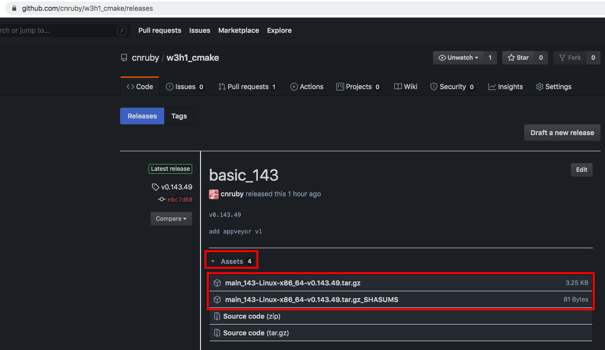

<h2>Hello, publish:Assets!</h2>
<h3>How to upload a Multiple Artifacts to Github Assets</h3>
</br>
</br>

[@Gitter](https://gitter.im/cnruby): gitter.im/cnruby<br/>
Code ID: basic_143</br>
Code Name: Hello, publish:Assets!</br>
<p class ="fragment" data-audio-src="docs/143/audio/basic_143-01.m4a"></p>


[<h1>Youtube Video</h1>](https://youtu.be/h5tpJtrDQeI)

[<h1>Demo Video</h1>](https://www.youtube.com/watch?v=h5tpJtrDQeI&t=71s)


<h2>TABLE of CONTENTS</h2>

- [About The Project](#about-the-project)
- [A Demonstration of Building Project](#a-demonstration-of-building-project)
- [Explain the Build's Commands and <code>CMake</code> Codes](#explain-the-builds-commands-and-cmake-codes)
  - [Archiv the release to artifacts](#archiv-the-release-to-artifacts)
  - [Upload the release to Github Assets](#upload-the-release-to-github-assets)
  - [Get <code>GITHUB_TOKEN</code> from Local System](#get-github_token-from-local-system)
- [Final Summary](#final-summary)
- [References](#references)
  - [General](#general)
  - [Requirements](#requirements)
  - [Get The Code with Shell Commands](#get-the-code-with-shell-commands)
  - [The Structure of Folder](#the-structure-of-folder)
- [Explain <code>C++</code>  and <code>CMake</code> Code](#explain-c-and-cmake-code)
<div class ="fragment" data-audio-src="docs/143/audio/basic_143-02.m4a"></div>




## About The Project
<p class ="fragment" data-audio-src="docs/143/audio/basic_143-03.m4a"></p>


## A Demonstration of Building Project
<video width="720" height="480" controls data-autoplay>
  <source src="docs/143/video/basic_143-04.mp4" autoplay=true type="video/mp4">
</video>


<!--{ "./docs/cmd/upload_release.sh" | line-numbers: " " | lines: 3 9 | code: bash }-->
```bash
3 # https://github.com/settings/tokens
4 git config --global github.token "YOUR_GITHUB_TOKEN"
5 cmake -GNinja -H. -B_build -DCMAKE_BUILD_TYPE=Release
6 ninja -C _build/
7 ninja -C _build zip_app
8 ninja -C _build get_ghr
9 ninja -C _build github_release
```
<!--{ end }-->
## Explain the Build's Commands and <code>CMake</code> Codes
<p class ="fragment" data-audio-src="docs/143/audio/basic_143-05.m4a"></p>


<!--{ "./cmake/publish.cmake" | line-numbers: " " | lines: 13 18 | code: CMake }-->
```CMake
13 add_custom_target(
14   zip_app
15   ${CMAKE_COMMAND} -E chdir ${CMAKE_RUNTIME_OUTPUT_DIRECTORY} tar -zcvf ${_APP_NAME} ${_MAIN_EXE}
16   COMMAND ${CMAKE_COMMAND} -E copy ${CMAKE_RUNTIME_OUTPUT_DIRECTORY}/${_APP_NAME} ${_APP_OUTPUT_DIRECTORY}
17   WORKING_DIRECTORY ${_APP_OUTPUT_DIRECTORY}
18 )
```
<!--{ end }-->
### Archiv the release to artifacts
<p class ="fragment" data-audio-src="docs/143/audio/basic_143-06.m4a"></p>


<!--{ "./cmake/publish.cmake" | line-numbers: " " | lines: 21 34 | code: bash }-->
```bash
21 add_custom_target(
22   get_shasums
23   ${CMAKE_COMMAND} -E sha1sum ${_APP_NAME} > ${_SHASUMS}
24   WORKING_DIRECTORY ${_APP_OUTPUT_DIRECTORY}
25 )
26 add_custom_target(
27   github_release
28   # ghr [options...] TAG [PATH]
29   # ghr -t <GITHUB_TOKEN> v<0.0.0> <APP.tar.gz>
30   # ghr -t c346cbb4831ac04421439332d04a3e02dfa v1.0.0 app.tar.gz
31   COMMAND ${_TOOL_INPUT_DIRECTORY}/${_GHR_APP}/ghr -t ${GITHUB_TOKEN} -n ${PROJECT_NAME} v${PROJECT_VERSION} ${_APP_OUTPUT_DIRECTORY}/${_APP_NAME}
32   COMMAND ${_TOOL_INPUT_DIRECTORY}/${_GHR_APP}/ghr -t ${GITHUB_TOKEN} -n ${PROJECT_NAME} v${PROJECT_VERSION} ${_APP_OUTPUT_DIRECTORY}/${_SHASUMS}
33   WORKING_DIRECTORY ${PROJECT_SOURCE_DIR}
34   DEPENDS get_shasums
```
<!--{ end }-->
### Upload the release to Github Assets
<p class ="fragment" data-audio-src="docs/143/audio/basic_143-07.m4a"></p>


<!--{ "./cmake/GetGitHubToken.cmake" | line-numbers: " " | lines: 7 13  | code: bash }-->
```bash
 7       execute_process(
 8         # https://github.com/settings/tokens
 9         # git config --global github.token "YOUR_GITHUB_TOKEN"
10         COMMAND ${GIT_EXECUTABLE} config github.token
11         OUTPUT_VARIABLE GITHUB_TOKEN
12         OUTPUT_STRIP_TRAILING_WHITESPACE
13       )
```
<!--{ end }-->
### Get <code>GITHUB_TOKEN</code> from Local System
<p class ="fragment" data-audio-src="docs/143/audio/basic_143-08.m4a"></p>


## Final Summary
<p class ="fragment" data-audio-src="docs/143/audio/basic_143-09.m4a"></p>


<h1>感谢大家观看!</h1>

@Gitter: gitter.im/cnruby<br/>

@Github: github.com/cnruby<br/>

@Twitter: twitter.com/cnruby<br/>

@Blogspot: cnruby.blogspot.com


## References


### General
- https://cmake.org/cmake/help/v3.12/envvar/DESTDIR.html
- https://cmake.org/pipermail/cmake/2009-April/029017.html
- https://discourse.appimage.org/t/how-to-create-an-appimage/155/38
- https://github.com/AppImage/AppImageKit/issues/1048
- https://fireflytech.org/2019/05/29/appimage-an-app-bundle-format-for-linux-howto/
- https://github.com/linuxdeploy/linuxdeploy/releases
- https://dev.to/slurpsmadrips/everything-you-never-wanted-to-know-about-cmake-4mgg
- https://thomask.sdf.org/blog/2019/05/05/techniques-for-verifying-shasums-conveniently.html


### Requirements
- [Ubuntu 20.04+](https://ubuntu.com/)
- [VS Code 1.43.0+](https://code.visualstudio.com/)
- [CMake 3.17.3+](https://cmake.org/)


### Get The Code with Shell Commands
```bash
git clone https://github.com/cnruby/w3h1_cmake.git basic_143
cd basic_143
git checkout basic_143
code .
```


### The Structure of Folder
<!--{ "./docs/output/tree.txt" | code: bash }-->
```bash
.
├── cmake
│  ├── CMakeLists.txt
│  ├── config.hxx.in
│  ├── GetGitHubToken.cmake
│  └── publish.cmake
├── CMakeLists.txt
└── src
   ├── CMakeLists.txt
   └── main.cxx
```
<!--{ end }-->
## Explain <code>C++</code>  and <code>CMake</code> Code 
<p class ="fragment" data-audio-src="docs/143/audio/basic_143-03.m4a"></p>
