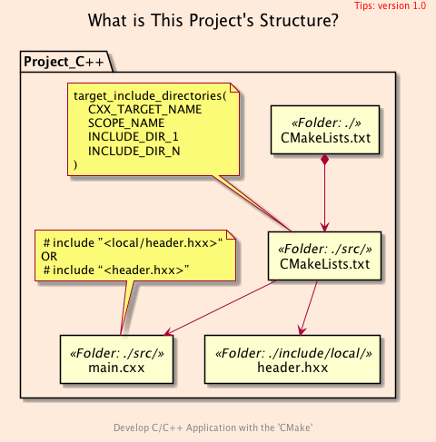
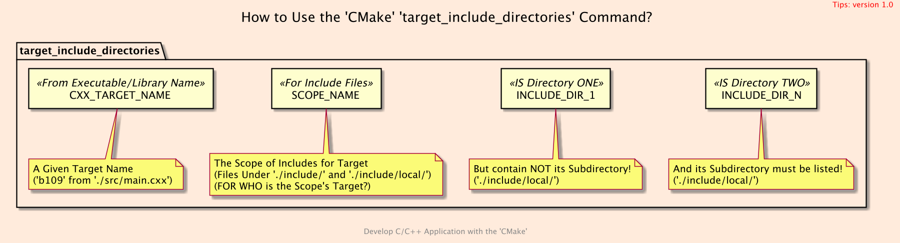

basic_109</br>
<h1>Hello, <code>C++</code> Header!</h1>
<h3>Using a Include File from Other Folder</h3>

[@Gitter](https://gitter.im/cnruby) :gitter.im/cnruby<br/>
<p class ="fragment" data-audio-src="docs/109/audio/basic_109-01.m4a"></p>


* [Youtube Video](https://youtu.be/dHt_i7-sBNM)


<h2>TABLE of CONTENTS</h2>

- [The Project <code>"Hello, Header!"</code>](#the-project-%22hello-header%22)
  - [What is This Project's Structure](#what-is-this-projects-structure)
  - [Get The Code with Shell Commands](#get-the-code-with-shell-commands)
- [The Bridge Between <code>C++</code> Main File and Include File](#the-bridge-between-c-main-file-and-include-file)
  - [How to Use the <code>CMake</code> <code>target_include_directories()</code> Command?](#how-to-use-the-cmake-targetincludedirectories-command)
  - [The <code>'CMake' 'target_include_directories'</code> Command](#the-cmake-targetincludedirectories-command)
  - [Demonstrate This Project's Code and Structure](#demonstrate-this-projects-code-and-structure)
  - [Build and Run The Project](#build-and-run-the-project)
  - [Demonstrate This Project's Structure](#demonstrate-this-projects-structure)
- [Tip: The Two <code>'CMake'</code> Variables](#tip-the-two-cmake-variables)
  - [Display The Two <code>'CMake</code> Variable's Values](#display-the-two-cmake-variables-values)
  - [Demonstratey The Two <code>'CMake</code> Variable's Values](#demonstratey-the-two-cmake-variables-values)
- [Final Summary](#final-summary)
- [References](#references)
- [The Project Command](#the-project-command)
<p class ="fragment" data-audio-src="docs/109/audio/basic_109-02.m4a"></p>


## The Project <code>"Hello, Header!"</code>
### What is This Project's Structure
<p class ="fragment" data-audio-src="docs/109/audio/basic_109-03.m4a"></p>



<p class ="fragment" data-audio-src="docs/109/audio/basic_109-04.m4a"></p>


### Get The Code with Shell Commands
```bash
git clone https://github.com/cnruby/w3h1_cmake.git basic_109
cd basic_109
git checkout basic_109
code .
```
<p class ="fragment" data-audio-src="docs/109/audio/basic_109-05.m4a"></p>


## The Bridge Between <code>C++</code> Main File and Include File
<p class ="fragment" data-audio-src="docs/109/audio/basic_109-06.m4a"></p>


### How to Use the <code>CMake</code> <code>target_include_directories()</code> Command?

<p class ="fragment" data-audio-src="docs/109/audio/basic_109-07.m4a"></p>


### The <code>'CMake' 'target_include_directories'</code> Command

```bash
#<!-- markdown-exec(cmd:cat src/CMakeLists.txt) -->#
add_executable(
  b109
  main.cxx
)
# target_include_directories(
#    CXX_TARGET_NAME SCOPE_NAME INCLUDE_DIR_1 INCLUDE_DIR_N)
set(
  HXX_DIRS
  ${PROJECT_SOURCE_DIR}/include/
)
target_include_directories(
  b109
  PRIVATE ${HXX_DIRS} ${HXX_DIRS}/local/
)

# The differece between PROJECT_SOURCE_DIR and CMAKE_CURRENT_SOURCE_DIR
message(STATUS "PROJECT_SOURCE_DIR = ${PROJECT_SOURCE_DIR}/include/")
message(STATUS "CURRENT_SOURCE_DIR = ${CMAKE_CURRENT_SOURCE_DIR}/include/")

# ERROR
# target_include_directories(b109 PRIVATE ${CMAKE_CURRENT_SOURCE_DIR}/include/)
#<!-- /markdown-exec -->
```
<p class ="fragment" data-audio-src="docs/109/audio/basic_109-08.m4a"></p>


### Demonstrate This Project's Code and Structure
<p class ="fragment" data-audio-src="docs/109/audio/basic_109-09.m4a"></p>


### Build and Run The Project
```bash
cmake -GNinja -Bbuild/
cmake --build build/
./bin/b109
```
<p class ="fragment" data-audio-src="docs/109/audio/basic_109-10.m4a"></p>


### Demonstrate This Project's Structure
<video width="720" height="480" controls data-autoplay>
  <source src="docs/109/video/basic_109-11.mp4" autoplay=true type="video/mp4">
</video>


## Tip: The Two <code>'CMake'</code> Variables
```bash
PROJECT_SOURCE_DIR
CMAKE_CURRENT_SOURCE_DIR
```
<p class ="fragment" data-audio-src="docs/109/audio/basic_109-12.m4a"></p>


### Display The Two <code>'CMake</code> Variable's Values
<pre><code>
cmake --build build/ --target rebuild_cache
</code></pre>
<p class ="fragment" data-audio-src="docs/109/audio/basic_109-13.m4a"></p>


### Demonstratey The Two <code>'CMake</code> Variable's Values
<video width="720" height="480" controls data-autoplay>
  <source src="docs/109/video/basic_109-14.mp4" autoplay=true type="video/mp4">
</video>


## Final Summary

<p class ="fragment" data-audio-src="docs/109/audio/basic_109-15.m4a"></p>


<h1><!-- markdown-exec(cmd:echo "感谢大家观看!") -->感谢大家观看!<!-- /markdown-exec --></h1>

@Gitter: gitter.im/cnruby<br/>

@Github: github.com/cnruby<br/>

@Twitter: twitter.com/cnruby<br/>

@Blogspot: cnruby.blogspot.com


## References
- https://cmake.org/cmake/help/latest/command/target_include_directories.html
- https://stackoverflow.com/questions/31969547/what-is-the-difference-between-include-directories-and-target-include-directorie
- https://stackoverflow.com/questions/26243169/cmake-target-include-directories-meaning-of-scope
- https://gitlab.kitware.com/cmake/cmake/issues/19802
- https://pabloariasal.github.io/2018/02/19/its-time-to-do-cmake-right/
- http://mariobadr.com/creating-a-header-only-library-with-cmake.html


## The Project Command
```bash
ruby format-codes.rb
```