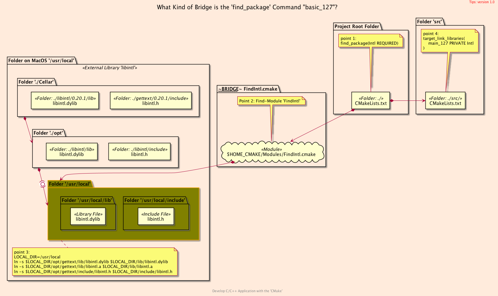
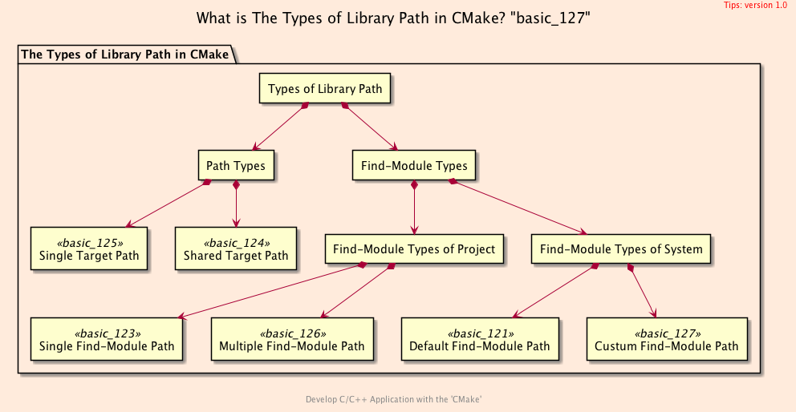

<h2>Hello, $PATH!</h2>
<h3>Creating a Symbolic Link for a Library</h3>
</br>
</br>

[@Gitter](https://gitter.im/cnruby) :gitter.im/cnruby<br/>
Code ID: basic_127</br>
Code Name: Hello, $PATH!</br>
<p class ="fragment" data-audio-src="docs/127/audio/basic_127-01.m4a"></p>


<h2>TABLE of CONTENTS</h2>

- [About The Project](#about-the-project)
  - [Requirements](#requirements)
  - [Install The Library <code>gettext</code>](#install-the-library-gettext)
  - [Get The Code with Shell Commands](#get-the-code-with-shell-commands)
- [Demonstrate Creating a Symbolic Link for a Library](#demonstrate-creating-a-symbolic-link-for-a-library)
- [The Structure of Project](#the-structure-of-project)
  - [The Process's Structure of Project "basic_121"](#the-processs-structure-of-project-%22basic121%22)
  - [The Process's Structure of Project  "basic_127"](#the-processs-structure-of-project-%22basic127%22)
- [The Codes of Project</code>](#the-codes-of-projectcode)
  - [The <code>Shell</code> Codes of Project</code>](#the-shell-codes-of-projectcode)
  - [The Listfile of Folder <code>'src'</code>](#the-listfile-of-folder-src)
  - [The File <code>'GetLibintl.cmake'</code> of Folder <code>'cmake'</code>](#the-file-getlibintlcmake-of-folder-cmake)
- [Final Summary](#final-summary)
- [References](#references)
- [The Structures of Project](#the-structures-of-project)
  - [The <code>Folder's</code> Structure](#the-folders-structure)
<div class ="fragment" data-audio-src="docs/127/audio/basic_127-02.m4a"></div>


## About The Project

<div class ="fragment" data-audio-src="docs/127/audio/basic_127-03.m4a"></div>


### Requirements
- [VS Code 1.43.0+](https://code.visualstudio.com/)
- [CMake 3.17.0+](https://cmake.org/)
- [Library gettext 0.20.1](https://www.gnu.org/software/gettext/)
<div class ="fragment" data-audio-src="docs/127/audio/basic_127-04.m4a"></div>


### Install The Library <code>gettext</code>
```bash
# For MacOS 10.11+
brew install gettext
# For Ubuntu 20.04+
sudo apt-get install -y gettext
```
<div class ="fragment" data-audio-src="docs/127/audio/basic_127-05.m4a"></div>


### Get The Code with Shell Commands
```bash
#<!-- markdown-exec(cmd:cat ../get_project.sh) -->#!/bin/bash
# ./get_project.sh <PROJECT_ID>
# ./get_project.sh basic_127
#
PROJECT_HOME=$HOME/Documents/dev/cpp-ws/$1
git clone https://github.com/cnruby/w3h1_cmake.git $PROJECT_HOME
cd $PROJECT_HOME && git checkout $1
code $PROJECT_HOME
#<!-- /markdown-exec -->
```
<div class ="fragment" data-audio-src="docs/127/audio/basic_127-06.m4a"></div>


## Demonstrate Creating a Symbolic Link for a Library
<video width="720" height="480" controls data-autoplay>
  <source src="docs/127/video/basic_127-07.mov" autoplay=true type="video/mp4">
</video>


## The Structure of Project

<p class ="fragment" data-audio-src="docs/127/audio/basic_127-11.m4a"></p>


### The Process's Structure of Project "basic_121"
<p class ="fragment" data-audio-src="docs/127/audio/basic_127-11.m4a"></p>



### The Process's Structure of Project  "basic_127"
<p class ="fragment" data-audio-src="docs/127/audio/basic_127-11.m4a"></p>


## The Codes of Project</code>
```bash
#<!-- markdown-exec(cmd:cat shell/ln_gettext_short.sh) -->#!/bin/sh
SOURCE_DIR=/usr/local/opt/gettext
DESTN_DIR=/usr/local
ln -s $SOURCE_DIR/include/libintl.h $DESTN_DIR/include/libintl.h
ln -s $SOURCE_DIR/lib/libintl.dylib $DESTN_DIR/lib/libintl.dylib
ln -s $SOURCE_DIR/lib/libintl.a $DESTN_DIR/lib/libintl.a
#<!-- /markdown-exec -->
```
### The <code>Shell</code> Codes of Project</code>
<div class ="fragment" data-audio-src="docs/127/audio/basic_127-06.m4a"></div>


```bash
#<!-- markdown-exec(cmd:cat src/CMakeLists.txt) -->#
add_executable(
  main_127 main.cxx
)

target_include_directories(
  main_127
  PRIVATE ${_PROJECT_CONFIG_DIR}
)

# link against the library
target_link_libraries(
  main_127
  PRIVATE Intl
)
#<!-- /markdown-exec -->
```
### The Listfile of Folder <code>'src'</code>
<p class ="fragment" data-audio-src="docs/127/audio/basic_127-08.m4a"></p>


```bash
#<!-- markdown-exec(cmd:cat cmake/GetLibintl.cmake) -->#
message("\nFROM cmake/GetLibintl.txt")
# find a library 'libintl'
find_package(Intl REQUIRED)

# check if Intl was found
if(Intl_FOUND)
  message(STATUS "Intl found\t\t= ${Intl_FOUND}")
  message(STATUS "Intl_INCLUDE_DIRS\t= ${Intl_INCLUDE_DIRS}")
  message(STATUS "Intl_LIBRARIES\t= ${Intl_LIBRARIES}")
else()
  message(FATAL_ERROR "Cannot find Intl")
endif()
message("FROM cmake/GetLibintl.txt")
#<!-- /markdown-exec -->
```
### The File <code>'GetLibintl.cmake'</code> of Folder <code>'cmake'</code>
<p class ="fragment" data-audio-src="docs/127/audio/basic_127-09.m4a"></p>



## Final Summary
<p class ="fragment" data-audio-src="docs/127/audio/basic_127-14.m4a"></p>


<h1><!-- markdown-exec(cmd:echo "感谢大家观看!") -->感谢大家观看!<!-- /markdown-exec --></h1>

@Gitter: gitter.im/cnruby<br/>

@Github: github.com/cnruby<br/>

@Twitter: twitter.com/cnruby<br/>

@Blogspot: cnruby.blogspot.com


## References
- https://cmake.org/cmake/help/latest/command/configure_file.html
- https://gitlab.kitware.com/cmake/community/-/wikis/doc/tutorials/How-to-create-a-ProjectConfig.cmake-file
- https://riptutorial.com/cmake/example/26652/generate-a-cplusplus-configure-file-with-cmake
- https://stackoverflow.com/questions/48580399/how-to-ensure-a-generated-config-h-file-is-in-the-include-path
- https://github.com/bast/cmake-example/tree/master/cmake 
- https://cmake.org/pipermail/cmake/2006-May/009049.html
- https://discourse.brew.sh/t/failed-to-set-locale-category-lc-numeric-to-en-ru/5092/5
- https://github.com/git/git/blob/master/po/zh_CN.po
- https://www.boost.org/doc/libs/1_57_0/libs/locale/doc/html/messages_formatting.html
- https://cmake.org/cmake/help/v3.0/variable/ENV.html
- https://cmake.org/cmake/help/latest/module/FindIntl.html
- https://stackoverflow.com/questions/1003360/complete-c-i18n-gettext-hello-world-example/1033337
- https://fedoraproject.org/wiki/How_to_do_I18N_through_gettext
- https://stackoverflow.com/questions/1003360/complete-c-i18n-gettext-hello-world-example
- https://stackoverflow.com/questions/21370363/link-error-installing-rcpp-library-not-found-for-lintl
- https://stackoverflow.com/questions/11370684/what-is-libintl-h-and-where-can-i-get-it


## The Structures of Project
```bash
#<!-- markdown-exec(cmd:cat docs/output/tree.txt) -->#
.
├── cmake
│  ├── CMakeLists.txt
│  └── config.h.in
├── CMakeLists.txt
├── config
│  └── config.hxx
└── src
   ├── CMakeLists.txt
    └── main.cxx
#<!-- /markdown-exec -->
```
### The <code>Folder's</code> Structure
