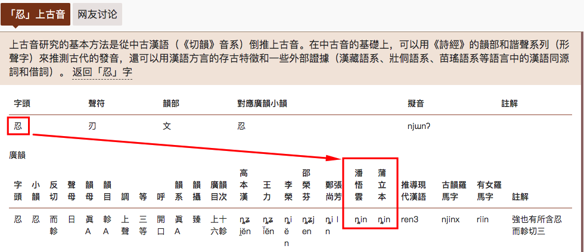
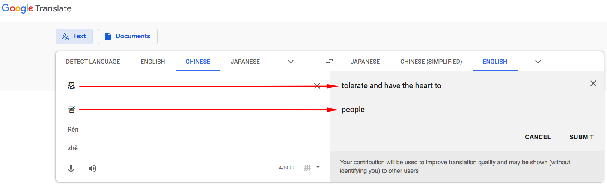
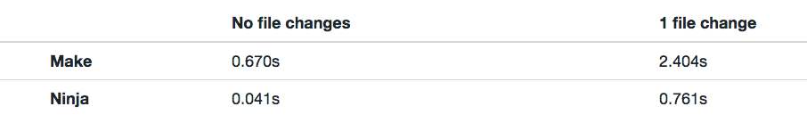
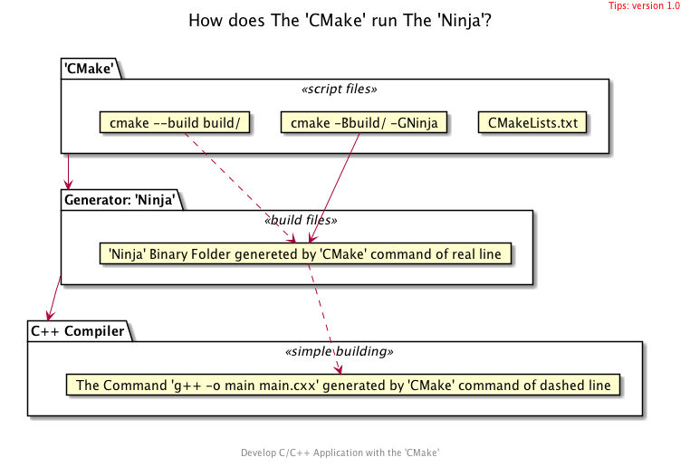

<h1>Hello Application with 'CMake' and 'Ninja'  basci_102</h1>

<h2>Table of Contents</h2>

- [WHAT](#what)
  - [What does The 'Ninja'?](#what-does-the-ninja)
  - [What do 忍者 and Ninja?](#what-do-%e5%bf%8d%e8%80%85-and-ninja)
- [WHERE](#where)
- [WHY](#why)
  - [On speed with Ninja](#on-speed-with-ninja)
  - [Show the all generator](#show-the-all-generator)
  - [Compare Make vs Ninja Build Folder](#compare-make-vs-ninja-build-folder)
- [HOW](#how)
  - [Get A Simplest Project](#get-a-simplest-project)
  - [Create Build Folder 'build' with Generator 'Ninja'](#create-build-folder-build-with-generator-ninja)
  - [Build And Run with 'CMake' Command](#build-and-run-with-cmake-command)
  - [Build And Run with 'Ninja' Command](#build-and-run-with-ninja-command)
- [References](#references)


## WHAT
### What does The 'Ninja'?
- Ninja is a small build system with a focus on speed.
- 

### What do 忍者 and Ninja?
- pronounce
- 
- mean [>>](http://t.ly/MVlgA)
-  

## WHERE
- **Google Chrome** is a main user and motivation for Ninja.
- Ninja used to build **Google Android**.
- Ninja is used by most developers working on **LLVM**.
- https://ninja-build.org/
- https://github.com/ninja-build/ninja
- https://en.wikipedia.org/wiki/Ninja_(build_system)

## WHY

### On speed with Ninja
- Ninja aims to be an assembler
- 

### Show the all generator
```bash
cmake --help
```

### Compare Make vs Ninja Build Folder
```bash
cmake -B build/ -GNinja
exa -T build/ >> tree-build-ninja.txt
rm -rf build/
cmake -B build/
exa -T build/ >> tree-build-make.txt
```

## HOW
- 

### Get A Simplest Project
```bash
git clone https://github.com/cnruby/w3h1_cmake.git basic_102
cd basic_102
git checkout basic_102
```

### Create Build Folder 'build' with Generator 'Ninja'
```bash
cmake -B build/ -GNinja
```

### Build And Run with 'CMake' Command
```bash
cmake --build build/
./bin/main
```

### Build And Run with 'Ninja' Command
```bash
cd build/
ninja clean
ninja
../bin/main
```


## References
- https://www.jetbrains.com/help/clion/quick-cmake-tutorial.html
- https://medium.com/@julienjorge/an-overview-of-build-systems-mostly-for-c-projects-ac9931494444
- https://github.com/ninja-build/ninja
- https://github.com/ninja-build/ninja/wiki/List-of-generators-producing-ninja-build-files
- https://stackoverflow.com/questions/11269833/cmake-selecting-a-generator-within-cmakelists-txt
- https://ninja-build.org/manual.html
- https://github.com/Discordia/android-cmake
- https://github.com/Discordia/android-cmake-example
- https://jpospisil.com/2014/03/16/replacing-make-with-ninja.html 
