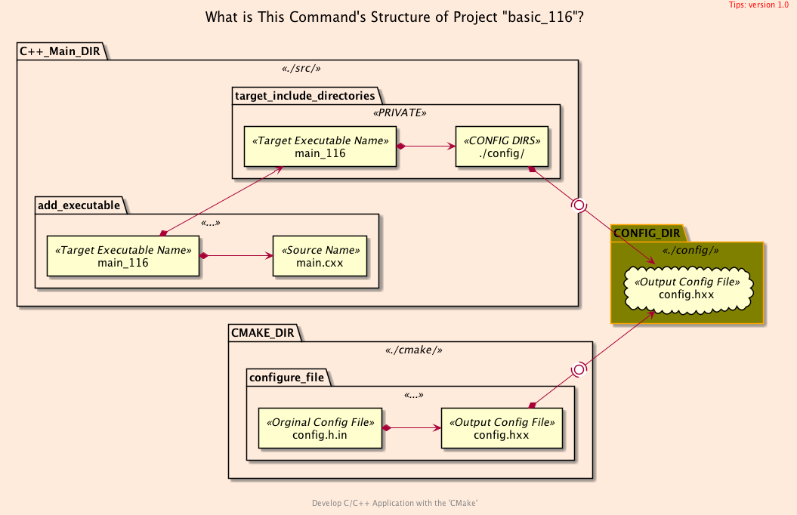
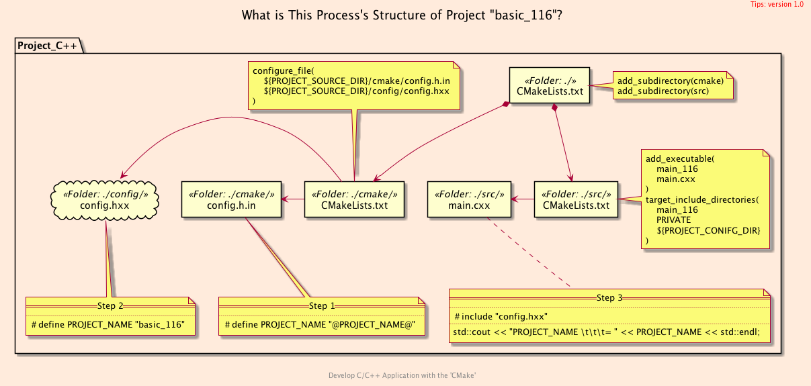
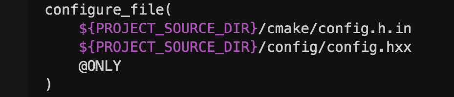
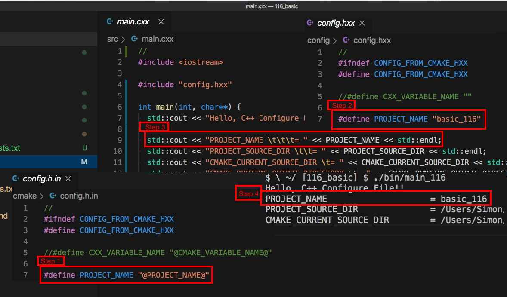

<h2>Hello, Configure File!</h2>
<h3>Generating a <code>C++</code> Configure File with <code>CMake</code></h3>
</br>
</br>

[@Gitter](https://gitter.im/cnruby) :gitter.im/cnruby<br/>
Code ID: basic_116</br>
Code Name: Hello, Configure File!</br>
<p class ="fragment" data-audio-src="docs/116/audio/basic_116-01.m4a"></p>


* [Youtube Video](https://youtu.be/thJFmINbG0U)


<h2>TABLE of CONTENTS</h2>

- [The Structures of Project](#the-structures-of-project)
  - [The <code>Folder's</code> Structure](#the-folders-structure)
  - [The <code>Command's</code> Structure](#the-commands-structure)
  - [The <code>Process's</code> Structure](#the-processs-structure)
- [<code>CMake</code> Files of The Project](#cmake-files-of-the-project)
  - [The Listfile of Folder <code>'src'</code>](#the-listfile-of-folder-src)
  - [The Listfile of Folder <code>'cmake'</code>](#the-listfile-of-folder-cmake)
  - [The Template File of Folder <code>'cmake'</code>](#the-template-file-of-folder-cmake)
- [C++ Files of The Project](#c-files-of-the-project)
  - [The C++ Config File of Folder <code>'config'</code>](#the-c-config-file-of-folder-config)
  - [The C++ Main File of Folder <code>'src'</code>](#the-c-main-file-of-folder-src)
- [Demonstrate Generating The Configure File with <code>CMake<code>](#demonstrate-generating-the-configure-file-with-codecmakecode)
- [Final Summary](#final-summary)
- [References](#references)
- [The Project's Commands](#the-projects-commands)
  - [Formatting The Codes](#formatting-the-codes)
  - [Get The Code with Shell Commands](#get-the-code-with-shell-commands)
  - [Build and Run The Project](#build-and-run-the-project)
<div class ="fragment" data-audio-src="docs/116/audio/basic_116-02.m4a"></div>


## The Structures of Project
```bash
#<!-- markdown-exec(cmd:cat docs/output/tree.txt) -->#
.
├── cmake
│  ├── CMakeLists.txt
│  └── config.h.in
├── CMakeLists.txt
├── config
│  └── config.hxx
└── src
   ├── CMakeLists.txt
    └── main.cxx
#<!-- /markdown-exec -->
```
### The <code>Folder's</code> Structure
<p class ="fragment" data-audio-src="docs/116/audio/basic_116-03.m4a"></p>



### The <code>Command's</code> Structure
<p class ="fragment" data-audio-src="docs/116/audio/basic_116-04.m4a"></p>



### The <code>Process's</code> Structure
<p class ="fragment" data-audio-src="docs/116/audio/basic_116-05.m4a"></p>


## <code>CMake</code> Files of The Project

<p class ="fragment" data-audio-src="docs/116/audio/basic_116-06.m4a"></p>


```bash
#<!-- markdown-exec(cmd:cat src/CMakeLists.txt) -->#
add_executable(
  main_116
  main.cxx
)
target_include_directories(
  main_116
  PRIVATE
  ${PROJECT_CONIFG_DIR}
)

message("\nFROM src/CMakeLists.txt")
message("PROJECT_SOURCE_DIR \t\t= ${PROJECT_SOURCE_DIR}")
message("CMAKE_CURRENT_SOURCE_DIR \t= ${CMAKE_CURRENT_SOURCE_DIR}")
message("FROM src/CMakeLists.txt")
#<!-- /markdown-exec -->
```
### The Listfile of Folder <code>'src'</code>
<p class ="fragment" data-audio-src="docs/116/audio/basic_116-07.m4a"></p>


```bash
#<!-- markdown-exec(cmd:cat cmake/CMakeLists.txt) -->#
configure_file(
    ${PROJECT_SOURCE_DIR}/cmake/config.h.in
    ${PROJECT_SOURCE_DIR}/config/config.hxx
    # Restrict the form @VAR@ of template variable, NOT the form ${var}
    @ONLY
)

message("\nFROM cmake/CMakeLists.txt")
message("PROJECT_SOURCE_DIR \t\t= ${PROJECT_SOURCE_DIR}")
message("CMAKE_CURRENT_SOURCE_DIR \t= ${CMAKE_CURRENT_SOURCE_DIR}")
message("FROM cmake/CMakeLists.txt")
#<!-- /markdown-exec -->
```
### The Listfile of Folder <code>'cmake'</code>
<p class ="fragment" data-audio-src="docs/116/audio/basic_116-08.m4a"></p>


```C++
//<!-- markdown-exec(cmd:cat cmake/config.h.in) -->//
#ifndef CONFIG_FROM_CMAKE_HXX
#define CONFIG_FROM_CMAKE_HXX

//#define CXX_VARIABLE_NAME "@CMAKE_VARIABLE_NAME@"

#define PROJECT_NAME "@PROJECT_NAME@"
#define PROJECT_SOURCE_DIR "@PROJECT_SOURCE_DIR@"
#define CMAKE_CURRENT_SOURCE_DIR "@CMAKE_CURRENT_SOURCE_DIR@"
#define CMAKE_RUNTIME_OUTPUT_DIRECTORY "@CMAKE_RUNTIME_OUTPUT_DIRECTORY@"

//const char *CXX_VARIABLE_NAME = "@CMAKE_VARIABLE_NAME@"
const char *PROJECT_CONIFG_DIR = "@PROJECT_CONIFG_DIR@";

#endif
//<!-- /markdown-exec -->
```
### The Template File of Folder <code>'cmake'</code>
<p class ="fragment" data-audio-src="docs/116/audio/basic_116-09.m4a"></p>


## C++ Files of The Project

<p class ="fragment" data-audio-src="docs/116/audio/basic_116-10.m4a"></p>


```C++
//<!-- markdown-exec(cmd:cat config/config.hxx) -->//
#ifndef CONFIG_FROM_CMAKE_HXX
#define CONFIG_FROM_CMAKE_HXX

//#define CXX_VARIABLE_NAME ""

#define PROJECT_NAME "basic_116"
#define PROJECT_SOURCE_DIR "/Users/Simon/Documents/dev/cpp-ws/116_basic"
#define CMAKE_CURRENT_SOURCE_DIR "/Users/Simon/Documents/dev/cpp-ws/116_basic/cmake"
#define CMAKE_RUNTIME_OUTPUT_DIRECTORY "/Users/Simon/Documents/dev/cpp-ws/116_basic/bin"

//const char *CXX_VARIABLE_NAME = ""
const char *PROJECT_CONIFG_DIR = "/Users/Simon/Documents/dev/cpp-ws/116_basic/config/";

#endif
//<!-- /markdown-exec -->
```
### The C++ Config File of Folder <code>'config'</code>
<p class ="fragment" data-audio-src="docs/116/audio/basic_116-11.m4a"></p>


```C++
//<!-- markdown-exec(cmd:cat src/main.cxx) -->//
#include <iostream>

#includxe "config.hxx"

int main(int, char**) {
  std::cout << "Hello, C++ Configure File!!" << std::endl;

  std::cout << "PROJECT_NAME \t\t\t= " << PROJECT_NAME << std::endl;
  std::cout << "PROJECT_SOURCE_DIR \t\t= " << PROJECT_SOURCE_DIR << std::endl;
  std::cout << "CMAKE_CURRENT_SOURCE_DIR \t= " << CMAKE_CURRENT_SOURCE_DIR << std::endl;
  std::cout << "CMAKE_RUNTIME_OUTPUT_DIRECTORY \t= " << CMAKE_RUNTIME_OUTPUT_DIRECTORY << std::endl;
  std::cout << "PROJECT_CONIFG_DIR \t\t= " << PROJECT_CONIFG_DIR << std::endl;

  return 0;
}
//<!-- /markdown-exec -->
```
### The C++ Main File of Folder <code>'src'</code>
<p class ="fragment" data-audio-src="docs/116/audio/basic_116-12.m4a"></p>


## Demonstrate Generating The Configure File with <code>CMake<code>
<video width="720" height="480" controls data-autoplay>
  <source src="docs/116/video/basic_116-13.mov" autoplay=true type="video/mp4">
</video>


## Final Summary
<p class ="fragment" data-audio-src="docs/116/audio/basic_116-14.m4a"></p>


<h1><!-- markdown-exec(cmd:echo "感谢大家观看!") -->感谢大家观看!<!-- /markdown-exec --></h1>

@Gitter: gitter.im/cnruby<br/>

@Github: github.com/cnruby<br/>

@Twitter: twitter.com/cnruby<br/>

@Blogspot: cnruby.blogspot.com


## References
- https://cmake.org/cmake/help/latest/command/configure_file.html
- https://gitlab.kitware.com/cmake/community/-/wikis/doc/tutorials/How-to-create-a-ProjectConfig.cmake-file
- https://riptutorial.com/cmake/example/26652/generate-a-cplusplus-configure-file-with-cmake
- https://stackoverflow.com/questions/48580399/how-to-ensure-a-generated-config-h-file-is-in-the-include-path
- https://github.com/bast/cmake-example/tree/master/cmake 
- https://cmake.org/pipermail/cmake/2006-May/009049.html


## The Project's Commands


### Formatting The Codes
```bash
ruby format-codes.rb
```


### Get The Code with Shell Commands
```bash
git clone https://github.com/cnruby/w3h1_cmake.git basic_116
cd basic_116
git checkout basic_116
code .
```


### Build and Run The Project
```bash
cmake -GNinja -Bbuild/
cmake --build build/ --clean-first -v
cmake --build build/ --target clean
cmake --build build/ --clean-first -v &> v11.txt
# generate the configure file
rm -rf config
cmake --build build/ --clean-first
cmake -Bbuild/
cmake --build build/ --target rebuild_cache
cmake --build build/ --clean-first
./bin/main_116
#  update the configure file
cmake --build build/ --clean-first
# others
markdown-exec README.md
ruby format-codes.rb
```