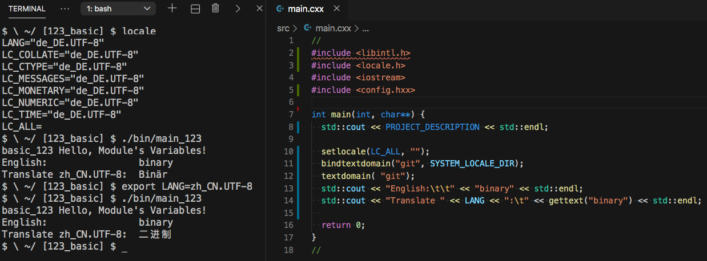
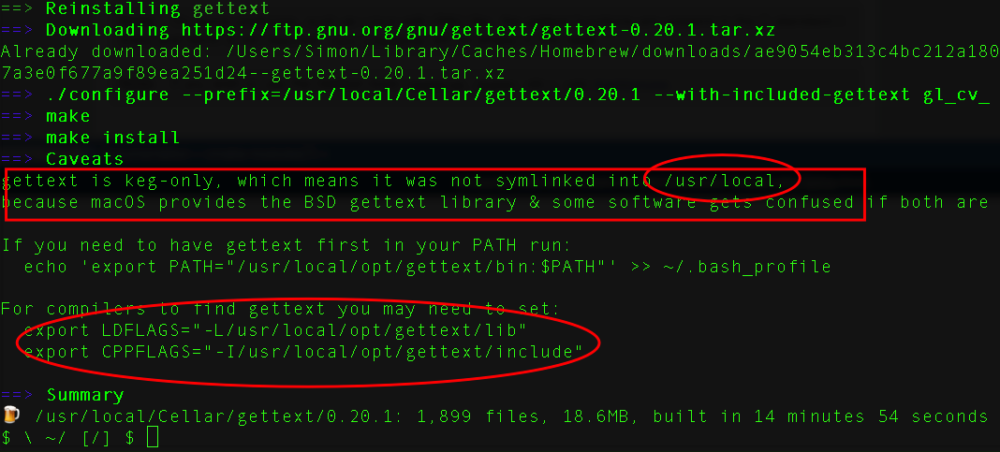
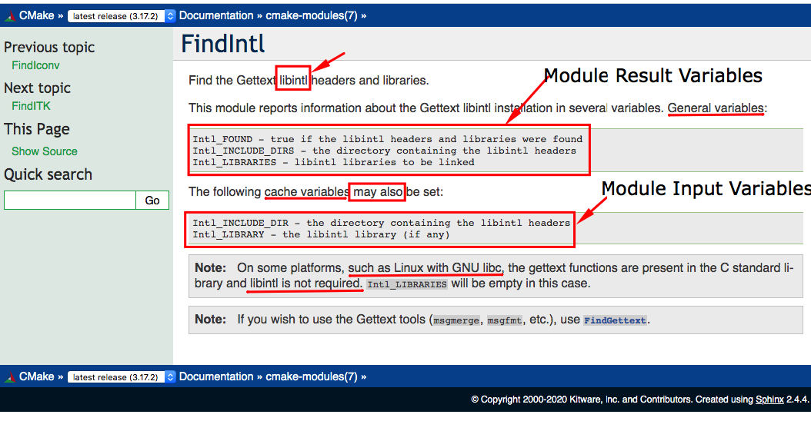
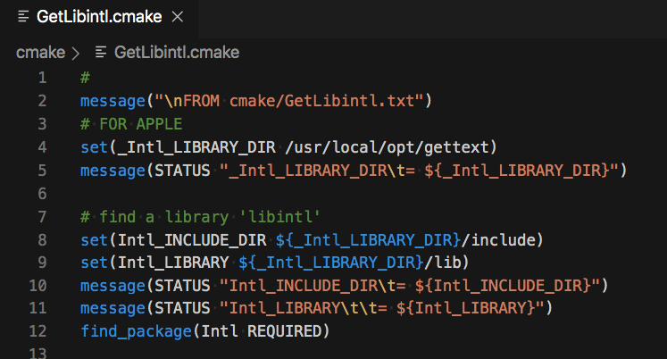

<h2>Hello, Module's Variables!</h2>
<h3>Using Find-Module's Variables with <code>CMake</code> Sources</h3>
</br>
</br>

[@Gitter](https://gitter.im/cnruby) :gitter.im/cnruby<br/>
Code ID: basic_123</br>
Code Name: Hello, Module's Variables!</br>
<p class ="fragment" data-audio-src="docs/123/audio/basic_123-01.m4a"></p>


[<h1>Youtube Video</h1>](https://youtu.be/UuMJGiRZmlA)


<h2>TABLE of CONTENTS</h2>

- [About The Project](#about-the-project)
  - [Requirements](#requirements)
  - [Install The Library <code>gettext</code>](#install-the-library-gettext)
  - [Get The Code with Shell Commands](#get-the-code-with-shell-commands)
  - [The <code>Folder's</code> Structure](#the-folders-structure)
- [Demonstrate the problem of build](#demonstrate-the-problem-of-build)
  - [Install The Output of <code>'gettext'</code> with <code>brew</code> on MacOS](#install-the-output-of-gettext-with-brew-on-macos)
- [Choosing a Solution Method](#choosing-a-solution-method)
  - [The File <code>'GetLibintl.cmake'<code> of Folder <code>'cmake'</code>](#the-file-getlibintlcmakecode-of-folder-codecmake)
  - [The Listfile of Folder <code>'src'</code>](#the-listfile-of-folder-src)
  - [Demonstrate the problem of Folder <code>'src'<code>s Listfile](#demonstrate-the-problem-of-folder-codesrccodes-listfile)
- [Demonstrate Building The Project](#demonstrate-building-the-project)
- [Off-Topic: Variables Type in CMake](#off-topic-variables-type-in-cmake)
  - [Demonstrate the Variable Types in CMake](#demonstrate-the-variable-types-in-cmake)
- [Final Summary](#final-summary)
- [References](#references)
<div class ="fragment" data-audio-src="docs/123/audio/basic_123-02.m4a"></div>


## About The Project

<div class ="fragment" data-audio-src="docs/123/audio/basic_123-03.m4a"></div>


### Requirements
- [VS Code 1.43.0+](https://code.visualstudio.com/)
- [CMake 3.17.0+](https://cmake.org/)
- [Library gettext 0.20.1](https://www.gnu.org/software/gettext/)
<div class ="fragment" data-audio-src="docs/123/audio/basic_123-04.m4a"></div>


### Install The Library <code>gettext</code>
```bash
# For MacOS 10.11+
brew install gettext
# For Ubuntu 20.04+
sudo apt-get install -y gettext
```
<div class ="fragment" data-audio-src="docs/123/audio/basic_123-05.m4a"></div>


### Get The Code with Shell Commands
```bash
git clone https://github.com/cnruby/w3h1_cmake.git basic_123
cd basic_123
git checkout basic_123
code .
```
<div class ="fragment" data-audio-src="docs/123/audio/basic_123-06.m4a"></div>


```bash
#<!-- markdown-exec(cmd:cat docs/output/tree.txt) -->#
.
├── cmake
│  ├── CMakeLists.txt
│  ├── config.h.in
│  ├── GetLibintl.cmake
│  ├── GetLocaleDir.cmake
│  └── Initialize.cmake
├── CMakeLists.txt
├── config
│  └── config.hxx
└── src
   ├── CMakeLists.txt
   └── main.cxx
#<!-- /markdown-exec -->
```
### The <code>Folder's</code> Structure
<p class ="fragment" data-audio-src="docs/123/audio/basic_123-07.m4a"></p>


## Demonstrate the problem of build
<video width="720" height="480" controls data-autoplay>
  <source src="docs/123/video/basic_123-08.mov" autoplay=true type="video/mp4">
</video>



### Install The Output of <code>'gettext'</code> with <code>brew</code> on MacOS
<p class ="fragment" data-audio-src="docs/123/audio/basic_123-09.m4a"></p>



## Choosing a Solution Method
<p class ="fragment" data-audio-src="docs/123/audio/basic_123-10.m4a"></p>



### The File <code>'GetLibintl.cmake'<code> of Folder <code>'cmake'</code>
<p class ="fragment" data-audio-src="docs/123/audio/basic_123-11.m4a"></p>


```bash
#<!-- markdown-exec(cmd:cat src/CMakeLists.txt) -->#
add_executable( main_123 main.cxx )

target_include_directories(
  main_123 PRIVATE 
  ${Intl_INCLUDE_DIRS}
  ${_PROJECT_CONFIG_DIR}
)

target_link_directories (
  main_123 PRIVATE ${Intl_LIBRARIES}
)

target_link_libraries( main_123 PRIVATE Intl )
#<!-- /markdown-exec -->
```
### The Listfile of Folder <code>'src'</code>
<p class ="fragment" data-audio-src="docs/123/audio/basic_123-12.m4a"></p>


### Demonstrate the problem of Folder <code>'src'<code>s Listfile
<video width="720" height="480" controls data-autoplay>
  <source src="docs/123/video/basic_123-13.mov" autoplay=true type="video/mp4">
</video>


## Demonstrate Building The Project
<video width="720" height="480" controls data-autoplay>
  <source src="docs/123/video/basic_123-14.mov" autoplay=true type="video/mp4">
</video>


## Off-Topic: Variables Type in CMake

<p class ="fragment" data-audio-src="docs/123/audio/basic_123-15.m4a"></p>


### Demonstrate the Variable Types in CMake
<video width="720" height="480" controls data-autoplay>
  <source src="docs/123/video/basic_123-16.mov" autoplay=true type="video/mp4">
</video>


## Final Summary
<p class ="fragment" data-audio-src="docs/123/audio/basic_123-17.m4a"></p>


<h1><!-- markdown-exec(cmd:echo "感谢大家观看!") -->感谢大家观看!<!-- /markdown-exec --></h1>

@Gitter: gitter.im/cnruby<br/>

@Github: github.com/cnruby<br/>

@Twitter: twitter.com/cnruby<br/>

@Blogspot: cnruby.blogspot.com


## References
- https://cmake.org/cmake/help/latest/command/configure_file.html
- https://gitlab.kitware.com/cmake/community/-/wikis/doc/tutorials/How-to-create-a-ProjectConfig.cmake-file
- https://riptutorial.com/cmake/example/26652/generate-a-cplusplus-configure-file-with-cmake
- https://stackoverflow.com/questions/48580399/how-to-ensure-a-generated-config-h-file-is-in-the-include-path
- https://github.com/bast/cmake-example/tree/master/cmake 
- https://cmake.org/pipermail/cmake/2006-May/009049.html
- https://discourse.brew.sh/t/failed-to-set-locale-category-lc-numeric-to-en-ru/5092/5
- https://raw.githubusercontent.com/git/git/master/po/de.po
- https://raw.githubusercontent.com/git/git/master/po/zh_CN.po
- https://www.boost.org/doc/libs/1_57_0/libs/locale/doc/html/messages_formatting.html
- https://cmake.org/cmake/help/v3.0/variable/ENV.html
- https://cmake.org/cmake/help/latest/module/FindIntl.html
- https://stackoverflow.com/questions/1003360/complete-c-i18n-gettext-hello-world-example/1033337
- https://fedoraproject.org/wiki/How_to_do_I18N_through_gettext
- https://stackoverflow.com/questions/1003360/complete-c-i18n-gettext-hello-world-example
- https://stackoverflow.com/questions/21370363/link-error-installing-rcpp-library-not-found-for-lintl
- https://ubuntuforums.org/showthread.php?t=108879
- https://github.com/neovim/neovim/blob/master/src/nvim/po/de.po
- https://progmar.net.pl/en/knowledge-base/gettext
- https://stackoverflow.com/questions/11789615/how-to-support-multiple-language-in-a-linux-c-c-program
- https://stackoverflow.com/questions/11370684/what-is-libintl-h-and-where-can-i-get-it
- https://nkumar.fedorapeople.org/helloi18n/helloworldintld/
- https://nkumar.fedorapeople.org/helloi18n/helloworld/