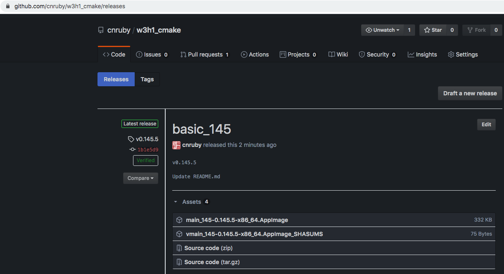
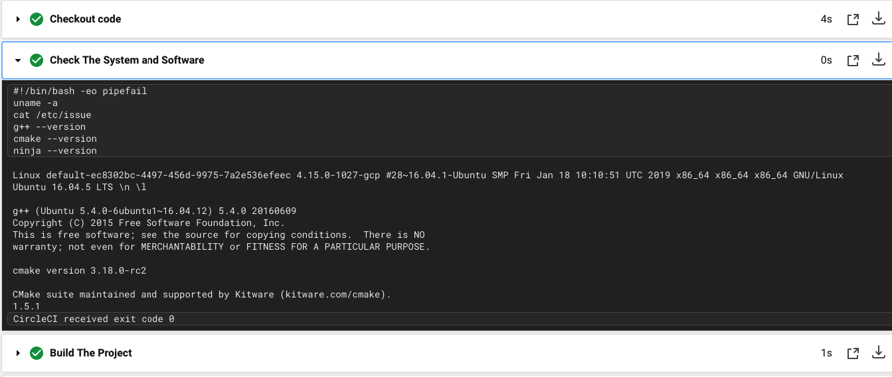
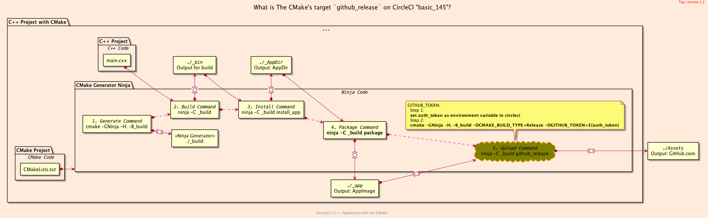

<h2>Hello, CI:AppImage!</h2>
<h3>How to publish Artifacts to Github Assets with CircleCI</h3>
</br>
</br>

[@Gitter](https://gitter.im/cnruby): gitter.im/cnruby<br/>
Code ID: basic_145</br>
Code Name: Hello, CI:AppImage!</br>
Code Status: [](https://circleci.com/gh/cnruby/w3h1_cmake/tree/basic_145)
<p class ="fragment" data-audio-src="docs/145/audio/basic_145-01.m4a"></p>


[<h1>Youtube Video</h1>](https://youtu.be/rmoPxvgQm38)

[<h1>Demo Video</h1>](https://www.youtube.com/watch?v=rmoPxvgQm38&t=122s)


<h2>TABLE of CONTENTS</h2>

- [About The Project](#about-the-project)
  - [Requirements](#requirements)
  - [The Commands of Building the project on Local and CircleCI](#the-commands-of-building-the-project-on-local-and-circleci)
- [A Demonstration of CI on <code>CircleCI</code>](#a-demonstration-of-ci-on-circleci)
- [Explain the configuration file of CircleCI](#explain-the-configuration-file-of-circleci)
  - [The Mode `machine` of CircleCI](#the-mode-machine-of-circleci)
  - [Intsall <code>CMake</code> on `machine` of CircleCI](#intsall-cmake-on-machine-of-circleci)
- [Final Summary](#final-summary)
- [References](#references)
  - [Requirements](#requirements-1)
  - [Get The Code with Shell Commands](#get-the-code-with-shell-commands)
  - [The Structure of project](#the-structure-of-project)
<p class ="fragment" data-audio-src="docs/145/audio/basic_145-02.m4a"></p>




## About The Project
<p class ="fragment" data-audio-src="docs/145/audio/basic_145-03.m4a"></p>


### Requirements
- [video basic_141](https://youtu.be/NtYyjwSjt9Q)
- [video basic_142](https://youtu.be/QkpnCki13Mc)
- [video basic_143](https://youtu.be/h5tpJtrDQeI)
- [video basic_144](https://youtu.be/7lxEofq8jhM)
<p class ="fragment" data-audio-src="docs/145/audio/basic_145-04.m4a"></p>


<!--{ "./docs/cmd/build_all_local.sh"| line-numbers | line: 1 3 4 5 | code: bash }-->
```bash
 1: # build the console app on local
 3: cmake -GNinja -H. -B_build
 4: cmake -DCMAKE_BUILD_TYPE=Release _build
 5: ninja -C _build
```
<!--{ end }-->
<!--{ "./docs/cmd/build_all_circleci.sh"| line-numbers | line: 1 3 4 5 | code: bash }-->
```bash
 1: # build the console app on CircleCI
 3: cmake -GNinja -H. -B_build
 4: cmake -DCMAKE_BUILD_TYPE=Release -DGITHUB_TOKEN=${auth_token} _build
 5: ninja -C _build
```
<!--{ end }-->
### The Commands of Building the project on Local and CircleCI
<p class ="fragment" data-audio-src="docs/145/audio/basic_145-05.m4a"></p>


## A Demonstration of CI on <code>CircleCI</code>
<video width="720" height="480" controls data-autoplay>
  <source src="docs/145/video/basic_145-06.mp4" autoplay=true type="video/mp4">
</video>




## Explain the configuration file of CircleCI
<p class ="fragment" data-audio-src="docs/145/audio/basic_145-07.m4a"></p>


<!--{ "./.circleci/config.yml"| line-numbers | line: 5 6 7 8 10 | code: bash }-->
```bash
 5: version: 2.1
 6: jobs:
 7:   build_ninja:
 8:     machine:
10:       image: ubuntu-1604:202004-01
```
<!--{ end }-->
### The Mode `machine` of CircleCI
<p class ="fragment" data-audio-src="docs/145/audio/basic_145-08.m4a"></p>


<!--{ "./.circleci/config.yml" | line-numbers | line: 12 16 17 18 19 20 21 22 23 24 25 26 | code: bash }-->
```bash
12:       - run:
16:           name: Install prerequisites
17:           command: |
18:             sudo apt-get -q update
19:             sudo apt-get -qy install apt-transport-https ca-certificates gnupg software-properties-common wget apt-utils
20:             wget -O - https://apt.kitware.com/keys/kitware-archive-latest.asc 2>/dev/null | gpg --dearmor - | sudo tee /etc/apt/trusted.gpg.d/kitware.gpg >/dev/null
21:             sudo apt-add-repository 'deb https://apt.kitware.com/ubuntu/ xenial main'
22:             sudo apt-get -q update
23:             sudo apt-add-repository 'deb https://apt.kitware.com/ubuntu/ xenial-rc main'
24:             sudo apt-get -q update
25:             sudo apt-get -qy install kitware-archive-keyring
26:             sudo rm /etc/apt/trusted.gpg.d/kitware.gpg
```
<!--{ end }-->
### Intsall <code>CMake</code> on `machine` of CircleCI
<p class ="fragment" data-audio-src="docs/145/audio/basic_145-09.m4a"></p>




## Final Summary
<p class ="fragment" data-audio-src="docs/145/audio/basic_145-10.m4a"></p>


<h1>感谢大家观看!</h1>

@Gitter: gitter.im/cnruby<br/>

@Github: github.com/cnruby<br/>

@Twitter: twitter.com/cnruby<br/>

@Blogspot: cnruby.blogspot.com


## References
- https://circleci.com/
- https://circleci.com/docs/2.0/getting-started/#section=getting-started
- http://gueepo.me/blog/simple-ci-for-cpp/
- https://thoughts-on-coding.com/2020/04/20/a-cpp-github-template-repository-utilizing-circleci-cmake-docker-and-doxygen/
- https://shields.io/category/build
- https://circleci.com/docs/2.0/status-badges/
- https://github.com/GPMueller/circleci-cpp


### Requirements
- [Ubuntu 20.04+](https://ubuntu.com/)
- [VS Code 1.43.0+](https://code.visualstudio.com/)
- [CMake 3.17.3+](https://cmake.org/)
- [CircleCI 2.0](https://circleci.com/)


### Get The Code with Shell Commands
```bash
git clone https://github.com/cnruby/w3h1_cmake.git basic_145
cd basic_145
git checkout basic_145
code .
```


### The Structure of project
<!--{ "./docs/output/tree.txt" | code: bash }-->
```bash
.
├── .circleci
│  └── config.yml
├── appimage
│  ├── CMakeLists.txt
│  ├── package.cmake
│  └── resource
│     ├── CMakeLists.txt
│     ├── hello.appdata.xml
│     ├── hello.CMakeLists.txt
│     ├── hello.desktop
│     └── hello.png
├── cmake
│  ├── appimage.cmake
│  ├── CMakeLists.txt
│  ├── GetGitHubToken.cmake
│  ├── in
│  │  ├── config.hxx.in
│  │  └── in.config.yml
│  ├── publish.cmake
│  └── targets.cmake
├── CMakeLists.txt
├── COMMAND.md
└── src
   ├── CMakeLists.txt
   ├── install.cmake
   └── main.cxx
```
<!--{ end }-->