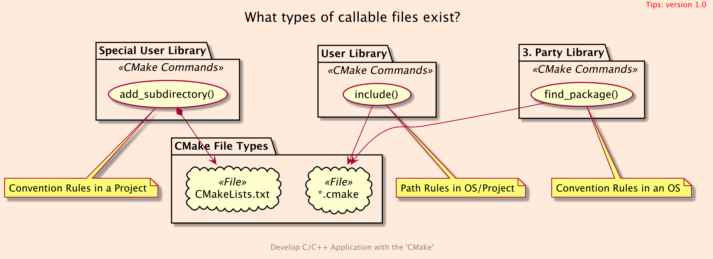
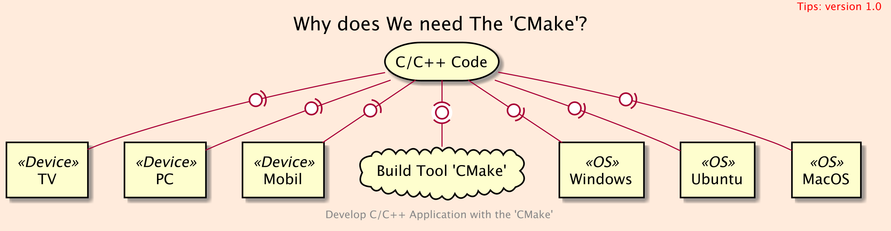

# basci_101

## WHAT



## WHY



## WHERE

### Where is The 'CMake' on the web?

- [CMake]()

### Where is The 'CMake' executable on MacOS?

```bash
which cmake
# >> /usr/local/bin/cmake
```

## HOW

### GET

```bash
git clone https://github.com/cnruby/w3h1_cmake.git basic_101
cd basic_101
git checkout basic_101
```

### BUILD AND RUN

```bash
cmake -B build/
cmake --build build/
./bin/main
```

## REFERENCES

### the 'CMake'

- https://cmake.org/cmake/help/latest/manual/cmake-compile-features.7.html
- https://cmake.org/cmake/help/v3.17/prop_gbl/CMAKE_CXX_KNOWN_FEATURES.html

### W3H1

- https://stackoverflow.com/questions/12236642/what-does-cmake-do
- https://stackoverflow.com/questions/40083642/why-do-we-need-cmake
- https://stackoverflow.com/questions/17525153/how-exactly-does-cmake-work
- https://stackoverflow.com/questions/16844454/where-is-the-cmake-executable-on-ubuntu
- https://cgold.readthedocs.io/en/latest/first-step/installation.html
-
