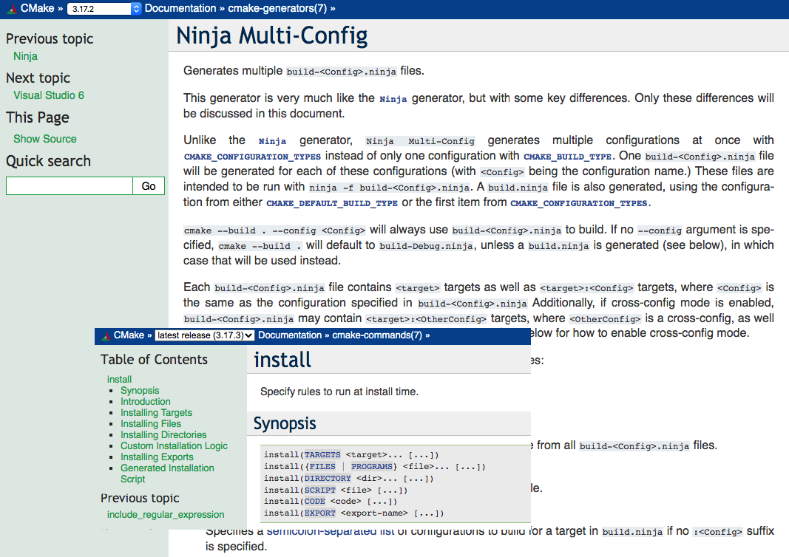
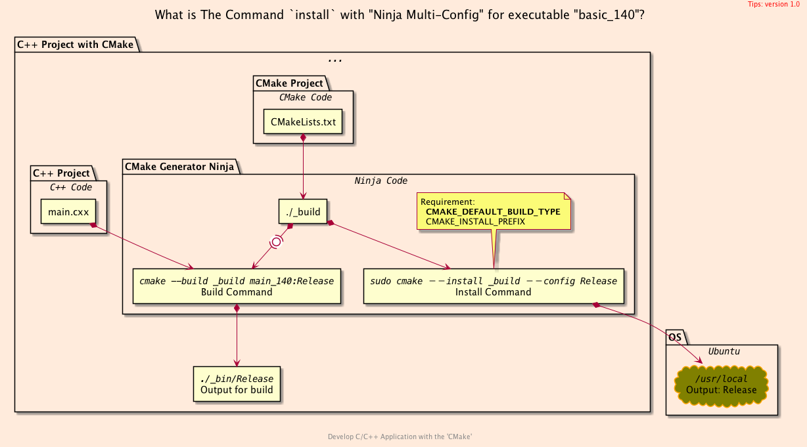

<h2>Hello, install:multi!</h2>
<h3>How to install executable on local with <code>"Ninja Multi-Config"</code></h3>
</br>
</br>

[@Gitter](https://gitter.im/cnruby) :gitter.im/cnruby<br/>
Code ID: basic_140</br>
Code Name: Hello, install:multi!</br>
<p class ="fragment" data-audio-src="docs/140/audio/basic_140-01.m4a"></p>


[<h1>Youtube Video</h1>](https://youtu.be/tCN-eFZN8xE)

[<h1>Demo Video</h1>](https://www.youtube.com/watch?v=tCN-eFZN8xE&t=187s)


<h2>TABLE of CONTENTS</h2>

- [About The Project](#about-the-project)
  - [Requirements](#requirements)
- [<code>CMake</code> Code of Project](#cmake-code-of-project)
  - [<code>CMake</code>'s `"Ninja Multi-Config"` Code of Project](#cmakes-ninja-multi-config-code-of-project)
  - [<code>CMake</code>'s `"install"` Code of Project](#cmakes-install-code-of-project)
  - [install executable commands on Project](#install-executable-commands-on-project)
  - [install executable commands on OS](#install-executable-commands-on-os)
- [A Demonstration of Building Project](#a-demonstration-of-building-project)
- [Final Summary](#final-summary)
- [References](#references)
  - [Requirements](#requirements-1)
  - [Get The Code with Shell Commands](#get-the-code-with-shell-commands)
  - [The Structure of Folder](#the-structure-of-folder)
- [Explain <code>C++</code>  and <code>CMake</code> Code](#explain-c-and-cmake-code)
<div class ="fragment" data-audio-src="docs/140/audio/basic_140-02.m4a"></div>




## About The Project
<p class ="fragment" data-audio-src="docs/140/audio/basic_140-03.m4a"></p>


### Requirements
- [video basic_116](https://youtu.be/thJFmINbG0U)
- [video basic_133](https://youtu.be/TLpscEDcI1U)
- [video basic_139](https://youtu.be/nJj1efRi6oI)
<p class ="fragment" data-audio-src="docs/140/audio/basic_140-04.m4a"></p>


## <code>CMake</code> Code of Project
- <code>CMake</code>'s `"Ninja Multi-Config"` Code
- <code>CMake</code>'s `"install"` Code
- install executable commands on Project
- install executable commands on OS
<p class ="fragment" data-audio-src="docs/140/audio/basic_140-05.m4a"></p>


<!--{ "./cmake/multi_config.cmake" | line-numbers: " " | lines: 13 23 | code: bash }-->
```bash
13 if(NOT CMAKE_CONFIGURATION_TYPES)
14   set(
15     CMAKE_CONFIGURATION_TYPES "Debug;Release;RelWithDebInfo"
16     CACHE STRING "specifies available build types" FORCE )
17 endif()
18 if(NOT CMAKE_CROSS_CONFIGS)
19   set(                                # -DCMAKE_CROSS_CONFIGS="all"
20     CMAKE_CROSS_CONFIGS "all"
21     #CMAKE_CROSS_CONFIGS "Debug;Release;RelWithDebInfo"
22     CACHE STRING "create available config files" FORCE )
23   endif()
```
<!--{ end }-->
### <code>CMake</code>'s `"Ninja Multi-Config"` Code of Project
<p class ="fragment" data-audio-src="docs/140/audio/basic_140-06.m4a"></p>


<!--{ "./src/install.cmake" | line-numbers: " " | lines: 4 15 | code: bash }-->
```bash
4 install(
5   TARGETS ${TARGET_NAME}
6   CONFIGURATIONS Debug
7   RUNTIME
8     DESTINATION ${RUNTIME_INSTALL_DIRECTORY}/Debug/bin
9 )
10 install(
11   TARGETS ${TARGET_NAME}
12   CONFIGURATIONS Release
13   RUNTIME
14     DESTINATION ${CMAKE_INSTALL_PREFIX}/bin
15 )
```
<!--{ end }-->
### <code>CMake</code>'s `"install"` Code of Project
<p class ="fragment" data-audio-src="docs/140/audio/basic_140-07.m4a"></p>


<!--{ "./docs/cmd/on_project.sh" | line-numbers: " " | code: bash }-->
```bash
1 # to install executable to Project for Developer
2 cmake -G"Ninja Multi-Config" -H. -B_build
3 cmake -DCMAKE_BUILD_TYPE=Debug --build _build
4 
5 ninja -C _build main_140:Debug
6 ./_bin/Debug/main_140
7 
8 ninja -C _build install:Debug
9 ./_install/Debug/bin/main_140
```
<!--{ end }-->
### install executable commands on Project
<p class ="fragment" data-audio-src="docs/140/audio/basic_140-08.m4a"></p>


<!--{ "./docs/cmd/on_os.sh" | line-numbers: " " | code: bash }-->
```bash
1 # to install executable from source to OS for User
2 cmake -G"Ninja Multi-Config" -H. -B_build
3 cmake -DCMAKE_DEFAULT_BUILD_TYPE=Release _build
4 
5 cmake --build _build --target main_140:Release
6 ./_bin/Release/main_140
7 
8 sudo cmake --build _build --target install:Release
9 cmake --install _build help
10 sudo cmake --install _build --config Release
11 main_140
12 #sudo ninja -C _build install:Release
```
<!--{ end }-->
### install executable commands on OS
<p class ="fragment" data-audio-src="docs/140/audio/basic_140-09.m4a"></p>


## A Demonstration of Building Project
<video width="720" height="480" controls data-autoplay>
  <source src="docs/140/video/basic_140-10.mp4" autoplay=true type="video/mp4">
</video>




## Final Summary
<p class ="fragment" data-audio-src="docs/140/audio/basic_140-11.m4a"></p>


<h1>感谢大家观看!</h1>

@Gitter: gitter.im/cnruby<br/>

@Github: github.com/cnruby<br/>

@Twitter: twitter.com/cnruby<br/>

@Blogspot: cnruby.blogspot.com


## References
- https://cmake.org/cmake/help/latest/command/install.html
- https://www.dealii.org/9.1.1/users/cmakelists.html
- https://cliutils.gitlab.io/modern-cmake/modern-cmake.pdf


### Requirements
- [Ubuntu 20.04+](https://ubuntu.com/)
- [VS Code 1.43.0+](https://code.visualstudio.com/)
- [CMake 3.17.3+](https://cmake.org/)


### Get The Code with Shell Commands
```bash
git clone https://github.com/cnruby/w3h1_cmake.git basic_140
cd basic_140
git checkout basic_140
code .
```


### The Structure of Folder
<!--{ "./docs/output/tree.txt" | code: bash }-->
```bash
.
├── cmake
│  ├── CMakeLists.txt
│  ├── config.h.in
│  ├── multi_config.cmake
│  └── targets.cmake
├── CMakeLists.txt
├── config
│  └── config.hxx
└── src
   ├── CMakeLists.txt
   ├── install.cmake
   └── main.cxx
```
<!--{ end }-->
## Explain <code>C++</code>  and <code>CMake</code> Code 
<p class ="fragment" data-audio-src="docs/137/audio/basic_137-03.m4a"></p>
