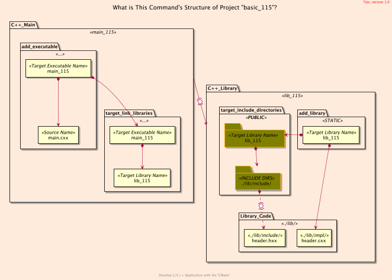
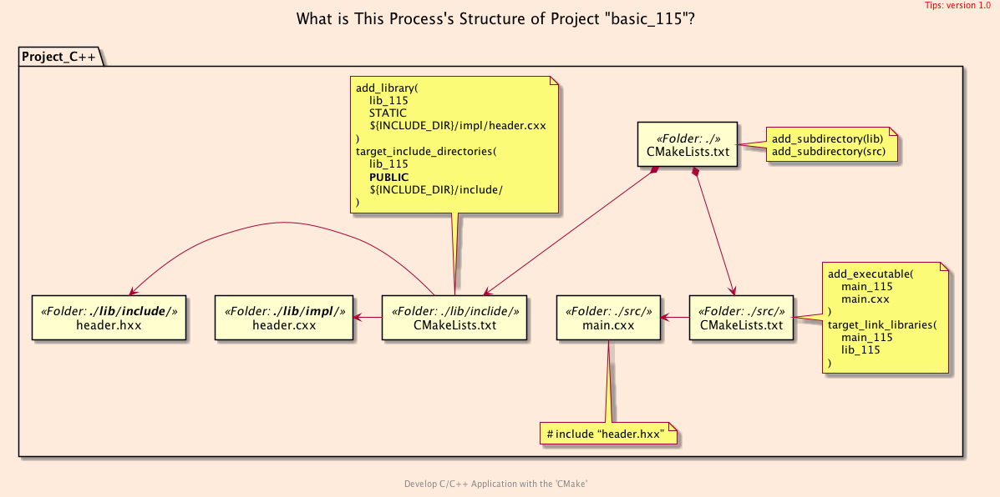
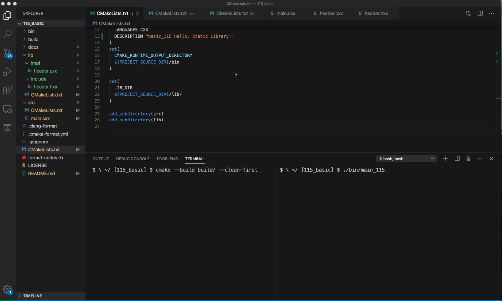

<h2>Hello, PRIVATE/PUBLIC!</h2>
<h3>Difference between <code>PRIVATE</code>/<code>PUBLIC</code> with <code>target_include_directories</code></h3>
</br>
</br>

[@Gitter](https://gitter.im/cnruby) :gitter.im/cnruby<br/>
Code ID: basic_115</br>
Code Name: Hello, PRIVATE/PUBLIC!</br>
<p class ="fragment" data-audio-src="docs/115/audio/basic_115-01.m4a"></p>


* [Youtube Video](https://youtu.be/pmRWYYEXLoc)


<h2>TABLE of CONTENTS</h2>

- [The Structures of Project](#the-structures-of-project)
  - [The <code>Folder's</code> Structure](#the-folders-structure)
  - [The <code>Command's</code> Structure](#the-commands-structure)
  - [The <code>Process's</code> Structure](#the-processs-structure)
- [Analyze The Build of <code>CMake</code>](#analyze-the-build-of-cmake)
  - [The Listfile of Folder <code>'lib'</code>](#the-listfile-of-folder-lib)
  - [The Listfile of Folder <code>'src'</code>](#the-listfile-of-folder-src)
  - [Demonstrate Build's Process on <code>CMake<code>](#demonstrate-builds-process-on-codecmakecode)
- [Final Summary](#final-summary)
- [References](#references)
- [The Project's Commands](#the-projects-commands)
  - [Formatting The Codes](#formatting-the-codes)
  - [Get The Code with Shell Commands](#get-the-code-with-shell-commands)
  - [Build and Run The Project](#build-and-run-the-project)
<p class ="fragment" data-audio-src="docs/115/audio/basic_115-02.m4a"></p>


## The Structures of Project
```bash
#<!-- markdown-exec(cmd:cat docs/output/tree.txt) -->#
.
├── CMakeLists.txt
├── lib
│  ├── CMakeLists.txt
│  ├── impl
│  │  └── header.cxx
│  └── include
│     └── header.hxx
└── src
   ├── CMakeLists.txt
   └── main.cxx
#<!-- /markdown-exec -->
```
### The <code>Folder's</code> Structure
<p class ="fragment" data-audio-src="docs/115/audio/basic_115-03.m4a"></p>



### The <code>Command's</code> Structure
<p class ="fragment" data-audio-src="docs/115/audio/basic_115-04.m4a"></p>



### The <code>Process's</code> Structure
<p class ="fragment" data-audio-src="docs/115/audio/basic_115-05.m4a"></p>


## Analyze The Build of <code>CMake</code>

<p class ="fragment" data-audio-src="docs/115/audio/basic_115-06.m4a"></p>


```bash
#<!-- markdown-exec(cmd:cat lib/CMakeLists.txt) -->#
add_library(
  lib_115 STATIC
  ${LIB_DIR}/impl/header.cxx
)
target_include_directories(
    lib_115
    PUBLIC
    ${LIB_DIR}/include/
)
#<!-- /markdown-exec -->
```
### The Listfile of Folder <code>'lib'</code>
<p class ="fragment" data-audio-src="docs/115/audio/basic_115-07.m4a"></p>


```bash
#<!-- markdown-exec(cmd:cat src/CMakeLists.txt) -->#
add_executable(
  main_115
  main.cxx
)
target_link_libraries(main_115 lib_115)
#<!-- /markdown-exec -->
```
### The Listfile of Folder <code>'src'</code>
<p class ="fragment" data-audio-src="docs/115/audio/basic_115-08.m4a"></p>


### Demonstrate Build's Process on <code>CMake<code>
<video width="720" height="480" controls data-autoplay>
  <source src="docs/115/video/basic_115-09.mov" autoplay=true type="video/mp4">
</video>


## Final Summary
<p class ="fragment" data-audio-src="docs/115/audio/basic_115-10.m4a"></p>


<h1><!-- markdown-exec(cmd:echo "感谢大家观看!") -->感谢大家观看!<!-- /markdown-exec --></h1>

@Gitter: gitter.im/cnruby<br/>

@Github: github.com/cnruby<br/>

@Twitter: twitter.com/cnruby<br/>

@Blogspot: cnruby.blogspot.com


## References
- https://cmake.org/pipermail/cmake/2016-May/063400.html
- https://stackoverflow.com/questions/26243169/cmake-target-include-directories-meaning-of-scope


## The Project's Commands


### Formatting The Codes
```bash
ruby format-codes.rb
```


### Get The Code with Shell Commands
```bash
git clone https://github.com/cnruby/w3h1_cmake.git basic_115
cd basic_115
git checkout basic_115
code .
```


### Build and Run The Project
```bash
cmake -GNinja -Bbuild/
cmake --build build/ --clean-first -v
cmake --build build/ --target clean
cmake --build build/ --clean-first -v &> v11.txt
./bin/main_115
```