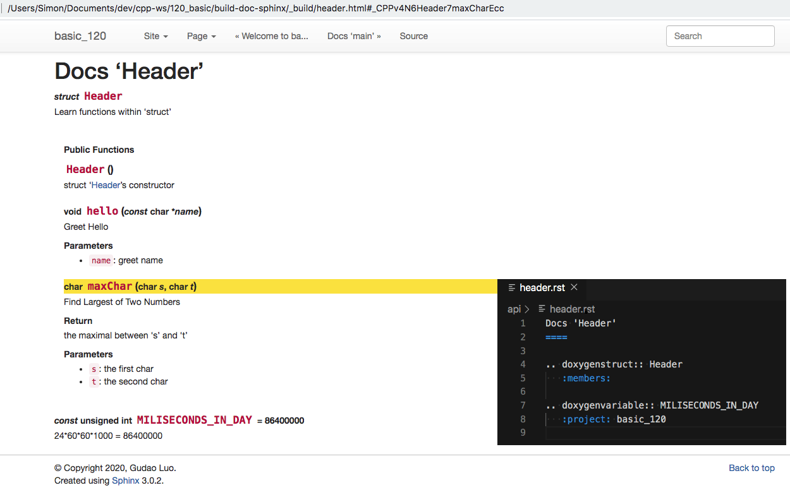
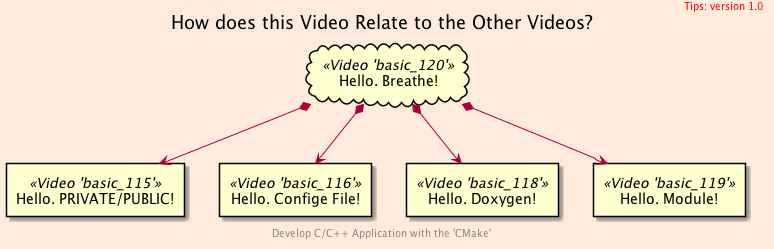
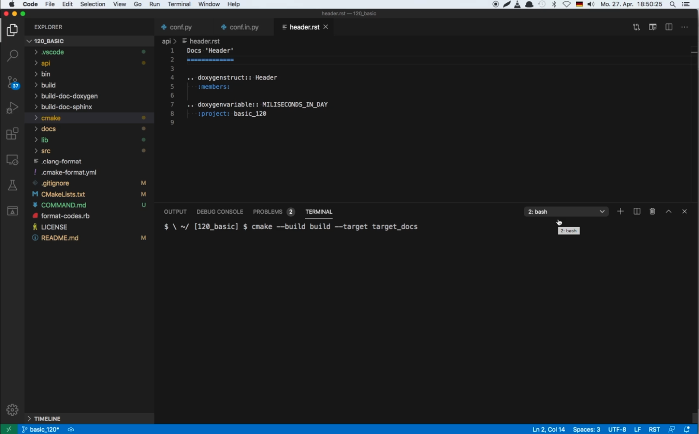
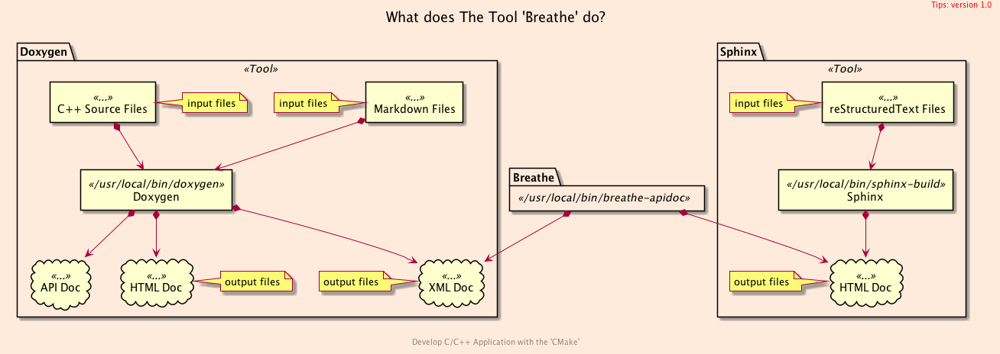
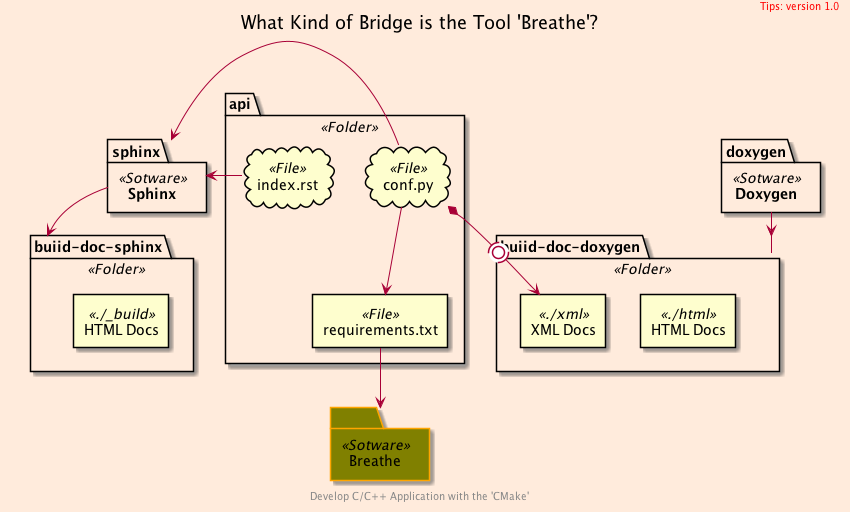

<h2>Hello, <code>Breathe</code>!</h2>
<h3>Generating functional Documentation For '<code>C/C++</code>'s Sources</h3>
</br>
</br>

[@Gitter](https://gitter.im/cnruby) :gitter.im/cnruby<br/>
Code ID: basic_120</br>
Code Name: Hello, Breathe!</br>
<p class ="fragment" data-audio-src="docs/120/audio/basic_120-01.m4a"></p>


[<h1>Youtube Video</h1>](https://youtu.be/RE6rbuy11Z0)


<h2>TABLE of CONTENTS</h2>

- [About The Project](#about-the-project)
  - [Requirements](#requirements)
  - [Install Breathe, Doxygen and Sphinx on MacOS](#install-breathe-doxygen-and-sphinx-on-macos)
  - [How does this Video Relate to the Other Videos?](#how-does-this-video-relate-to-the-other-videos)
- [Generation <code>'Breathe's</code> API Documentation](#generation-breathes-api-documentation)
  - [What is The Tool <code>breathe</code>](#what-is-the-tool-breathe)
  - [Get The Code with Shell Commands](#get-the-code-with-shell-commands)
  - [Illustrate Generating <code>'Breathe's</code> API Documentation](#illustrate-generating-breathes-api-documentation)
  - [The <code>Folder's</code> Structure](#the-folders-structure)
  - [Commands for The Illustratation](#commands-for-the-illustratation)
- [Final Summary](#final-summary)
- [References](#references)
<div class ="fragment" data-audio-src="docs/120/audio/basic_120-02.m4a"></div>


## About The Project

<div class ="fragment" data-audio-src="docs/120/audio/basic_120-03.m4a"></div>


### Requirements
- [VS Code 1.43.0+](https://code.visualstudio.com/)
- [CMake 3.17.0+](https://cmake.org/)
- [Python 3.7+](https://www.python.org/)
- [Doxygen 1.8.17](http://www.doxygen.nl/)
- [Graphviz 2.43.0+](http://graphviz.org/)
- [Sphinx 3.0.2](https://www.sphinx-doc.org/)
- [Sphinx bootstrap theme](https://github.com/ryan-roemer/sphinx-bootstrap-theme)
- [Breathe 4.16.0+: Sphinx bridge to Doxygen](https://github.com/michaeljones/breathe)
- [VS Code Extension: reStructuredText](https://marketplace.visualstudio.com/items?itemName=lextudio.restructuredtext)
<div class ="fragment" data-audio-src="docs/120/audio/basic_120-04.m4a"></div>


### Install Breathe, Doxygen and Sphinx on MacOS
```bash
brew install doxygen
brew cask install graphviz
pip install sphinx sphinx-autobuild
brew install sphinx-doc
pip install sphinx_bootstrap_theme
pip install breathe
```
<div class ="fragment" data-audio-src="docs/120/audio/basic_120-05.m4a"></div>


### How does this Video Relate to the Other Videos?

<div class ="fragment" data-audio-src="docs/120/audio/basic_120-06.m4a"></div>


## Generation <code>'Breathe's</code> API Documentation

<div class ="fragment" data-audio-src="docs/120/audio/basic_120-07.m4a"></div>


### What is The Tool <code>breathe</code>

<div class ="fragment" data-audio-src="docs/120/audio/basic_120-08.m4a"></div>


### Get The Code with Shell Commands
```bash
git clone https://github.com/cnruby/w3h1_cmake.git basic_120
cd basic_120
git checkout basic_120
code .
```
<div class ="fragment" data-audio-src="docs/120/audio/basic_120-09.m4a"></div>


### Illustrate Generating <code>'Breathe's</code> API Documentation
<video width="720" height="480" controls data-autoplay>
  <source src="docs/120/video/basic_120-10.mp4" autoplay=true type="video/mp4">
</video>


### The <code>Folder's</code> Structure
```bash
#<!-- markdown-exec(cmd:cat docs/output/tree.txt) -->#
.
├── api
│  ├── conf.py
│  ├── header.rst
│  ├── index.rst
│  ├── main.rst
│  └── requirements.txt
├── cmake
│  ├── CMakeLists.txt
│  ├── doxygen
│  │  └── CMakeLists.txt
│  ├── module
│  │  └── FindSphinx.cmake
│  └── sphinx
│     ├── CMakeLists.txt
│     └── conf.in.py
├── CMakeLists.txt
├── lib
│  ├── CMakeLists.txt
│  ├── header.cxx
│  └── header.hxx
└── src
   ├── CMakeLists.txt
   └── main.cxx
#<!-- /markdown-exec -->
```
<p class ="fragment" data-audio-src="docs/120/audio/basic_120-11.m4a"></p>


### Commands for The Illustratation
```bash
cmake -GNinja -Bbuild/
cmake --build build --target target_doxygen
cmake --build build --target target_sphinx
cmake --build build --target target_docs
open build-doc-doxygen/html/index.html
open build-doc-sphinx/_build/index.html
```
<div class ="fragment" data-audio-src="docs/120/audio/basic_120-12.m4a"></div>


## Final Summary

<p class ="fragment" data-audio-src="docs/120/audio/basic_120-13.m4a"></p>


<h1><!-- markdown-exec(cmd:echo "感谢大家观看!") -->感谢大家观看!<!-- /markdown-exec --></h1>

@Gitter: gitter.im/cnruby<br/>

@Github: github.com/cnruby<br/>

@Twitter: twitter.com/cnruby<br/>

@Blogspot: cnruby.blogspot.com


## References
- https://www.sphinx-doc.org/en/master/usage/installation.html
- https://devblogs.microsoft.com/cppblog/clear-functional-c-documentation-with-sphinx-breathe-doxygen-cmake/
- https://github.com/InsightSoftwareConsortium/ITKExamples/blob/master/CMake/FindSphinx.cmake
- https://eb2.co/blog/2012/03/sphinx-and-cmake-beautiful-documentation-for-c---projects/
- https://stackoverflow.com/questions/26464879/how-to-build-cmake-documentation-with-sphinx
- https://cmake.org/pipermail/cmake/2009-February/027365.html
- http://macappstore.org/doxygen/
- http://www.doxygen.nl/
- http://macappstore.org/doxygen/
- http://macappstore.org/graphviz-2/
- http://graphviz.org/
- https://stackoverflow.com/questions/24488250/check-graphviz-installed-version-on-ubuntu
- https://github.com/TartanLlama/cpp-documentation-example
- https://www.sphinx-doc.org/en/master/usage/quickstart.html
- https://github.com/akheron/jansson/blob/master/cmake/FindSphinx.cmake
- https://github.com/InsightSoftwareConsortium/ITKExamples/blob/master/CMake/FindSphinx.cmake
- https://gitlab.cern.ch/dss/eos/blob/1fda896069c59c8ab414770363a6bee94e4ad013/cmake/FindSphinx.cmake
- https://raw.githubusercontent.com/llvm-mirror/llvm/master/cmake/modules/FindSphinx.cmake
- https://ceres-solver.googlesource.com/ceres-solver/+/refs/tags/1.12.0rc4/CMakeLists.txt
- https://ceres-solver.googlesource.com/ceres-solver/+/refs/tags/1.12.0rc4/cmake/FindSphinx.cmake
- https://stackoverflow.com/questions/47553569/how-can-i-build-multiple-targets-using-cmake-build?rq=1
- https://github.com/michaeljones/breathe
- https://breathe.readthedocs.io/en/latest/index.html