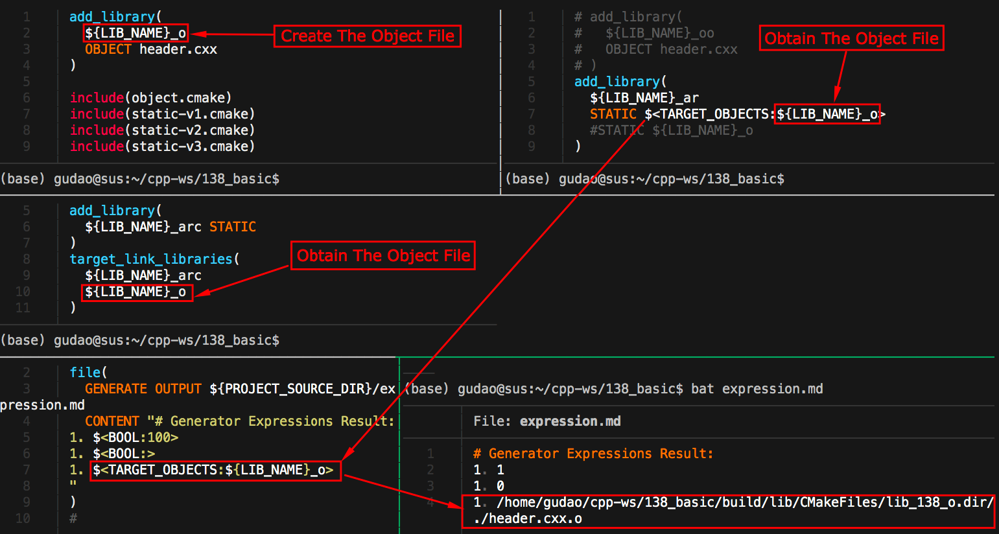
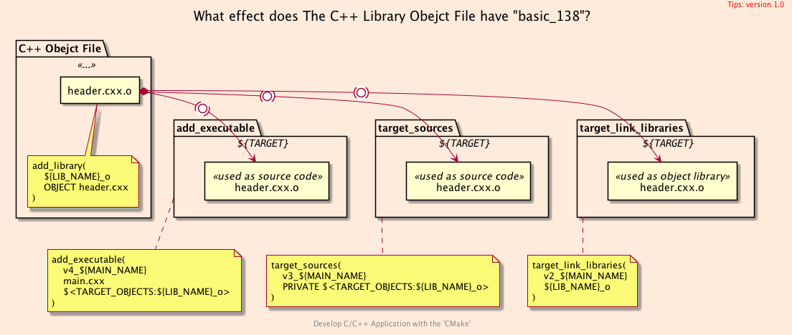
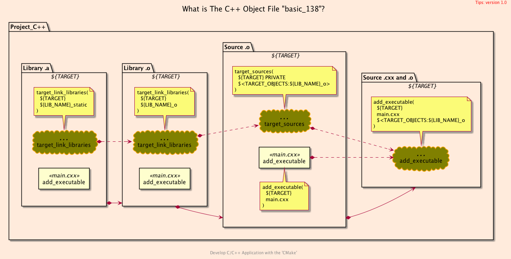
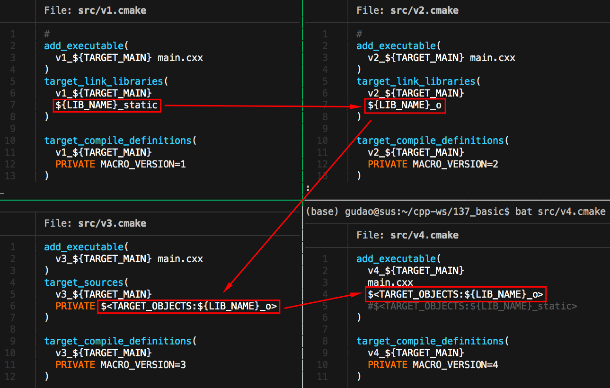
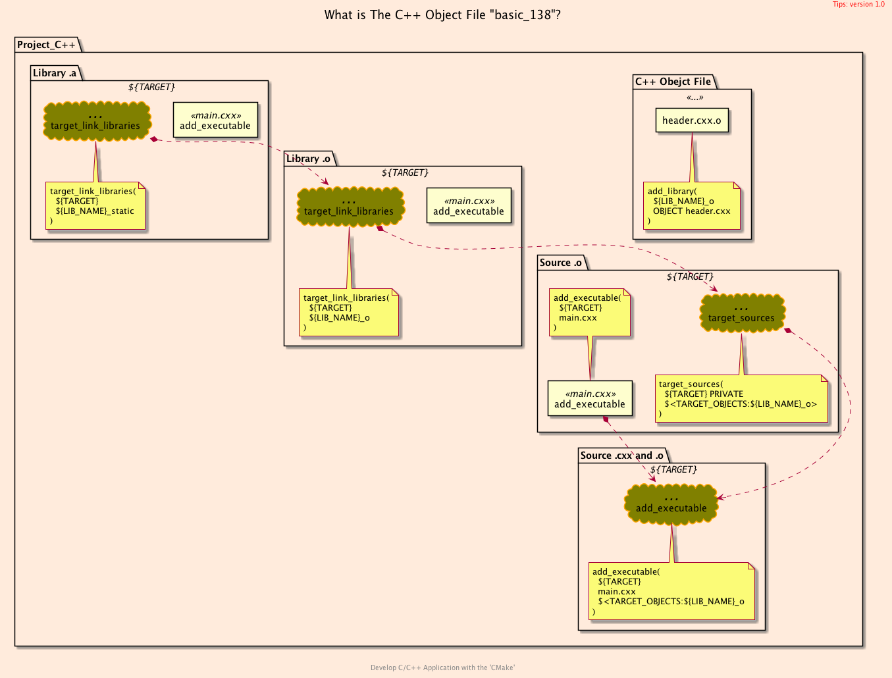

<h2>Hello, Object File!</h2>
<h3>How to Obtain and Apply The Object File of Library in CMake</h3>
</br>
</br>

[@Gitter](https://gitter.im/cnruby) :gitter.im/cnruby<br/>
Code ID: basic_138</br>
Code Name: Hello, Object File!</br>
<p class ="fragment" data-audio-src="docs/138/audio/basic_138-01.m4a"></p>


[<h1>Youtube Video</h1>](https://youtu.be/1LMmQ_3kjFA)


<h2>TABLE of CONTENTS</h2>

- [About The Project](#about-the-project)
  - [Explaining The Effect of <code>C++</code> Object File](#explaining-the-effect-of-c-object-file)
  - [Explaining The Evolution of <code>C++</code> Object File](#explaining-the-evolution-of-c-object-file)
  - [Building The Project Four Versions](#building-the-project-four-versions)
- [A Demonstration of Building Project](#a-demonstration-of-building-project)
- [Final Summary](#final-summary)
- [References](#references)
  - [Requirements](#requirements)
  - [Get The Code with Shell Commands](#get-the-code-with-shell-commands)
  - [The Structure of Folder](#the-structure-of-folder)
<div class ="fragment" data-audio-src="docs/138/audio/basic_138-02.m4a"></div>




## About The Project
<p class ="fragment" data-audio-src="docs/138/audio/basic_138-03.m4a"></p>




### Explaining The Effect of <code>C++</code> Object File
<p class ="fragment" data-audio-src="docs/138/audio/basic_138-04.m4a"></p>




### Explaining The Evolution of <code>C++</code> Object File
<p class ="fragment" data-audio-src="docs/138/audio/basic_138-05.m4a"></p>




### Building The Project Four Versions 
<p class ="fragment" data-audio-src="docs/138/audio/basic_138-06.m4a"></p>


## A Demonstration of Building Project
<video width="720" height="480" controls data-autoplay>
  <source src="docs/138/video/basic_138-07.mp4" autoplay=true type="video/mp4">
</video>




## Final Summary
<p class ="fragment" data-audio-src="docs/138/audio/basic_138-08.m4a"></p>


<h1><!-- markdown-exec(cmd:echo "感谢大家观看!") -->感谢大家观看!<!-- /markdown-exec --></h1>

@Gitter: gitter.im/cnruby<br/>

@Github: github.com/cnruby<br/>

@Twitter: twitter.com/cnruby<br/>

@Blogspot: cnruby.blogspot.com


## References
- https://stackoverflow.com/questions/8249945/what-is-object-in-object-file-and-why-is-it-called-this-way
- https://qiita.com/mrk_21/items/57075ce36f49ce0aacf4
- https://stackoverflow.com/questions/35696103/cmake-wildcard-for-target-objects
- https://stackoverflow.com/questions/44767099/linking-cmake-interface-libraries-with-object-libraries
- https://stackoverflow.com/questions/49265945/cmake-append-objects-from-different-cmakelists-txt-into-one-library
- https://stackoverflow.com/questions/58969829/cmake-object-files-of-executable-in-custom-command
- https://github.com/dev-cafe/cmake-cookbook
- https://www.dealii.org/9.1.1/users/cmakelists.html
- https://cmake.org/cmake/help/latest/manual/cmake-generator-expressions.7.html
- https://stackoverflow.com/questions/50684930/how-to-collect-object-files-o-in-a-particular-directory-with-cmake
- https://stackoverflow.com/questions/48296061/cmakes-objects-output-folder-variable
- https://stackoverflow.com/questions/29884856/how-to-get-path-to-object-files-with-cmake-for-both-multiconfiguration-generator
- https://stackoverflow.com/questions/38296756/what-is-the-idiomatic-way-in-cmake-to-add-the-fpic-compiler-option


### Requirements
- C++ STANDARD 17+
- [Ubuntu 20.04+](https://ubuntu.com/)
- [VS Code 1.43.0+](https://code.visualstudio.com/)
- [CMake 3.17.2+](https://cmake.org/)


### Get The Code with Shell Commands
```bash
git clone https://github.com/cnruby/w3h1_cmake.git basic_138
cd basic_138
git checkout basic_138
code .
```


### The Structure of Folder
```bash
#<!-- markdown-exec(cmd:cat ./docs/output/tree.txt) -->
<!-- /markdown-exec -->
```
