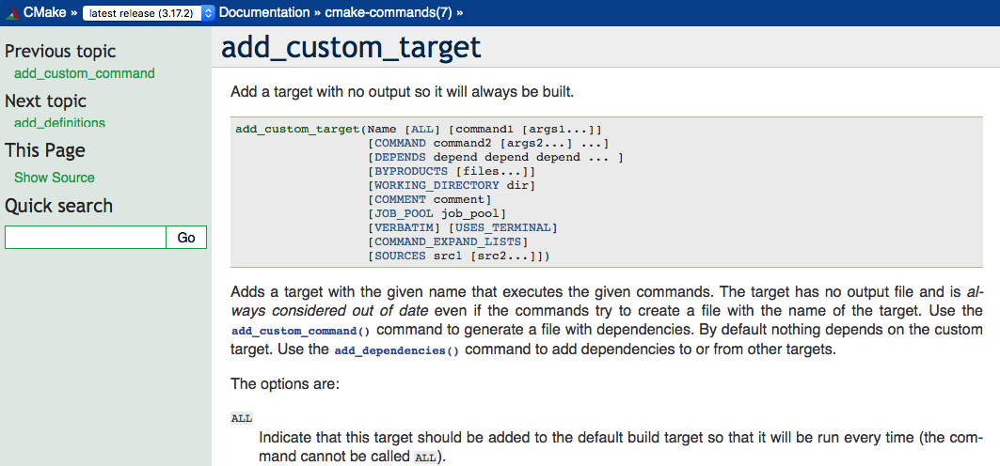
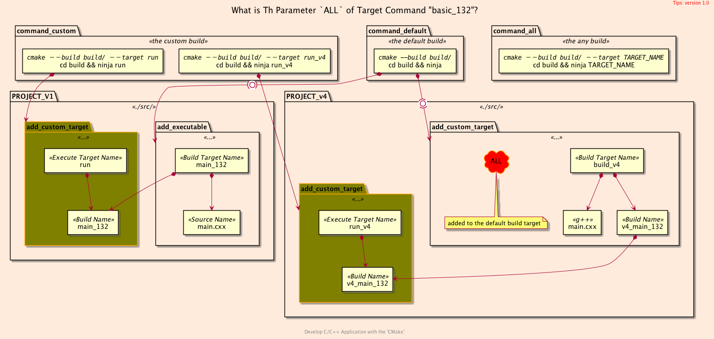

<h2>Hello, Custom Target!</h2>
<h3>Adding and Using A Custom Target in <code>CMake</code></h3>
</br>
</br>

[@Gitter](https://gitter.im/cnruby) :gitter.im/cnruby<br/>
Code ID: basic_132</br>
Code Name: Hello, Custom Target!</br>
<p class ="fragment" data-audio-src="docs/132/audio/basic_132-01.m4a"></p>


[<h1>Youtube Video</h1>](https://youtu.be/xcJbhFgVI04)


<h2>TABLE of CONTENTS</h2>

- [About The Project](#about-the-project)
  - [The <code>Folder's</code> Structure](#the-folders-structure)
- [Explaining the Custum Target](#explaining-the-custum-target)
  - [The File `v2.cmake` of Folder <code>'src'</code>](#the-file-v2cmake-of-folder-src)
  - [The File `v3.cmake` of Folder <code>'src'</code>](#the-file-v3cmake-of-folder-src)
  - [Demonstrate Building The Project](#demonstrate-building-the-project)
- [How to Use the Parameter `ALL` of Custom Target](#how-to-use-the-parameter-all-of-custom-target)
  - [The File `v5.cmake` of Folder <code>'src'</code>](#the-file-v5cmake-of-folder-src)
  - [Demonstrate Building The Project](#demonstrate-building-the-project-1)
- [Final Summary](#final-summary)
- [References](#references)
  - [Requirements](#requirements)
  - [Get The Code with Shell Commands](#get-the-code-with-shell-commands)
<div class ="fragment" data-audio-src="docs/132/audio/basic_132-02.m4a"></div>


## About The Project

<div class ="fragment" data-audio-src="docs/132/audio/basic_132-03.m4a"></div>


```bash
#<!-- markdown-exec(cmd:cat docs/output/tree.txt) -->#
.
├── CMakeLists.txt
└── src
  ├── CMakeLists.txt
  ├── main.cxx
  ├── v1.cmake
  ├── v2.cmake
  ├── v3.cmake
  ├── v4.cmake
  └── v5.cmake
#<!-- /markdown-exec -->
```
### The <code>Folder's</code> Structure
<p class ="fragment" data-audio-src="docs/132/audio/basic_132-04.m4a"></p>


## Explaining the Custum Target
```bash
#<!-- markdown-exec(cmd:cat src/v1.cmake) -->#
add_executable(
  main_132        # define a target and executable name for build
  main.cxx        # c++ file name
)
add_custom_target(
  run             # define a custom target name for execute
  main_132        # executable file name
)
# cd build && ninja run       # ./bin/main_132
# cmake --build build/ --target run
#<!-- /markdown-exec -->
```
<p class ="fragment" data-audio-src="docs/132/audio/basic_132-05.m4a"></p>


```bash
#<!-- markdown-exec(cmd:cat src/v2.cmake) -->#
set( _BUILD_TARGET v2_main_132 )
add_executable(
  ${_BUILD_TARGET}
  main.cxx
)
target_include_directories(
  ${_BUILD_TARGET}
  PRIVATE ${_PROJECT_CONIFG_DIR}
)
add_custom_target(
  run_v2
  ${_BUILD_TARGET}
)
#<!-- /markdown-exec -->
```
### The File `v2.cmake` of Folder <code>'src'</code>
<p class ="fragment" data-audio-src="docs/132/audio/basic_132-06.m4a"></p>


```bash
#<!-- markdown-exec(cmd:cat src/v3.cmake) -->#
set( _BUILD_TARGET v3_main_132 )
add_executable(
  ${_BUILD_TARGET} main.cxx
)
set_property(
  TARGET ${_BUILD_TARGET}
  PROPERTY RUNTIME_OUTPUT_DIRECTORY ${_RUNTIME_OUTPUT_DIR}
)
add_custom_target(
  run_v3
  ${_BUILD_TARGET}
  COMMENT "Run with working directory ${_RUNTIME_OUTPUT_DIR} configuration"
)
#<!-- /markdown-exec -->
```
### The File `v3.cmake` of Folder <code>'src'</code>
<p class ="fragment" data-audio-src="docs/132/audio/basic_132-07.m4a"></p>


### Demonstrate Building The Project
<video width="720" height="480" controls data-autoplay>
  <source src="docs/132/video/basic_132-08.mov" autoplay=true type="video/mp4">
</video>


## How to Use the Parameter `ALL` of Custom Target
```bash
#<!-- markdown-exec(cmd:cat src/v4.cmake) -->#
set( _EXECUTE_NAME v4_main_132 )
add_custom_target(
  mkdir_v4
  mkdir -p ${CMAKE_RUNTIME_OUTPUT_DIRECTORY}
)
add_custom_target(
  build_v4
  ALL
  COMMAND g++ -o ${CMAKE_RUNTIME_OUTPUT_DIRECTORY}/${_EXECUTE_NAME}
                 ${PROJECT_SOURCE_DIR}/src/main.cxx -I ${_PROJECT_CONIFG_DIR}
  DEPENDS mkdir_v4
)
add_custom_target(
  run_v4
  ./${_EXECUTE_NAME}
  WORKING_DIRECTORY ${CMAKE_RUNTIME_OUTPUT_DIRECTORY}
)
#<!-- /markdown-exec -->
```
<p class ="fragment" data-audio-src="docs/132/audio/basic_132-09.m4a"></p>


```bash
#<!-- markdown-exec(cmd:cat src/v5.cmake) -->#
set( _BUILD_TARGET v5_main_132 )
add_custom_target(
  mkdir_v5
  mkdir -p ${_RUNTIME_OUTPUT_DIR}
)
add_custom_target(
  run_v5              # define a custom target name for build and execute
  ALL
  g++ -o ${_RUNTIME_OUTPUT_DIR}/${_BUILD_TARGET}
         ${PROJECT_SOURCE_DIR}/src/main.cxx
      -I ${_PROJECT_CONIFG_DIR}
  COMMAND ./${_BUILD_TARGET}
  WORKING_DIRECTORY ${_RUNTIME_OUTPUT_DIR}
  DEPENDS mkdir_v5
  COMMENT "Working Directory: ${_RUNTIME_OUTPUT_DIR}"
)
#<!-- /markdown-exec -->
```
### The File `v5.cmake` of Folder <code>'src'</code>
<p class ="fragment" data-audio-src="docs/132/audio/basic_132-10.m4a"></p>


### Demonstrate Building The Project
<video width="720" height="480" controls data-autoplay>
  <source src="docs/132/video/basic_132-11.mov" autoplay=true type="video/mp4">
</video>



## Final Summary
<p class ="fragment" data-audio-src="docs/132/audio/basic_132-12.m4a"></p>


<h1><!-- markdown-exec(cmd:echo "感谢大家观看!") -->感谢大家观看!<!-- /markdown-exec --></h1>

@Gitter: gitter.im/cnruby<br/>

@Github: github.com/cnruby<br/>

@Twitter: twitter.com/cnruby<br/>

@Blogspot: cnruby.blogspot.com


## References
- https://cmake.org/cmake/help/latest/command/add_custom_target.html
- https://stackoverflow.com/questions/50198141/cmake-custom-target-doesnt-build
- https://stackoverflow.com/questions/43885692/build-custom-target-by-default-in-cmake
- https://gist.github.com/baiwfg2/39881ba703e9c74e95366ed422641609
- https://stackoverflow.com/questions/43885692/build-custom-target-by-default-in-cmake
- https://stackoverflow.com/questions/11971917/why-does-cmake-make-a-distinction-between-a-target-and-a-command
- https://samthursfield.wordpress.com/2015/11/21/cmake-dependencies-between-targets-and-files-and-custom-commands/
- https://gist.github.com/socantre/7ee63133a0a3a08f3990
- https://stackoverflow.com/questions/24163778/how-to-add-custom-target-that-depends-on-make-install
- https://stackoverflow.com/questions/30719275/add-custom-command-is-not-generating-a-target
- https://stackoverflow.com/questions/26024235/how-to-call-a-cmake-function-from-add-custom-target-command
- https://gist.github.com/socantre/7ee63133a0a3a08f3990
- https://blog.csdn.net/gubenpeiyuan/article/details/51096777
- https://stackoverflow.com/questions/43885692/build-custom-target-by-default-in-cmake
- https://gitlab.kitware.com/cmake/cmake/issues/16767
- https://www.dealii.org/8.4.1/users/cmakelists.html

### Requirements
- [VS Code 1.43.0+](https://code.visualstudio.com/)
- [CMake 3.17.0+](https://cmake.org/)


### Get The Code with Shell Commands
```bash
git clone https://github.com/cnruby/w3h1_cmake.git basic_132
cd basic_132
git checkout basic_132
code .
```
