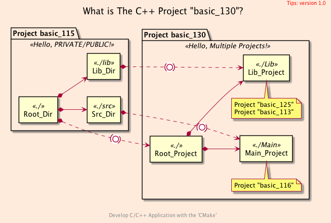
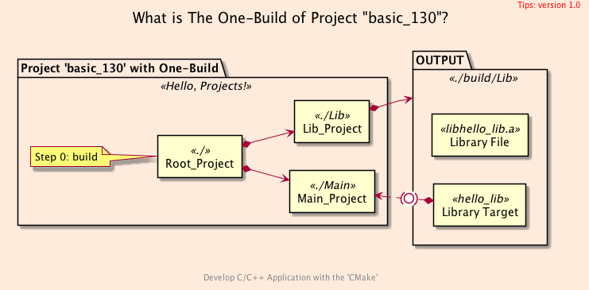
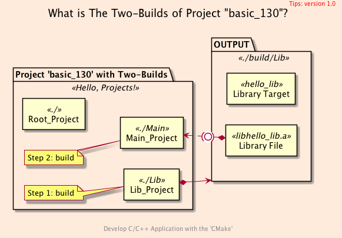
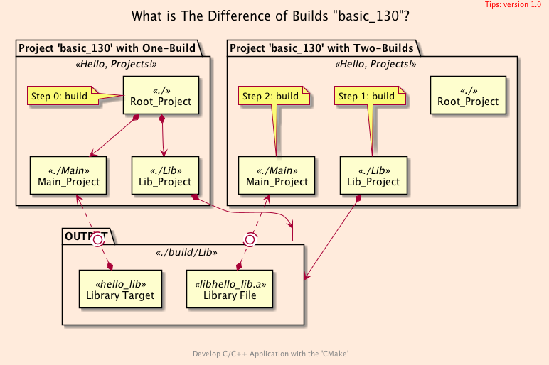

<h2>Hello, <code>Multiple Projects</code>!</h2>
<h3>Creating a Solution with <code>C++</code> Multiple Projects</h3>
</br>
</br>

[@Gitter](https://gitter.im/cnruby) :gitter.im/cnruby<br/>
Code ID: basic_130</br>
Code Name: Hello, Multiple Projects!</br>
<p class ="fragment" data-audio-src="docs/130/audio/basic_130-01.m4a"></p>


<h2>TABLE of CONTENTS</h2>

- [About The Project](#about-the-project)
  - [The <code>Folder's</code> Structure](#the-folders-structure)
- [The One-Build of Project](#the-one-build-of-project)
  - [The Listfile of Folder <code>'./Main'</code>](#the-listfile-of-folder-main)
  - [The File <code>'integrate.cmake'</code></code>](#the-file-integratecmakecode)
  - [Demonstrate The One-Build of Project](#demonstrate-the-one-build-of-project)
- [The Two-Builds of Project](#the-two-builds-of-project)
  - [The Listfile of Folder <code>'./Main'</code>](#the-listfile-of-folder-main-1)
  - [The File <code>'develop.cmake'</code>](#the-file-developcmake)
  - [Demonstrate The Two-Builds of Project](#demonstrate-the-two-builds-of-project)
- [Final Summary](#final-summary)
- [References](#references)
  - [Important](#important)
  - [General](#general)
  - [Requirements](#requirements)
  - [Get The Code with Shell Commands](#get-the-code-with-shell-commands)
<div class ="fragment" data-audio-src="docs/130/audio/basic_130-02.m4a"></div>


## About The Project

<div class ="fragment" data-audio-src="docs/130/audio/basic_130-03.m4a"></div>


```bash
#<!-- markdown-exec(cmd:cat docs/output/tree.txt) -->#
.
├── CMakeLists.txt
├── Lib
│  ├── CMakeLists.txt
│  ├── impl
│  │  └── hello.cxx
│  └── include
│     └── hello.hxx
└── Main
   │   ...
   ├── CMakeLists.txt
   └── src
      ├── CMakeLists.txt
      └── main.cxx
#<!-- /markdown-exec -->
```
### The <code>Folder's</code> Structure
<p class ="fragment" data-audio-src="docs/130/audio/basic_130-04.m4a"></p>


## The One-Build of Project

<p class ="fragment" data-audio-src="docs/130/audio/basic_130-05.m4a"></p>


### The Listfile of Folder <code>'./Main'</code>
```bash
#<!-- markdown-exec(cmd:cat ./Main/CMakeLists.txt) -->#
cmake_minimum_required(VERSION 3.3)
project(cxx_main VERSION 0.1.0 LANGUAGES CXX DESCRIPTION "Hello, Multiple-Project's Main!" )

include("cmake/Initialize.cmake")
add_subdirectory(cmake)
include_directories(${PROJECT_CONIFG_DIR})

if(TARGET hello_lib)
  message(STATUS "The Library 'hello_lib' exists!")
  # Project "basic_113"
  include("src/integrate.cmake")
else()
  message(STATUS "The Library 'hello_lib' exists not.")
  # Project "basic_125"
  include("src/develop.cmake")
endif()
#<!-- /markdown-exec -->
```
<p class ="fragment" data-audio-src="docs/130/audio/basic_130-06.m4a"></p>


### The File <code>'integrate.cmake'</code></code>
```bash
#<!-- markdown-exec(cmd:cat ./Main/src/integrate.cmake) -->#
add_executable(main_130 src/main.cxx)
# Method 1
target_link_libraries(main_130 hello_lib)

# Method 2
#add_library(Any::alias ALIAS hello_lib)
#target_link_libraries(main_130 Any::alias)
#<!-- /markdown-exec -->
```
<p class ="fragment" data-audio-src="docs/130/audio/basic_130-07.m4a"></p>


### Demonstrate The One-Build of Project
<video width="720" height="480" controls data-autoplay>
  <source src="docs/130/video/basic_130-08.mp4" autoplay=true type="video/mp4">
</video>


## The Two-Builds of Project

<p class ="fragment" data-audio-src="docs/130/audio/basic_130-09.m4a"></p>


### The Listfile of Folder <code>'./Main'</code>
```bash
#<!-- markdown-exec(cmd:cat ./Main/CMakeLists.txt) -->#
cmake_minimum_required(VERSION 3.3)
project(cxx_main VERSION 0.1.0 LANGUAGES CXX DESCRIPTION "Hello, Multiple-Project's Main!" )

include("cmake/Initialize.cmake")
add_subdirectory(cmake)
include_directories(${PROJECT_CONIFG_DIR})

if(TARGET hello_lib)
  message(STATUS "The Library 'hello_lib' exists!")
  # Project "basic_113"
  include("src/integrate.cmake")
else()
  message(STATUS "The Library 'hello_lib' exists not.")
  # Project "basic_125"
  include("src/develop.cmake")
endif()
#<!-- /markdown-exec -->
```
<p class ="fragment" data-audio-src="docs/130/audio/basic_130-10.m4a"></p>


### The File <code>'develop.cmake'</code>
```bash
#<!-- markdown-exec(cmd:cat ./Main/src/develop.cmake) -->#
add_executable(
  main_130 src/main.cxx
)
target_include_directories(
  main_130 PRIVATE
  ${LIB_INCLUDE_DIR}
)
target_link_libraries(
  main_130
  ${LIB_LIB_DIR}/libhello_lib.a
)
#<!-- /markdown-exec -->
```
<p class ="fragment" data-audio-src="docs/130/audio/basic_130-11.m4a"></p>


### Demonstrate The Two-Builds of Project
<video width="720" height="480" controls data-autoplay>
  <source src="docs/130/video/basic_130-12.mov" autoplay=true type="video/mp4">
</video>




## Final Summary
<p class ="fragment" data-audio-src="docs/130/audio/basic_130-13.m4a"></p>


<h1><!-- markdown-exec(cmd:echo "感谢大家观看!") -->感谢大家观看!<!-- /markdown-exec --></h1>

@Gitter: gitter.im/cnruby<br/>

@Github: github.com/cnruby<br/>

@Twitter: twitter.com/cnruby<br/>

@Blogspot: cnruby.blogspot.com


## References


### Important
- https://github.com/cpp-pm/hunter/releases
- https://hunter.readthedocs.io/en/latest/packages.html
- https://hunter.readthedocs.io/en/latest/creating-new/create/cmake.html
- https://meetingcpp.com/mcpp/slides/2018/lightningtalk_hunter.pdf
- https://geokon-gh.github.io/hunterintro.html
- https://readthedocs.org/projects/hunter/downloads/pdf/latest/
- https://github.com/cpp-pm/gate
- https://discourse.cmake.org/t/hunter-c-c-cmake-package-manager-gained-an-easy-setup-mechanism-via-cmakes-fetchcontent/145
- https://craffael.github.io/lehrfempp/getting_started.html
- https://stackoverflow.com/questions/35689501/cmakes-execute-process-and-arbitrary-shell-scripts
- https://unix.stackexchange.com/questions/42797/openssl-dgst-sha1-producing-an-extraneous-stdin-prefix-and-trailing-new
- https://preshing.com/20170522/learn-cmakes-scripting-language-in-15-minutes/


### General
- https://www.youtube.com/watch?v=wrCObV3qlhM
- https://readthedocs.org/projects/hunter/downloads/pdf/latest/
- https://github.com/hunter-packages
- https://www.youtube.com/watch?v=O2_N8OzPGWQ 
- https://gitlab.lrz.de/ls-mayer-public/hunter/-/tree/042a420e7588ef6a662ccbc49881547f520fb594/examples
- https://github.com/cpp-pm/hunter/tree/master/cmake/projects/
- https://github.com/cpp-pm/hunter/blob/master/cmake/projects/sqlite3/hunter.cmake
- https://gitter.im/cpp-pm/community?at=5e1d99e7cb2aaa2d78377ca2
- https://hunter.readthedocs.io/en/latest/packages/pkg/Boost.html


### Requirements
- [VS Code 1.43.0+](https://code.visualstudio.com/)
- [CMake 3.17.0+](https://cmake.org/)
<div class ="fragment" data-audio-src="docs/130/audio/basic_130-04.m4a"></div>


### Get The Code with Shell Commands
```bash
git clone https://github.com/cnruby/w3h1_cmake.git basic_130
cd basic_130
git checkout basic_130
code .
```
<div class ="fragment" data-audio-src="docs/130/audio/basic_130-05.m4a"></div>