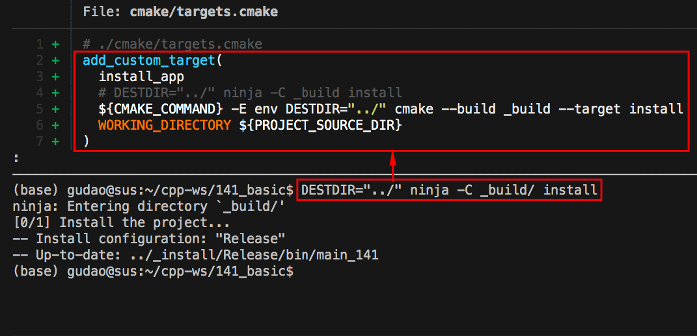
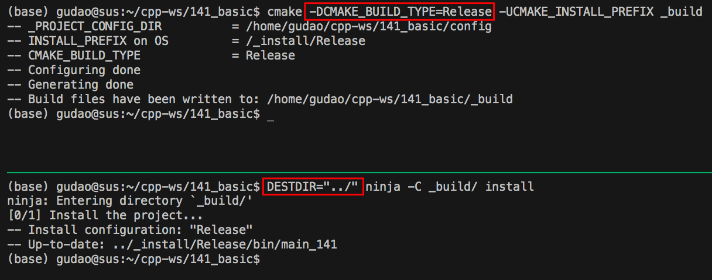
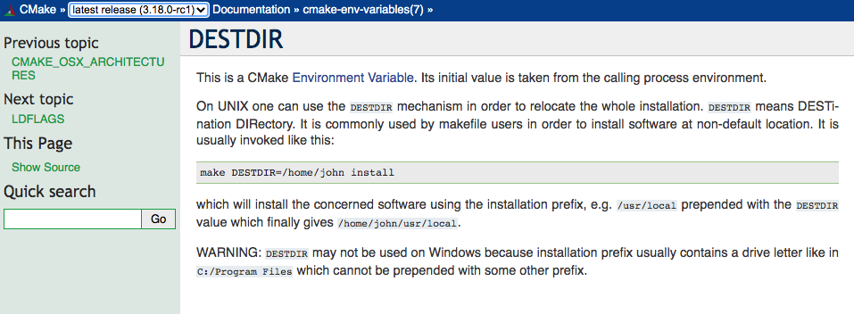
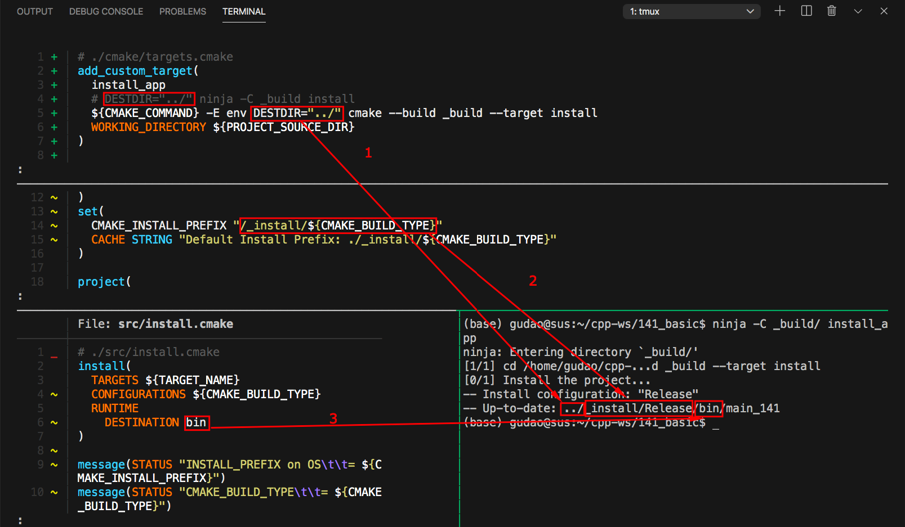
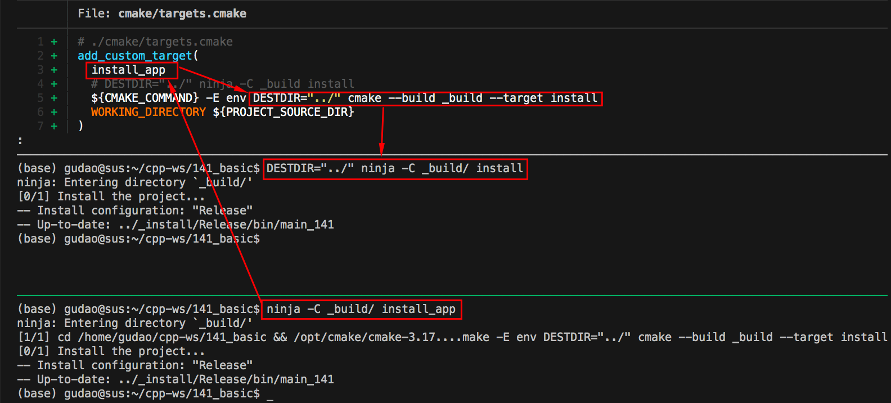

<h2>Hello, install:DESTDIR!</h2>
<h3>How to use CMake Environment Variable `DESTDIR`</h3>
</br>
</br>

[@Gitter](https://gitter.im/cnruby): gitter.im/cnruby<br/>
Code ID: basic_141</br>
Code Name: Hello, install:DESTDIR!</br>
<p class ="fragment" data-audio-src="docs/141/audio/basic_141-01.m4a"></p>


[<h1>Youtube Video</h1>](https://youtu.be/NtYyjwSjt9Q)


<h2>TABLE of CONTENTS</h2>

- [About The Project](#about-the-project)
- [Explaining the <code>CMake</code> Code and Command](#explaining-the-cmake-code-and-command)
  - [<code>CMake's</code> `install` Code](#cmakes-install-code)
  - [<code>CMake's</code> custom target <code>install_app</code> Code](#cmakes-custom-target-install_app-code)
  - [<code>CMake's</code> target <code>install</code> Command](#cmakes-target-install-command)
  - [<code>CMake's</code> target <code>install</code> Command](#cmakes-target-install-command-1)
- [A Demonstration of Building Project](#a-demonstration-of-building-project)
- [Explaining the <code>CMake<code> Environment Variable `DESTDIR`](#explaining-the-cmakecode-environment-variable-codedestdir)
  - [How is The `DESTDIR` combined](#how-is-the-destdir-combined)
  - [How is The custom target `install_app` combined](#how-is-the-custom-target-install_app-combined)
- [Final Summary](#final-summary)
- [References](#references)
  - [General](#general)
  - [CMake API](#cmake-api)
  - [Requirements](#requirements)
  - [Get The Code with Shell Commands](#get-the-code-with-shell-commands)
  - [The Structure of Folder](#the-structure-of-folder)
- [Explain <code>C++</code>  and <code>CMake</code> Code](#explain-c-and-cmake-code)
<div class ="fragment" data-audio-src="docs/141/audio/basic_141-02.m4a"></div>




## About The Project
<p class ="fragment" data-audio-src="docs/141/audio/basic_141-03.m4a"></p>


## Explaining the <code>CMake</code> Code and Command

<p class ="fragment" data-audio-src="docs/141/audio/basic_141-04.m4a"></p>


<!--{ "./src/install.cmake" | line-numbers: " " | lines: 1 7 | code: bash }-->
```bash
 1 # ./src/install.cmake
 2 install(
 3   TARGETS ${TARGET_NAME}
 4   CONFIGURATIONS ${CMAKE_BUILD_TYPE}
 5   RUNTIME
 6     DESTINATION bin
 7 )
```
<!--{ end }-->
### <code>CMake's</code> `install` Code
<p class ="fragment" data-audio-src="docs/141/audio/basic_141-05.m4a"></p>


<!--{ "./cmake/targets.cmake" | line-numbers: " " | lines: 1 7 | code: bash }-->
```bash
 1 # ./cmake/targets.cmake
 2 add_custom_target(
 3   install_app
 4   # DESTDIR="../" ninja -C _build install
 5   ${CMAKE_COMMAND} -E env DESTDIR="${_DESTDIR}" cmake --build _build --target install
 6   WORKING_DIRECTORY ${PROJECT_SOURCE_DIR}
 7 )
```
<!--{ end }-->
### <code>CMake's</code> custom target <code>install_app</code> Code
<p class ="fragment" data-audio-src="docs/141/audio/basic_141-06.m4a"></p>


<!--{ "./docs/cmd/without_custom_install.sh" | line-numbers: " " | code: bash }-->
```bash
 1 # without custom install
 2 cmake -GNinja -H. -B_build
 3 
 4 # For Debug
 5 cmake -DCMAKE_BUILD_TYPE=Debug -UCMAKE_INSTALL_PREFIX _build
 6 ninja -C _build
 7 DESTDIR=../ ninja -C _build install
 8 
 9 # For Release
10 cmake -DCMAKE_BUILD_TYPE=Release -UCMAKE_INSTALL_PREFIX _build
11 ninja -C _build
12 DESTDIR=../ ninja -C _build install
```
<!--{ end }-->
### <code>CMake's</code> target <code>install</code> Command
<p class ="fragment" data-audio-src="docs/141/audio/basic_141-07.m4a"></p>


<!--{ "./docs/cmd/with_custom_install.sh" | line-numbers: " " | code: bash }-->
```bash
 1 # with custom install
 2 cmake -GNinja -H. -B_build
 3 
 4 # use custom target `install_app` with Debug
 5 cmake -DCMAKE_BUILD_TYPE=Debug -UCMAKE_INSTALL_PREFIX _build
 6 ninja -C _build
 7 ninja -C _build install_app
 8 
 9 # use custom target `install_app` with Release
10 cmake -DCMAKE_BUILD_TYPE=Release -UCMAKE_INSTALL_PREFIX _build
11 ninja -C _build
12 ninja -C _build install_app
```
<!--{ end }-->
### <code>CMake's</code> target <code>install</code> Command
<p class ="fragment" data-audio-src="docs/141/audio/basic_141-08.m4a"></p>


## A Demonstration of Building Project
<video width="720" height="480" controls data-autoplay>
  <source src="docs/141/video/basic_141-09.mp4" autoplay=true type="video/mp4">
</video>




## Explaining the <code>CMake<code> Environment Variable `DESTDIR`
<p class ="fragment" data-audio-src="docs/141/audio/basic_141-10.m4a"></p>




### How is The `DESTDIR` combined
<p class ="fragment" data-audio-src="docs/141/audio/basic_141-11.m4a"></p>




### How is The custom target `install_app` combined
<p class ="fragment" data-audio-src="docs/141/audio/basic_141-12.m4a"></p>


## Final Summary
<p class ="fragment" data-audio-src="docs/141/audio/basic_141-13.m4a"></p>


<h1>感谢大家观看!</h1>

@Gitter: gitter.im/cnruby<br/>

@Github: github.com/cnruby<br/>

@Twitter: twitter.com/cnruby<br/>

@Blogspot: cnruby.blogspot.com


## References


### General
- https://stackoverflow.com/questions/44047611/how-to-set-environment-variable-for-build-time-in-cmake
- https://stackoverflow.com/questions/35029277/how-to-modify-environment-variables-passed-to-custom-cmake-target


### CMake API
- https://cmake.org/cmake/help/latest/envvar/DESTDIR.html
- https://cmake.org/cmake/help/latest/command/install.html


### Requirements
- [Ubuntu 20.04+](https://ubuntu.com/)
- [VS Code 1.43.0+](https://code.visualstudio.com/)
- [CMake 3.17.3+](https://cmake.org/)


### Get The Code with Shell Commands
```bash
git clone https://github.com/cnruby/w3h1_cmake.git basic_141
cd basic_141
git checkout basic_141
code .
```


### The Structure of Folder
<!--{ "./docs/output/tree.txt" | code: bash }-->
```bash
.
├── cmake
│  ├── CMakeLists.txt
│  ├── config.hxx.in
│  └── targets.cmake
├── CMakeLists.txt
├── config
│  └── config.hxx
└── src
   ├── CMakeLists.txt
   ├── install.cmake
   └── main.cxx
```
<!--{ end }-->
## Explain <code>C++</code>  and <code>CMake</code> Code 
<p class ="fragment" data-audio-src="docs/137/audio/basic_137-03.m4a"></p>
