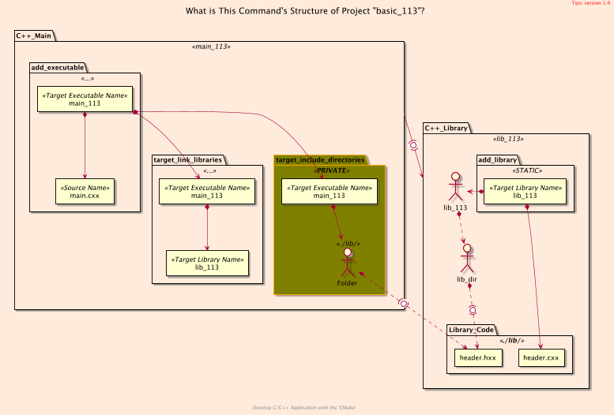
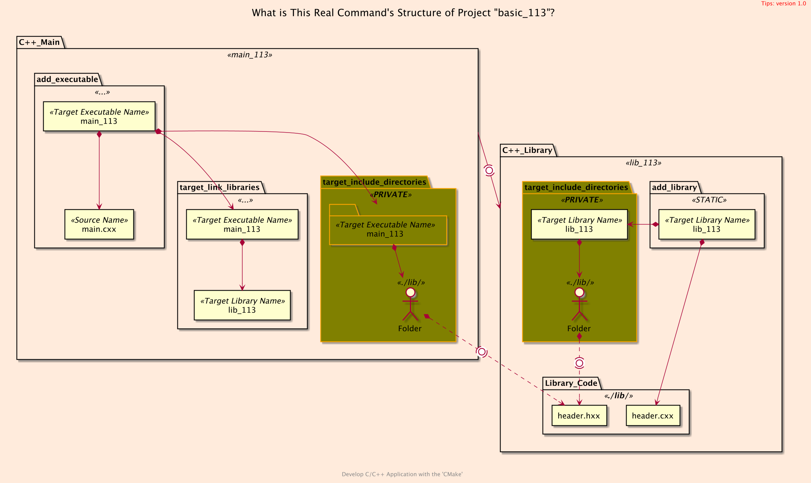
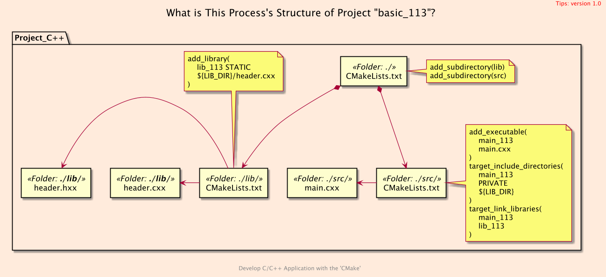
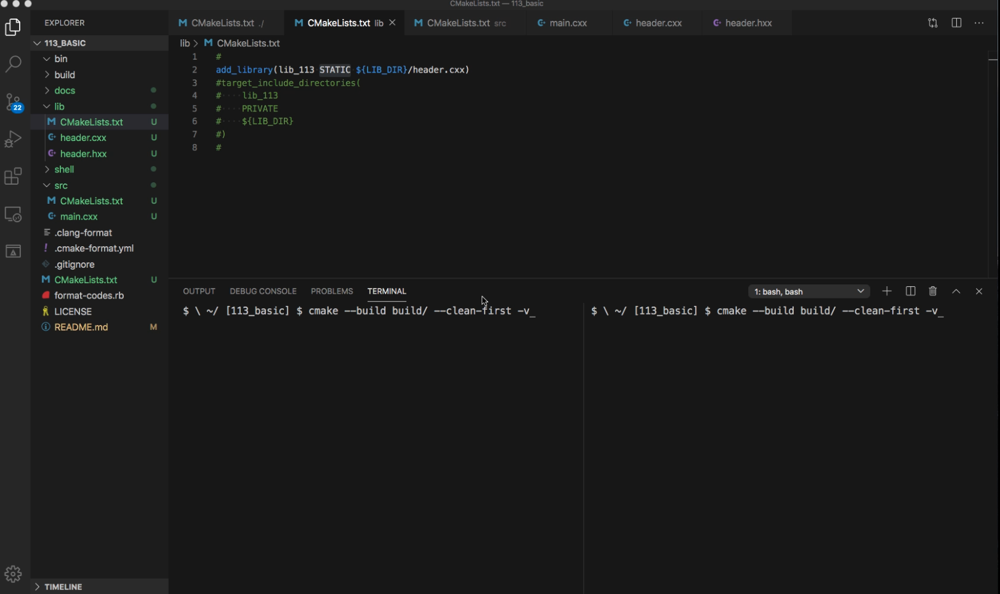
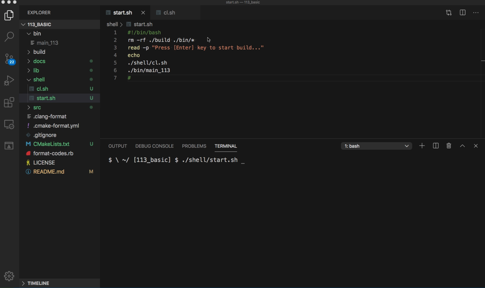
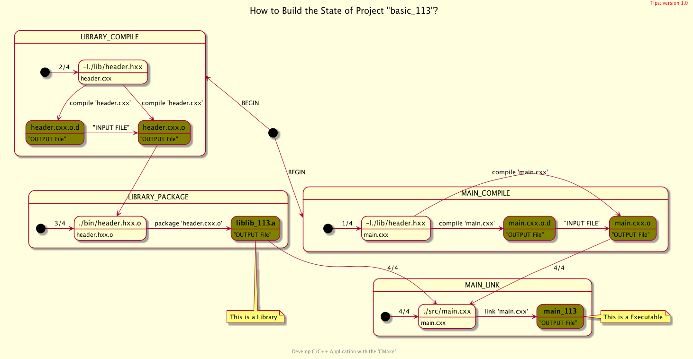
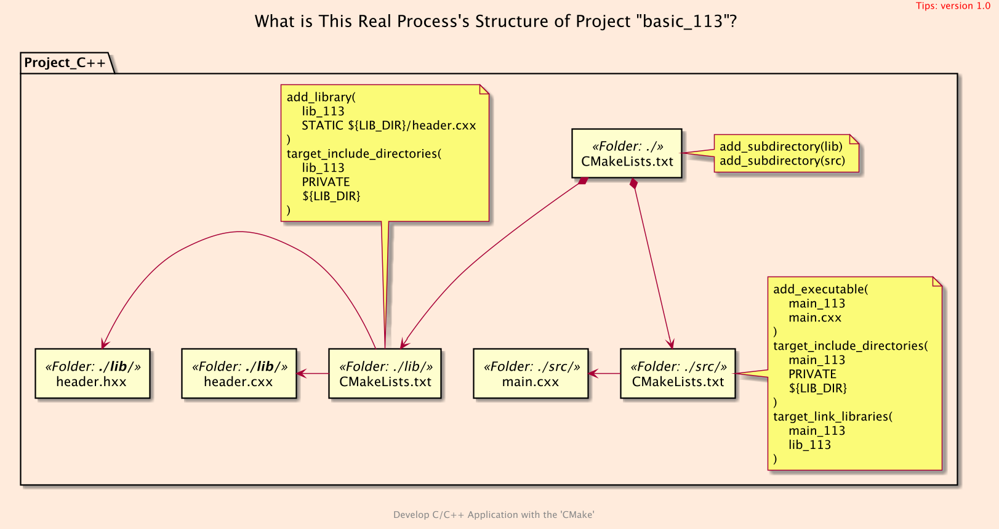

<h2>Hello, <code>Static</code> Library!</h2>
<h3>Creating, Building and Using Static Library</h3>
</br>
</br>

[@Gitter](https://gitter.im/cnruby) :gitter.im/cnruby<br/>
Code ID: basic_113</br>
Code Name: Hello, Static Library!</br>
<p class ="fragment" data-audio-src="docs/113/audio/basic_113-01.m4a"></p>


* [Youtube Video](https://youtu.be/ztmYpK7lFCI)


<iframe width="560" height="315" src="https://www.youtube.com/embed/-1hA3QqJKEw" frameborder="0" allow="accelerometer; autoplay; encrypted-media; gyroscope; picture-in-picture" allowfullscreen></iframe>


<h2>TABLE of CONTENTS</h2>

- [What is This Structure of Project?](#what-is-this-structure-of-project)
  - [The <code>Folder's</code> Structure](#the-folders-structure)
  - [The <code>Command's</code> Structure](#the-commands-structure)
  - [The Real <code>Command's</code> Structure](#the-real-commands-structure)
  - [The <code>Process's</code> Structure](#the-processs-structure)
- [Analyze The Build of <code>CMake</code>](#analyze-the-build-of-cmake)
  - [Code of The Listfile of <code>'lib'</code>](#code-of-the-listfile-of-lib)
  - [Code of The Listfile of <code>'src'</code>](#code-of-the-listfile-of-src)
  - [Demonstrate Build's Process on <code>CMake<code>](#demonstrate-builds-process-on-codecmakecode)
- [Analyze The Build of Compiler's Commands](#analyze-the-build-of-compilers-commands)
  - [Build's Commands of <code>C++</code> Compiler](#builds-commands-of-c-compiler)
  - [Demonstrate Build's Commands of <code>C++</code> Compiler](#demonstrate-builds-commands-of-c-compiler)
  - [How to Graph the relationship of Build's Process](#how-to-graph-the-relationship-of-builds-process)
- [Final Summary](#final-summary)
- [References](#references)
- [The Real <code>Process's</code> Structure](#the-real-processs-structure)
- [The Project Command](#the-project-command)
  - [Formatting The Codes](#formatting-the-codes)
  - [Get The Code with Shell Commands](#get-the-code-with-shell-commands)
  - [Build and Run The Project](#build-and-run-the-project)
<p class ="fragment" data-audio-src="docs/113/audio/basic_113-02.m4a"></p>


## What is This Structure of Project?
### The <code>Folder's</code> Structure
```bash
#<!-- markdown-exec(cmd:cat docs/output/tree.txt) -->#
.
├── CMakeLists.txt
├── lib
│  ├── CMakeLists.txt
│  ├── header.cxx
│  └── header.hxx
└── src
   ├── CMakeLists.txt
   └── main.cxx
#<!-- /markdown-exec -->
```
<p class ="fragment" data-audio-src="docs/113/audio/basic_113-03.m4a"></p>



### The <code>Command's</code> Structure
<p class ="fragment" data-audio-src="docs/113/audio/basic_113-04.m4a"></p>



### The Real <code>Command's</code> Structure
<p class ="fragment" data-audio-src="docs/113/audio/basic_113-05.m4a"></p>



### The <code>Process's</code> Structure
<p class ="fragment" data-audio-src="docs/113/audio/basic_113-06.m4a"></p>


## Analyze The Build of <code>CMake</code>

<p class ="fragment" data-audio-src="docs/113/audio/basic_113-07.m4a"></p>


```bash
#<!-- markdown-exec(cmd:cat lib/CMakeLists.txt) -->#
add_library(lib_113 STATIC ${LIB_DIR}/header.cxx)
#target_include_directories(
#    lib_113
#    PRIVATE
#    ${LIB_DIR}
#)
#<!-- /markdown-exec -->
```
### Code of The Listfile of <code>'lib'</code>
<p class ="fragment" data-audio-src="docs/113/audio/basic_113-08.m4a"></p>


```bash
#<!-- markdown-exec(cmd:cat src/CMakeLists.txt) -->#
add_executable(
  main_113
  main.cxx
)
target_include_directories(
  main_113
  PRIVATE
  ${LIB_DIR}/
)
target_link_libraries(main_113 lib_113)
#<!-- /markdown-exec -->
```
### Code of The Listfile of <code>'src'</code>
<p class ="fragment" data-audio-src="docs/113/audio/basic_113-09.m4a"></p>


### Demonstrate Build's Process on <code>CMake<code>
<video width="720" height="480" controls data-autoplay>
  <source src="docs/113/video/basic_113-10.mov" autoplay=true type="video/mp4">
</video>


## Analyze The Build of Compiler's Commands

<p class ="fragment" data-audio-src="docs/113/audio/basic_113-11.m4a"></p>


```bash
#<!-- markdown-exec(cmd:cat shell/cl.sh) -->#!/bin/bash
#[1/4]: Compile
c++ -I./lib -MD -MF ./bin/main.cxx.o.d  -c ./src/main.cxx \
  -o ./bin/main.cxx.o
#[2/4]: Compile
c++ -I./lib -MD -MF ./bin/header.cxx.o.d  -c ./lib/header.cxx \
  -o ./bin/header.cxx.o
#[3/4]: Package
cmake -E rm -f ./bin/liblib_113.a && \
  ar qc ./bin/liblib_113.a ./bin/header.cxx.o && \
  ranlib ./bin/liblib_113.a && cmake -E touch ./bin/liblib_113.a
#[4/4] : Link
c++ ./bin/main.cxx.o  -o ./bin/main_113  ./bin/liblib_113.a
#<!-- /markdown-exec -->
```
### Build's Commands of <code>C++</code> Compiler
<p class ="fragment" data-audio-src="docs/113/audio/basic_113-12.m4a"></p>


### Demonstrate Build's Commands of <code>C++</code> Compiler
<video width="720" height="480" controls data-autoplay>
  <source src="docs/113/video/basic_113-13.mov" autoplay=true type="video/mp4">
</video>



### How to Graph the relationship of Build's Process
<p class ="fragment" data-audio-src="docs/113/audio/basic_113-14.m4a"></p>


## Final Summary
<p class ="fragment" data-audio-src="docs/113/audio/basic_113-15.m4a"></p>


<h1><!-- markdown-exec(cmd:echo "感谢大家观看!") -->感谢大家观看!<!-- /markdown-exec --></h1>

@Gitter: gitter.im/cnruby<br/>

@Github: github.com/cnruby<br/>

@Twitter: twitter.com/cnruby<br/>

@Blogspot: cnruby.blogspot.com


## References
- https://cmake.org/cmake/help/latest/command/include_directories.html
- https://cmake.org/cmake/help/latest/command/target_include_directories.html
- https://stackoverflow.com/questions/31969547/what-is-the-difference-between-include-directories-and-target-include-directorie
- https://stackoverflow.com/questions/26243169/cmake-target-include-directories-meaning-of-scope
- https://gitlab.kitware.com/cmake/cmake/issues/19802
- https://pabloariasal.github.io/2018/02/19/its-time-to-do-cmake-right/
- http://mariobadr.com/creating-a-header-only-library-with-cmake.html
- https://stackoverflow.com/questions/18869282/initialize-char
- https://stackoverflow.com/questions/2587349/initializing-char-and-char-pointers
- https://stackoverflow.com/questions/18963888/c-char-initialization-in-constructor
- https://stackoverflow.com/questions/13703647/how-to-properly-add-include-directories-with-cmake
- https://stackoverflow.com/questions/9834067/difference-between-char-and-const-char
- https://stackoverflow.com/questions/2186246/what-is-o-file
- https://www.online-convert.com/file-format/o


## The Real <code>Process's</code> Structure



## The Project Command


### Formatting The Codes
```bash
ruby format-codes.rb
```


### Get The Code with Shell Commands
```bash
git clone https://github.com/cnruby/w3h1_cmake.git basic_113
cd basic_113
git checkout basic_113
code .
```


### Build and Run The Project
```bash
cmake -GNinja -Bbuild/
cmake --build build/ --clean-first -v
cmake --build build/ --target clean
cmake --build build/ --clean-first -v &> v11.txt
./bin/main_113
rm -rf ./build/ ./bin/*
./shell/start.sh
```