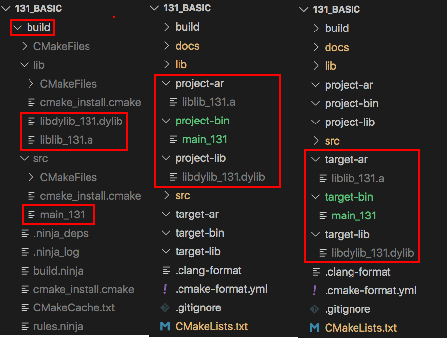
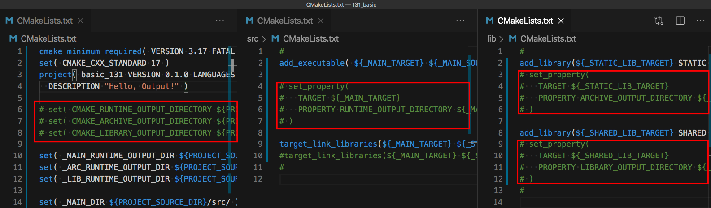
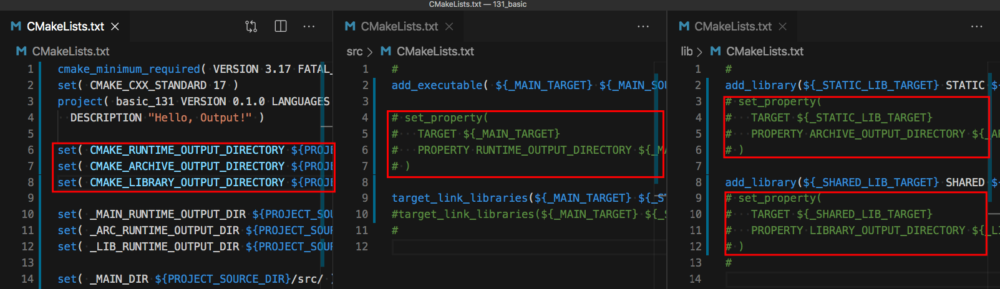
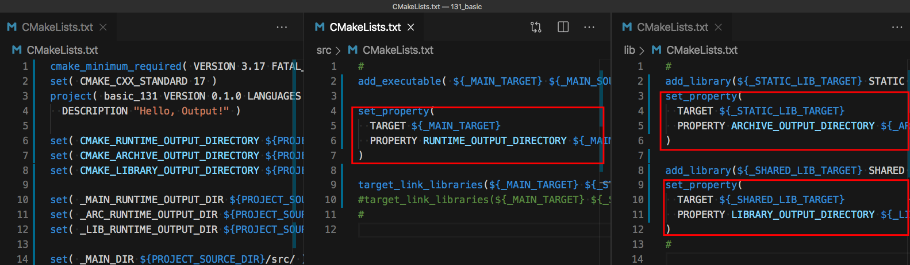
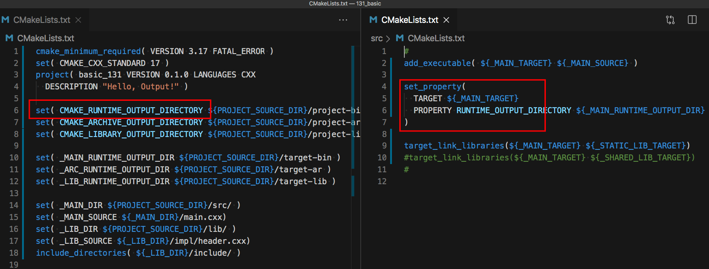

<h2>Hello, Output!</h2>
<h3>Changing the output default directory in a dedicated directory</h3>
</br>
</br>

[@Gitter](https://gitter.im/cnruby) :gitter.im/cnruby<br/>
Code ID: basic_131</br>
Code Name: Hello, Output!</br>
<p class ="fragment" data-audio-src="docs/131/audio/basic_131-01.m4a"></p>


[<h1>Youtube Video</h1>](https://youtu.be/HnXP8jgryC4)


<h2>TABLE of CONTENTS</h2>

- [About The Project](#about-the-project)
  - [The <code>Folder's</code> Structure](#the-folders-structure)
- [The default output directory for a project](#the-default-output-directory-for-a-project)
  - [Demonstrate default output directory for a project](#demonstrate-default-output-directory-for-a-project)
- [Changing output directory for a Project](#changing-output-directory-for-a-project)
  - [The Listfile of Folder <code>'./'</code>](#the-listfile-of-folder)
  - [Demonstrate output directory for a Project](#demonstrate-output-directory-for-a-project)
- [Changing output directory for a target](#changing-output-directory-for-a-target)
  - [The Listfile of Folder <code>'./src'</code>](#the-listfile-of-folder-src)
  - [The Listfile of Folder <code>'./lib'</code>](#the-listfile-of-folder-lib)
  - [Demonstrate output directory for a target](#demonstrate-output-directory-for-a-target)
- [Final Summary](#final-summary)
- [References](#references)
  - [Requirements](#requirements)
  - [Get The Code with Shell Commands](#get-the-code-with-shell-commands)
<div class ="fragment" data-audio-src="docs/131/audio/basic_131-02.m4a"></div>


## About The Project

<div class ="fragment" data-audio-src="docs/131/audio/basic_131-03.m4a"></div>


```bash
#<!-- markdown-exec(cmd:cat docs/output/tree.txt) -->#
.
├── CMakeLists.txt
├── lib
│  ├── CMakeLists.txt
│  ├── impl
│  │  └── header.cxx
│  └── include
│     └── header.hxx
└── src
   ├── CMakeLists.txt
   └── main.cxx
#<!-- /markdown-exec -->
```
### The <code>Folder's</code> Structure
<p class ="fragment" data-audio-src="docs/131/audio/basic_131-04.m4a"></p>


## The default output directory for a project

<p class ="fragment" data-audio-src="docs/131/audio/basic_131-05.m4a"></p>


### Demonstrate default output directory for a project
<video width="720" height="480" controls data-autoplay>
  <source src="docs/131/video/basic_131-06.mov" autoplay=true type="video/mp4">
</video>


## Changing output directory for a Project

<p class ="fragment" data-audio-src="docs/131/audio/basic_131-07.m4a"></p>


### The Listfile of Folder <code>'./'</code>
```bash
#<!-- markdown-exec(cmd:cat ./CMakeLists.txt) -->cmake_minimum_required( VERSION 3.17 FATAL_ERROR )
set( CMAKE_CXX_STANDARD 17 )
project( basic_131 VERSION 0.1.0 LANGUAGES CXX
  DESCRIPTION "Hello, Output!" )

set( CMAKE_RUNTIME_OUTPUT_DIRECTORY ${PROJECT_SOURCE_DIR}/project-bin )
set( CMAKE_ARCHIVE_OUTPUT_DIRECTORY ${PROJECT_SOURCE_DIR}/project-ar )
set( CMAKE_LIBRARY_OUTPUT_DIRECTORY ${PROJECT_SOURCE_DIR}/project-lib )

set( _MAIN_RUNTIME_OUTPUT_DIR ${PROJECT_SOURCE_DIR}/target-bin )
set( _ARC_RUNTIME_OUTPUT_DIR ${PROJECT_SOURCE_DIR}/target-ar )
set( _LIB_RUNTIME_OUTPUT_DIR ${PROJECT_SOURCE_DIR}/target-lib )

set( _MAIN_DIR ${PROJECT_SOURCE_DIR}/src/ )
set( _MAIN_SOURCE ${_MAIN_DIR}/main.cxx)
set( _LIB_DIR ${PROJECT_SOURCE_DIR}/lib/ )
set( _LIB_SOURCE ${_LIB_DIR}/impl/header.cxx)
include_directories( ${_LIB_DIR}/include/ )

set(_MAIN_TARGET main_131)
set(_STATIC_LIB_TARGET lib_131)
set(_SHARED_LIB_TARGET dylib_131)

add_subdirectory(src)
add_subdirectory(lib)<!-- /markdown-exec -->
```
<p class ="fragment" data-audio-src="docs/131/audio/basic_131-08.m4a"></p>


### Demonstrate output directory for a Project
<video width="720" height="480" controls data-autoplay>
  <source src="docs/131/video/basic_131-09.mov" autoplay=true type="video/mp4">
</video>


## Changing output directory for a target

<p class ="fragment" data-audio-src="docs/131/audio/basic_131-10.m4a"></p>


### The Listfile of Folder <code>'./src'</code>
```bash
#<!-- markdown-exec(cmd:cat ./src/CMakeLists.txt) -->#
add_executable( ${_MAIN_TARGET} ${_MAIN_SOURCE} )

set_property(
  TARGET ${_MAIN_TARGET}
  PROPERTY RUNTIME_OUTPUT_DIRECTORY ${_MAIN_RUNTIME_OUTPUT_DIR}
)

target_link_libraries(${_MAIN_TARGET} ${_STATIC_LIB_TARGET})
#target_link_libraries(${_MAIN_TARGET} ${_SHARED_LIB_TARGET})
#<!-- /markdown-exec -->
```
<p class ="fragment" data-audio-src="docs/131/audio/basic_131-11.m4a"></p>


### The Listfile of Folder <code>'./lib'</code>
```bash
#<!-- markdown-exec(cmd:cat ./lib/CMakeLists.txt) -->#
add_library(${_STATIC_LIB_TARGET} STATIC ${_LIB_SOURCE})
set_property(
  TARGET ${_STATIC_LIB_TARGET}
  PROPERTY ARCHIVE_OUTPUT_DIRECTORY ${_ARC_RUNTIME_OUTPUT_DIR}
)

add_library(${_SHARED_LIB_TARGET} SHARED ${_LIB_SOURCE})
set_property(
  TARGET ${_SHARED_LIB_TARGET}
  PROPERTY LIBRARY_OUTPUT_DIRECTORY ${_LIB_RUNTIME_OUTPUT_DIR}
)
#<!-- /markdown-exec -->
```
<p class ="fragment" data-audio-src="docs/131/audio/basic_131-12.m4a"></p>


### Demonstrate output directory for a target
<video width="720" height="480" controls data-autoplay>
  <source src="docs/131/video/basic_131-13.mov" autoplay=true type="video/mp4">
</video>




## Final Summary
<p class ="fragment" data-audio-src="docs/131/audio/basic_131-14.m4a"></p>


<h1><!-- markdown-exec(cmd:echo "感谢大家观看!") -->感谢大家观看!<!-- /markdown-exec --></h1>

@Gitter: gitter.im/cnruby<br/>

@Github: github.com/cnruby<br/>

@Twitter: twitter.com/cnruby<br/>

@Blogspot: cnruby.blogspot.com


## References
- https://www.dealii.org/9.1.1/users/cmakelists.html
- https://stackoverflow.com/questions/3742090/custom-directory-for-cmake-library-output
- https://stackoverflow.com/questions/52022717/how-to-make-cmake-output-to-the-build-directory
- https://stackoverflow.com/questions/13556885/how-to-change-the-executable-output-directory-for-win32-builds-in-cmake


### Requirements
- [VS Code 1.43.0+](https://code.visualstudio.com/)
- [CMake 3.17.0+](https://cmake.org/)


### Get The Code with Shell Commands
```bash
git clone https://github.com/cnruby/w3h1_cmake.git basic_131
cd basic_131
git checkout basic_131
code .
```