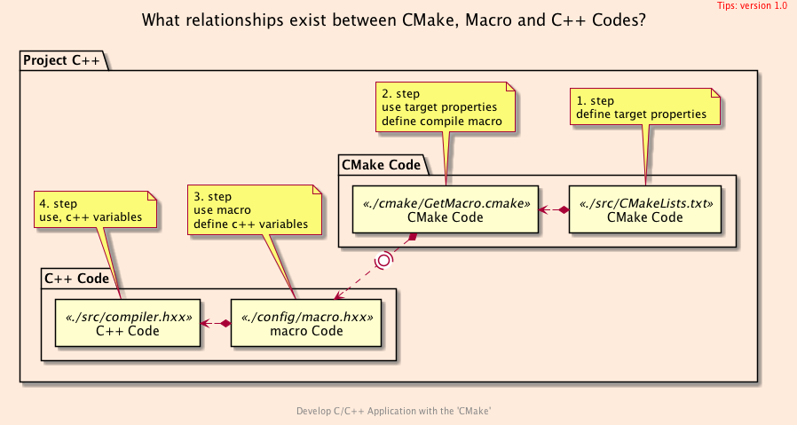
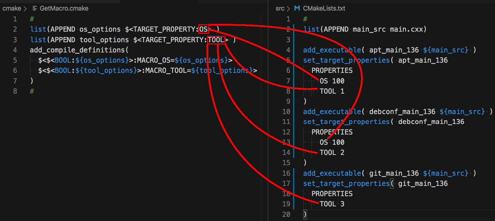
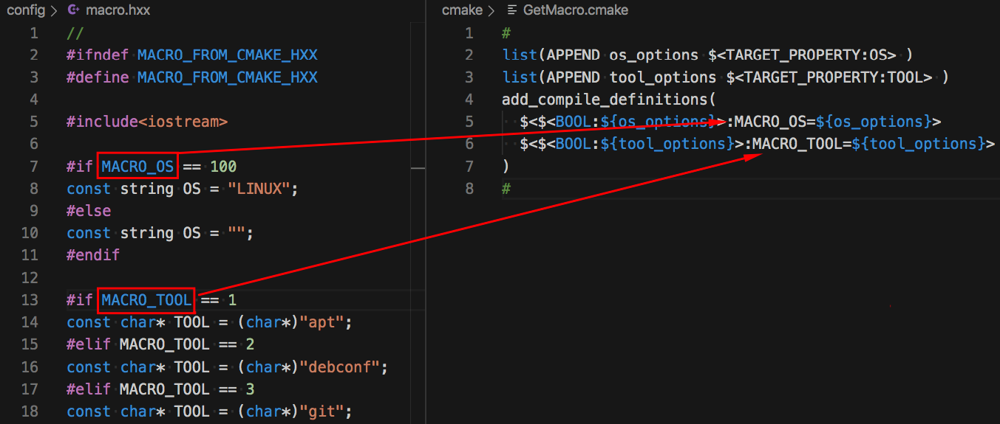
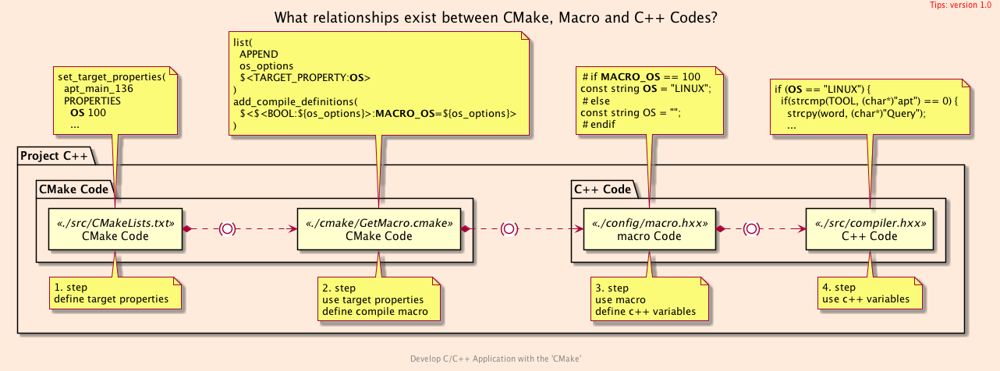

<h2>Hello, Targets 2.0!</h2>
<h3>How to Use Generator Expression in C++ Project</h3>
</br>
</br>

[@Gitter](https://gitter.im/cnruby) :gitter.im/cnruby<br/>
Code ID: basic_136</br>
Code Name: Hello, Targets 2.0!</br>
<p class ="fragment" data-audio-src="docs/136/audio/basic_136-01.m4a"></p>


[<h1>Youtube Video</h1>](https://youtu.be/hEWES7JgrfU)


<h2>TABLE of CONTENTS</h2>

- [About The Project](#about-the-project)
  - [Requirements](#requirements)
- [About The Code of Project](#about-the-code-of-project)
  - [Relation for CMake Codes](#relation-for-cmake-codes)
  - [Relation Between <code>CMake</code> and <code>C++</code> Code](#relation-between-cmake-and-c-code)
- [A Demonstration of Building Project](#a-demonstration-of-building-project)
- [Final Summary](#final-summary)
- [References](#references)
  - [References CMake API](#references-cmake-api)
  - [Requirements](#requirements-1)
  - [Get The Code with Shell Commands](#get-the-code-with-shell-commands)
  - [The Structure of Folder](#the-structure-of-folder)
<div class ="fragment" data-audio-src="docs/136/audio/basic_136-02.m4a"></div>




## About The Project
<p class ="fragment" data-audio-src="docs/136/audio/basic_136-03.m4a"></p>


### Requirements
- [video basic_116](https://youtu.be/thJFmINbG0U)
- [video basic_123](https://youtu.be/UuMJGiRZmlA)
- [video basic_124](https://youtu.be/-T4BMEI2agc)
- [video basic_134](https://youtu.be/4GPcMCwWgVM)
- [video basic_135](https://youtu.be/xZkakSO3_II)
<p class ="fragment" data-audio-src="docs/136/audio/basic_136-04.m4a"></p>


## About The Code of Project
```bash
#<!-- markdown-exec(cmd:cat ./cmake/GetMacro.cmake) -->#
list(APPEND os_options $<TARGET_PROPERTY:OS> )
list(APPEND tool_options $<TARGET_PROPERTY:TOOL> )
add_compile_definitions(
  $<$<BOOL:${os_options}>:MACRO_OS=${os_options}>
  $<$<BOOL:${tool_options}>:MACRO_TOOL=${tool_options}>
)
#<!-- /markdown-exec -->
```
<p class ="fragment" data-audio-src="docs/136/audio/basic_136-05.m4a"></p>




### Relation for CMake Codes
<p class ="fragment" data-audio-src="docs/136/audio/basic_136-06.m4a"></p>




### Relation Between <code>CMake</code> and <code>C++</code> Code
<p class ="fragment" data-audio-src="docs/136/audio/basic_136-07.m4a"></p>


## A Demonstration of Building Project
<video width="720" height="480" controls data-autoplay>
  <source src="docs/136/video/basic_136-08.mp4" autoplay=true type="video/mp4">
</video>




## Final Summary
<p class ="fragment" data-audio-src="docs/136/audio/basic_136-09.m4a"></p>


<h1><!-- markdown-exec(cmd:echo "感谢大家观看!") -->感谢大家观看!<!-- /markdown-exec --></h1>

@Gitter: gitter.im/cnruby<br/>

@Github: github.com/cnruby<br/>

@Twitter: twitter.com/cnruby<br/>

@Blogspot: cnruby.blogspot.com


## References
- https://stackoverflow.com/questions/46206495/cmake-generator-expressions
- https://www.rapidtables.com/code/linux/gcc/gcc-d.html
- https://stackoverflow.com/questions/26226874/what-is-the-d-compiler-flag-c-clang-gnu-msvc
- https://qiita.com/mrk_21/items/57075ce36f49ce0aacf4
- https://stackoverflow.com/questions/35696103/cmake-wildcard-for-target-objects
- https://stackoverflow.com/questions/44767099/linking-cmake-interface-libraries-with-object-libraries
- https://stackoverflow.com/questions/49265945/cmake-append-objects-from-different-cmakelists-txt-into-one-library
- https://stackoverflow.com/questions/58969829/cmake-object-files-of-executable-in-custom-command
- https://github.com/dev-cafe/cmake-cookbook
- https://www.dealii.org/9.1.1/users/cmakelists.html
- https://cmake.org/cmake/help/latest/manual/cmake-generator-expressions.7.html
- https://stackoverflow.com/questions/50684930/how-to-collect-object-files-o-in-a-particular-directory-with-cmake
- https://stackoverflow.com/questions/48296061/cmakes-objects-output-folder-variable
- https://stackoverflow.com/questions/29884856/how-to-get-path-to-object-files-with-cmake-for-both-multiconfiguration-generator
- https://stackoverflow.com/questions/25845294/target-compile-definitions-with-several-flags
- https://stackoverflow.com/questions/5096881/does-set-target-properties-in-cmake-override-cmake-cxx-flags
- https://stackoverflow.com/questions/30546677/cmake-how-to-set-multiple-compile-definitions-for-target-executable
- https://foonathan.net/2017/05/preprocessor/
- https://www.codenong.com/15223779/
- https://stackoverflow.com/questions/15223779/cmake-when-to-use-add-definitions-instead-of-set-target-propertiestarget-prope/15263203
- https://stackoverflow.com/questions/5403705/cmake-add-definitions-and-compile-definitions-how-to-see-them
- https://stackoverflow.com/questions/23973470/cmake-compile-definition-not-working
- https://cmake.org/pipermail/cmake/2017-April/065258.html
- https://cmake.org/pipermail/cmake/2011-February/042919.html
- https://en.cppreference.com/w/cpp/preprocessor/conditional
- https://stackoverflow.com/questions/2335888/how-to-compare-strings-in-c-conditional-preprocessor-directives
- https://stackoverflow.com/questions/26193171/cmake-how-to-create-a-file-with-make-command
- https://samthursfield.wordpress.com/2015/11/21/cmake-dependencies-between-targets-and-files-and-custom-commands/
- https://support.circleci.com/hc/en-us/articles/360003649774-Permission-Denied-When-Creating-Directory-or-Writing-a-File
- https://stackoverflow.com/questions/31582344/how-to-redirect-the-output-of-a-cmake-custom-command-to-a-file
- http://mariobadr.com/creating-a-header-only-library-with-cmake.html


### References CMake API
- https://cmake.org/cmake/help/latest/manual/cmake-generator-expressions.7.html
- https://cmake.org/cmake/help/latest/command/add_compile_definitions.html
- https://cmake.org/cmake/help/latest/command/set_property.html
- https://cmake.org/cmake/help/latest/command/set_target_properties.html
- https://stackoverflow.com/questions/50430185/cmake-how-to-set-a-generator-expression-based-on-an-option-and-compiler-build


### Requirements
- [Ubuntu 20.04+](https://ubuntu.com/)
- [VS Code 1.43.0+](https://code.visualstudio.com/)
- [CMake 3.17.2+](https://cmake.org/)


### Get The Code with Shell Commands
```bash
git clone https://github.com/cnruby/w3h1_cmake.git basic_136
cd basic_136
git checkout basic_136
code .
```


### The Structure of Folder
```bash
#<!-- markdown-exec(cmd:cat ./docs/output/tree.txt) -->#
.
├── cmake
│  ├── CMakeLists.txt
│  ├── config.h.in
│  ├── GetLibintl.cmake
│  ├── GetLocaleDir.cmake
│  ├── GetMacro.cmake
│  ├── Initialize.cmake
│  ├── macro.h.in
│  └── TargetAll.cmake
├── CMakeLists.txt
├── config
│  ├── config.hxx
│  └── macro.hxx
└── src
   ├── CMakeLists.txt
   ├── compiler.hxx
   └── main.cxx
#<!-- /markdown-exec -->
```
