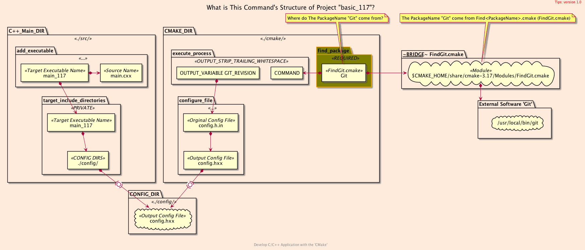
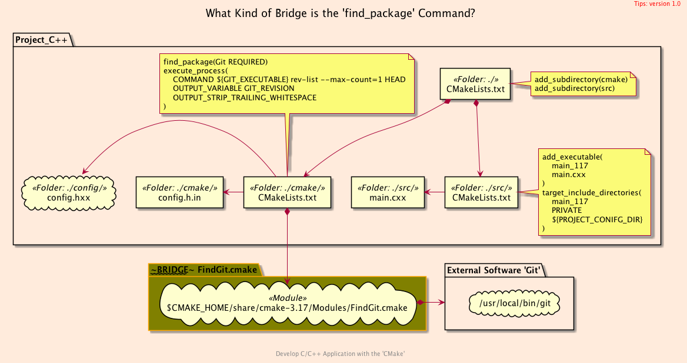
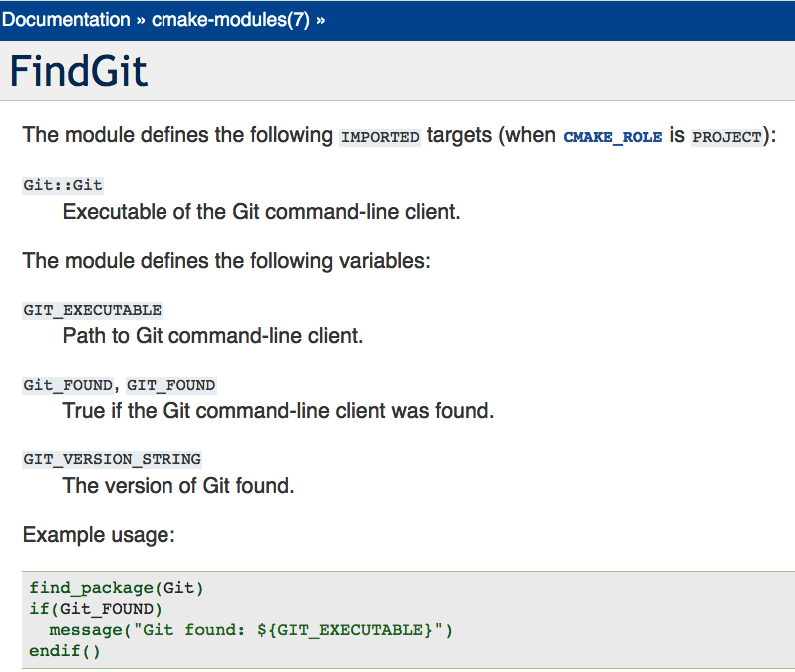

<h2>Hello, Package!</h2>
<h3>Finding an Executable Package For <code>C++</code> Code</h3>
</br>
</br>

[@Gitter](https://gitter.im/cnruby) :gitter.im/cnruby<br/>
Code ID: basic_117</br>
Code Name: Hello, Package!</br>
<p class ="fragment" data-audio-src="docs/117/audio/basic_117-01.m4a"></p>


* [Youtube Video](https://youtu.be/D5sny0H8jUM)


<h2>TABLE of CONTENTS</h2>

- [Demonstrate Finding an Executable Package](#demonstrate-finding-an-executable-package)
- [The Structures of Project](#the-structures-of-project)
  - [The <code>Folder's</code> Structure](#the-folders-structure)
  - [The <code>Command's</code> Structure](#the-commands-structure)
  - [The <code>Process's</code> Structure](#the-processs-structure)
- [<code>CMake</code> Files of The Project](#cmake-files-of-the-project)
  - [The Listfile of Folder <code>'cmake'</code>](#the-listfile-of-folder-cmake)
  - [The Template File of Folder <code>'cmake'</code>](#the-template-file-of-folder-cmake)
- [C++ Files of The Project](#c-files-of-the-project)
  - [The C++ Config File of Folder <code>'config'</code>](#the-c-config-file-of-folder-config)
  - [The C++ Main File of Folder <code>'src'</code>](#the-c-main-file-of-folder-src)
- [Final Summary](#final-summary)
- [References](#references)
- [The Project's Commands](#the-projects-commands)
  - [Formatting The Codes](#formatting-the-codes)
  - [Get The Code with Shell Commands](#get-the-code-with-shell-commands)
  - [Build and Run The Project](#build-and-run-the-project)
<div class ="fragment" data-audio-src="docs/117/audio/basic_117-02.m4a"></div>


## Demonstrate Finding an Executable Package
<video width="720" height="480" controls data-autoplay>
  <source src="docs/117/video/basic_117-03.mov" autoplay=true type="video/mp4">
</video>


## The Structures of Project
```bash
#<!-- markdown-exec(cmd:cat docs/output/tree.txt) -->#
.
├── cmake
│  ├── CMakeLists.txt
│  └── config.h.in
├── CMakeLists.txt
├── config
│  └── config.hxx
└── src
   ├── CMakeLists.txt
    └── main.cxx
#<!-- /markdown-exec -->
```
### The <code>Folder's</code> Structure
<p class ="fragment" data-audio-src="docs/117/audio/basic_117-04.m4a"></p>



### The <code>Command's</code> Structure
<p class ="fragment" data-audio-src="docs/117/audio/basic_117-05.m4a"></p>



### The <code>Process's</code> Structure
<p class ="fragment" data-audio-src="docs/117/audio/basic_117-06.m4a"></p>


## <code>CMake</code> Files of The Project

<p class ="fragment" data-audio-src="docs/117/audio/basic_117-07.m4a"></p>


```bash
#<!-- markdown-exec(cmd:cat cmake/CMakeLists.txt) -->#
find_package(Git REQUIRED)
message(STATUS "GIT_FOUND\t\t= ${GIT_FOUND}")
if(GIT_FOUND)
  message(STATUS "GIT_EXECUTABLE\t= ${GIT_EXECUTABLE}")
  message(STATUS "GIT_VERSION_STRING\t= ${GIT_VERSION_STRING}")
  execute_process(
    #COMMAND git rev-list --max-count=1 HEAD
    COMMAND ${GIT_EXECUTABLE} rev-list --max-count=1 HEAD
    # User-defined Variable "GIT_REVISION"
    OUTPUT_VARIABLE GIT_REVISION
    OUTPUT_STRIP_TRAILING_WHITESPACE
  )
  message(STATUS "GIT_REVISION\t\t= ${GIT_REVISION}")
else()
  message(STATUS "Git NOT FOUND")
endif(GIT_FOUND)

configure_file(
  ${PROJECT_SOURCE_DIR}/cmake/config.h.in
  ${PROJECT_SOURCE_DIR}/config/config.hxx
)

#<!-- /markdown-exec -->
```
### The Listfile of Folder <code>'cmake'</code>
<p class ="fragment" data-audio-src="docs/117/audio/basic_117-08.m4a"></p>


```C++
//<!-- markdown-exec(cmd:cat cmake/config.h.in) -->//
#ifndef CMAKE_CONFIG_H
#define CMAKE_CONFIG_H

const char *GIT_VERSION   = "@GIT_VERSION_STRING@";
const char *GIT_REVISION  = "@GIT_REVISION@";

#endif
//<!-- /markdown-exec -->
```
### The Template File of Folder <code>'cmake'</code>
<p class ="fragment" data-audio-src="docs/117/audio/basic_117-09.m4a"></p>


## C++ Files of The Project
```C++
//<!-- markdown-exec(cmd:cat config/config.hxx) -->//
#ifndef CMAKE_CONFIG_H
#define CMAKE_CONFIG_H

const char *GIT_VERSION   = "2.21.0";
const char *GIT_REVISION  = "e5b2c4b722bad446d2b9673bc0daaa507aeaabd6";

#endif
//<!-- /markdown-exec -->
```
### The C++ Config File of Folder <code>'config'</code>
<p class ="fragment" data-audio-src="docs/117/audio/basic_117-10.m4a"></p>


```C++
//<!-- markdown-exec(cmd:cat src/main.cxx) -->//
#include <iostream>
#include "config.hxx"

int main(int, char **)
{
    std::cout << "Hello, C++ Package!" << std::endl;

    std::cout << "git version:\t\t" << GIT_VERSION << std::endl;
    std::cout << "git revision hash:\t" << GIT_REVISION << std::endl;
}
//<!-- /markdown-exec -->
```
### The C++ Main File of Folder <code>'src'</code>
<p class ="fragment" data-audio-src="docs/117/audio/basic_117-11.m4a"></p>


## Final Summary
<p class ="fragment" data-audio-src="docs/117/audio/basic_117-12.m4a"></p>


<h1><!-- markdown-exec(cmd:echo "感谢大家观看!") -->感谢大家观看!<!-- /markdown-exec --></h1>

@Gitter: gitter.im/cnruby<br/>

@Github: github.com/cnruby<br/>

@Twitter: twitter.com/cnruby<br/>

@Blogspot: cnruby.blogspot.com


## References
- https://cmake.org/cmake/help/latest/command/find_package.html
- https://cmake.org/cmake/help/latest/command/execute_process.html


## The Project's Commands


### Formatting The Codes
```bash
ruby format-codes.rb
```


### Get The Code with Shell Commands
```bash
git clone https://github.com/cnruby/w3h1_cmake.git basic_117
cd basic_117
git checkout basic_117
code .
```


### Build and Run The Project
```bash
cmake -GNinja -Bbuild/
cmake --build build/ --clean-first -v
cmake --build build/ --target clean
cmake --build build/ --clean-first -v &> v11.txt
# generate the configure file
rm -rf config
cmake --build build/ --clean-first
cmake -Bbuild/
cmake --build build/ --target rebuild_cache
cmake --build build/ --clean-first
./bin/main_117
#  update the configure file
cmake --build build/ --clean-first
# others
markdown-exec README.md
code build/build.ninja
ruby format-codes.rb
cmake --check-system-vars --build build/
cmake --help-command find_package | less
```