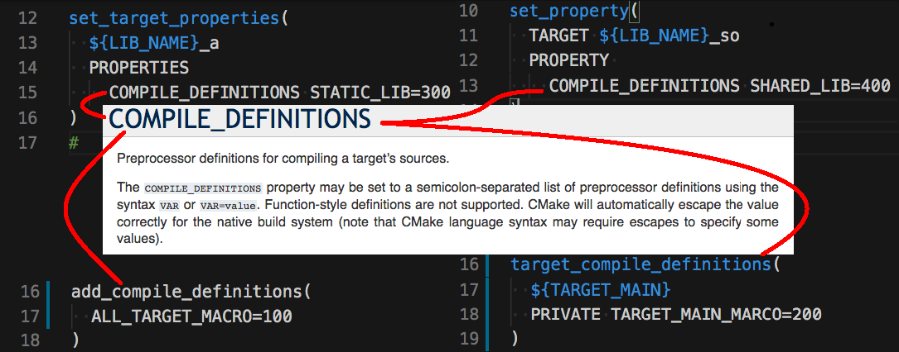
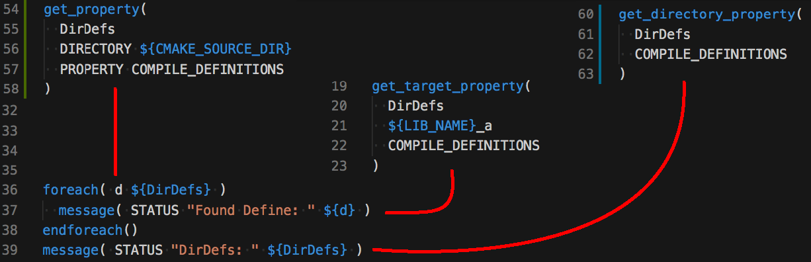
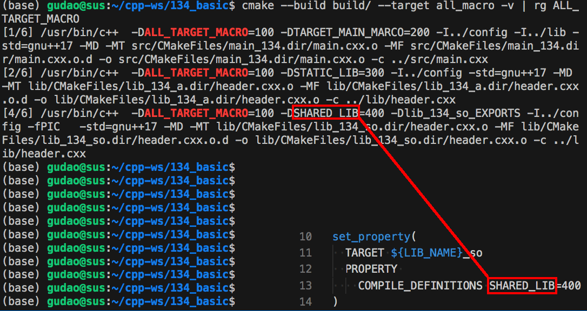
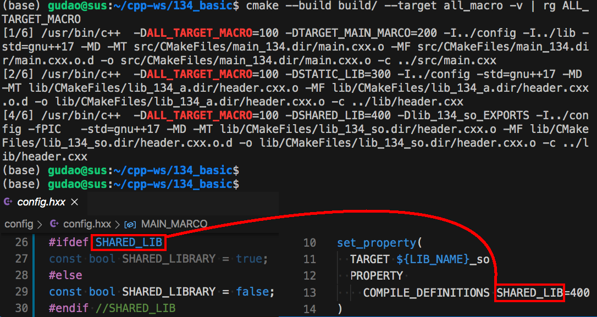
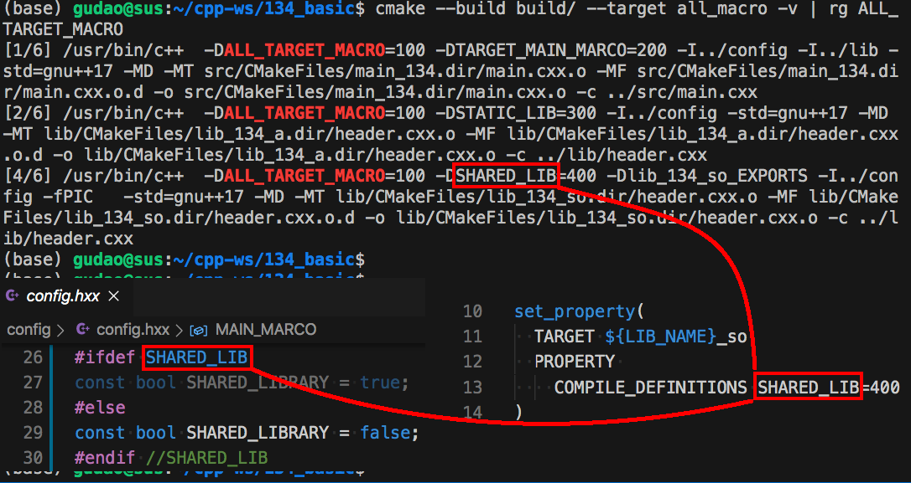

<h2>Hello, COMPILE_DEFINITIONS!</h2>
<h3>How to specify preprocessor definitions through CMake</h3>
</br>
</br>

[@Gitter](https://gitter.im/cnruby) :gitter.im/cnruby<br/>
Code ID: basic_134</br>
Code Name: Hello, COMPILE_DEFINITIONS!</br>
<p class ="fragment" data-audio-src="docs/134/audio/basic_134-01.m4a"></p>


<h2>TABLE of CONTENTS</h2>

- [About The Project](#about-the-project)
  - [<code>CMake's</code> `get` Commands](#cmakes-get-commands)
- [<code>CMake</code> Code and Compiler Command](#cmake-code-and-compiler-command)
  - [Demonstration between <code>CMake</code> Code and Compiler Command](#demonstration-between-cmake-code-and-compiler-command)
- [<code>CMake</code> Command and <code>C++</code> Code](#cmake-command-and-c-code)
  - [Demonstration between <code>CMake</code> Command and <code>C++</code> Code](#demonstration-between-cmake-command-and-c-code)
- [Final Summary](#final-summary)
- [References](#references)
  - [References CMake API](#references-cmake-api)
  - [Requirements](#requirements)
  - [Get The Code with Shell Commands](#get-the-code-with-shell-commands)
  - [The Structure of Folder](#the-structure-of-folder)
<div class ="fragment" data-audio-src="docs/134/audio/basic_134-02.m4a"></div>



## About The Project
<p class ="fragment" data-audio-src="docs/134/audio/basic_134-03.m4a"></p>




### <code>CMake's</code> `get` Commands
<p class ="fragment" data-audio-src="docs/134/audio/basic_134-04.m4a"></p>




## <code>CMake</code> Code and Compiler Command
<p class ="fragment" data-audio-src="docs/134/audio/basic_134-05.m4a"></p>


### Demonstration between <code>CMake</code> Code and Compiler Command
<video width="720" height="480" controls data-autoplay>
  <source src="docs/134/video/basic_134-06.mp4" autoplay=true type="video/mp4">
</video>



## <code>CMake</code> Command and <code>C++</code> Code
<p class ="fragment" data-audio-src="docs/134/audio/basic_134-07.m4a"></p>


### Demonstration between <code>CMake</code> Command and <code>C++</code> Code
<video width="720" height="480" controls data-autoplay>
  <source src="docs/134/video/basic_134-08.mp4" autoplay=true type="video/mp4">
</video>



## Final Summary
<p class ="fragment" data-audio-src="docs/134/audio/basic_134-09.m4a"></p>


<h1><!-- markdown-exec(cmd:echo "感谢大家观看!") -->感谢大家观看!<!-- /markdown-exec --></h1>

@Gitter: gitter.im/cnruby<br/>

@Github: github.com/cnruby<br/>

@Twitter: twitter.com/cnruby<br/>

@Blogspot: cnruby.blogspot.com


## References
- https://www.rapidtables.com/code/linux/gcc/gcc-d.html
- https://stackoverflow.com/questions/26226874/what-is-the-d-compiler-flag-c-clang-gnu-msvc
- https://qiita.com/mrk_21/items/57075ce36f49ce0aacf4
- https://stackoverflow.com/questions/35696103/cmake-wildcard-for-target-objects
- https://stackoverflow.com/questions/44767099/linking-cmake-interface-libraries-with-object-libraries
- https://stackoverflow.com/questions/49265945/cmake-append-objects-from-different-cmakelists-txt-into-one-library
- https://stackoverflow.com/questions/58969829/cmake-object-files-of-executable-in-custom-command
- https://github.com/dev-cafe/cmake-cookbook
- https://www.dealii.org/9.1.1/users/cmakelists.html
- https://cmake.org/cmake/help/latest/manual/cmake-generator-expressions.7.html
- https://stackoverflow.com/questions/50684930/how-to-collect-object-files-o-in-a-particular-directory-with-cmake
- https://stackoverflow.com/questions/48296061/cmakes-objects-output-folder-variable
- https://stackoverflow.com/questions/29884856/how-to-get-path-to-object-files-with-cmake-for-both-multiconfiguration-generator
- https://stackoverflow.com/questions/25845294/target-compile-definitions-with-several-flags
- https://stackoverflow.com/questions/5096881/does-set-target-properties-in-cmake-override-cmake-cxx-flags
- https://stackoverflow.com/questions/30546677/cmake-how-to-set-multiple-compile-definitions-for-target-executable
- https://foonathan.net/2017/05/preprocessor/
- https://www.codenong.com/15223779/
- https://stackoverflow.com/questions/15223779/cmake-when-to-use-add-definitions-instead-of-set-target-propertiestarget-prope/15263203
- https://stackoverflow.com/questions/5403705/cmake-add-definitions-and-compile-definitions-how-to-see-them
- https://stackoverflow.com/questions/23973470/cmake-compile-definition-not-working
- https://cmake.org/pipermail/cmake/2017-April/065258.html
- https://cmake.org/pipermail/cmake/2011-February/042919.html


### References CMake API
- https://cmake.org/cmake/help/latest/command/target_compile_options.html
- https://cmake.org/cmake/help/latest/command/target_compile_definitions.html
- https://cmake.org/cmake/help/latest/command/add_compile_options.html
- https://cmake.org/cmake/help/latest/command/add_compile_definitions.html
- https://cmake.org/cmake/help/latest/command/set_property.html
- https://cmake.org/cmake/help/latest/command/set_target_properties.html
- https://cmake.org/cmake/help/latest/command/get_target_property.html
- https://cmake.org/cmake/help/latest/command/get_directory_property.html


### Requirements
- [VS Code 1.43.0+](https://code.visualstudio.com/)
- [CMake 3.17.2+](https://cmake.org/)


### Get The Code with Shell Commands
```bash
git clone https://github.com/cnruby/w3h1_cmake.git basic_134
cd basic_134
git checkout basic_134
code .
```


### The Structure of Folder
```bash
#<!-- markdown-exec(cmd:cat ./docs/output/tree.txt) -->#
.
├── cmake
│  ├── CMakeLists.txt
│  └── config.h.in
├── CMakeLists.txt
├── lib
│  ├── CMakeLists.txt
│  ├── header.cxx
│  ├── header.hxx
│  ├── shared.cmake
│  └── static.cmake
└── src
   ├── CMakeLists.txt
   └── main.cxx
#<!-- /markdown-exec -->
```
