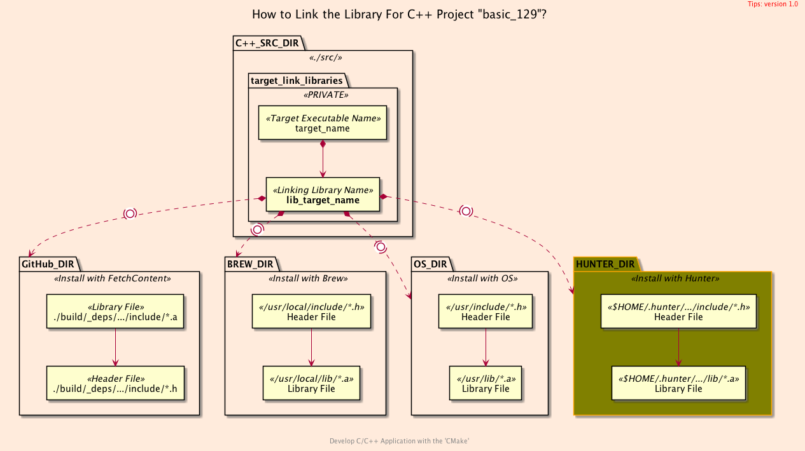
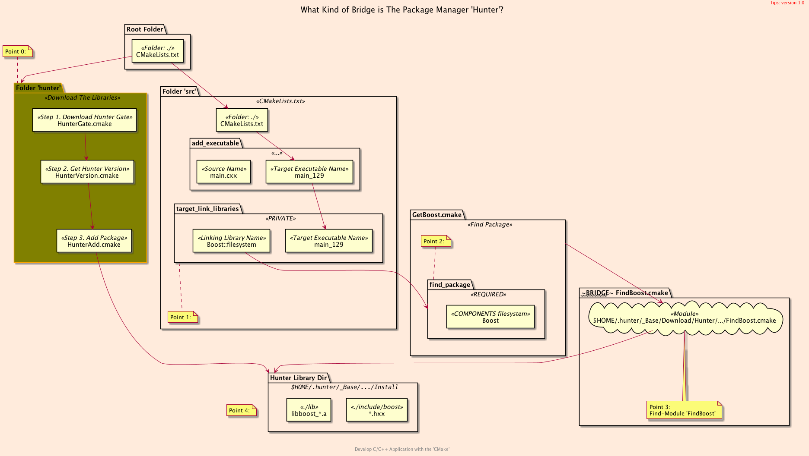
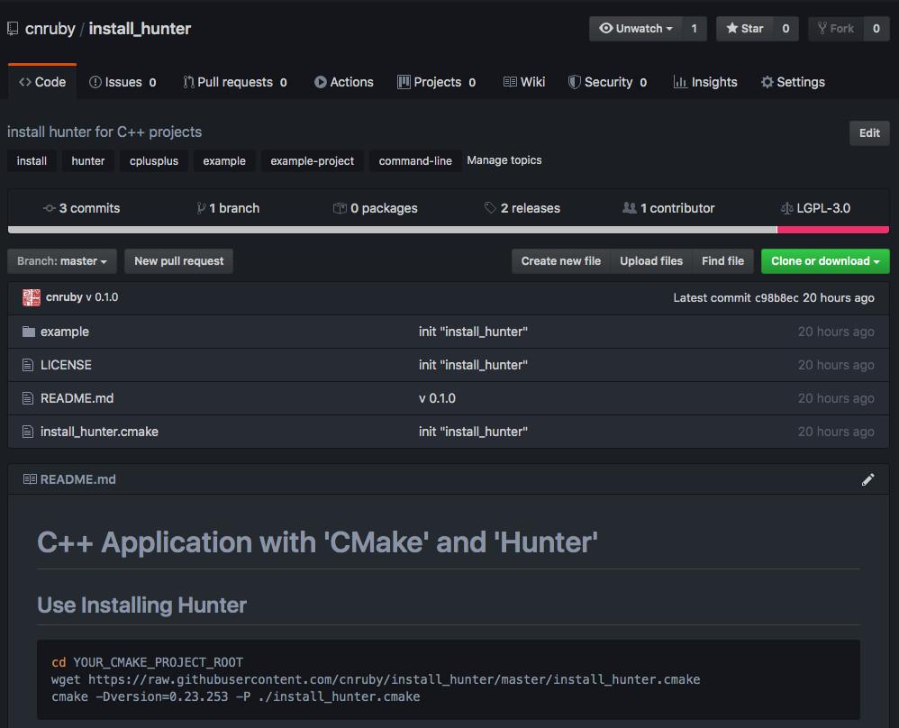

<h2>Hello, <code>Hunter</code>!</h2>
<h3>CMake-based Cross-Platform Package Manager for <code>C++</code> Projects</h3>
</br>
</br>

[@Gitter](https://gitter.im/cnruby) :gitter.im/cnruby<br/>
Code ID: basic_129</br>
Code Name: Hello, Hunter!</br>
<p class ="fragment" data-audio-src="docs/129/audio/basic_129-01.m4a"></p>


[<h1>Youtube Video</h1>](https://youtu.be/QWBu7vykWpc)


<h2>TABLE of CONTENTS</h2>

- [About The Project](#about-the-project)
  - [Requirements](#requirements)
  - [Get The Code with Shell Commands](#get-the-code-with-shell-commands)
  - [The <code>Folder's</code> Structure](#the-folders-structure)
- [Demonstrate The Project](#demonstrate-the-project)
- [Explain The Project](#explain-the-project)
  - [The Structure of Process](#the-structure-of-process)
  - [The Listfile of Folder <code>'.'</code>](#the-listfile-of-folder)
  - [The CMake File <code>'HunterVersion.cmake'</code> of Folder <code>'hunter'</code>](#the-cmake-file-hunterversioncmake-of-folder-hunter)
  - [The CMake File <code>'HunterAdd.cmake'</code> of Folder <code>'hunter'</code>](#the-cmake-file-hunteraddcmake-of-folder-hunter)
- [Final Summary](#final-summary)
- [References](#references)
  - [Important](#important)
  - [General](#general)
<div class ="fragment" data-audio-src="docs/129/audio/basic_129-02.m4a"></div>


## About The Project

<div class ="fragment" data-audio-src="docs/129/audio/basic_129-03.m4a"></div>


### Requirements
- [VS Code 1.43.0+](https://code.visualstudio.com/)
- [CMake 3.17.0+](https://cmake.org/)
<div class ="fragment" data-audio-src="docs/129/audio/basic_129-04.m4a"></div>


### Get The Code with Shell Commands
```bash
git clone https://github.com/cnruby/w3h1_cmake.git basic_129
cd basic_129
git checkout basic_129
code .
```
<div class ="fragment" data-audio-src="docs/129/audio/basic_129-05.m4a"></div>


```bash
#<!-- markdown-exec(cmd:cat docs/output/tree.txt) -->#
.
├── cmake
│  ├── CMakeLists.txt
│  ├── config.h.in
│  ├── GetBoost.cmake
│  └── Initialize.cmake
├── CMakeLists.txt
├── config
│  └── config.hxx
├── hunter
│  ├── HunterAdd.cmake
│  ├── HunterGate.cmake
│  └── HunterVersion.cmake
└── src
   ├── CMakeLists.txt
   └── main.cxx
#<!-- /markdown-exec -->
```
### The <code>Folder's</code> Structure
<p class ="fragment" data-audio-src="docs/129/audio/basic_129-06.m4a"></p>


## Demonstrate The Project
<video width="720" height="480" controls data-autoplay>
  <source src="docs/129/video/basic_129-07.mp4" autoplay=true type="video/mp4">
</video>


## Explain The Project


### The Structure of Process
<p class ="fragment" data-audio-src="docs/129/audio/basic_129-08.m4a"></p>


### The Listfile of Folder <code>'.'</code>
```bash
#<!-- markdown-exec(cmd:cat ./CMakeLists.txt) -->cmake_minimum_required( VERSION 3.17 FATAL_ERROR )
# For Hunter 1/3
#set(version 0.23.253)
#include("./installt_hunter.cmake")

# For Hunter 2/3: Please set hunter_add_package *before* project command
include("hunter/HunterVersion.cmake")

set( CMAKE_CXX_STANDARD 17 )
project( basic_129 VERSION 0.1.0 LANGUAGES CXX DESCRIPTION "Hello, Hunter!" )

# For Hunter 3/3: Please set hunter_add_package *after* project command
include("hunter/HunterAdd.cmake")

include("cmake/GetBoost.cmake")
include("cmake/Initialize.cmake")
include_directories( PRIVATE ${PROJECT_CONIFG_DIR} )

# call CMake File 'CMakeLists.txt'
add_subdirectory(cmake)
add_subdirectory(src)
#<!-- /markdown-exec -->
```
<p class ="fragment" data-audio-src="docs/129/audio/basic_129-09.m4a"></p>


```bash
#<!-- markdown-exec(cmd:cat hunter/HunterVersion.cmake) -->#
include(./hunter/HunterGate.cmake)
option(HUNTER_ENABLED "Enable Hunter package manager support" ON)
HunterGate(
    URL "https://github.com/cpp-pm/hunter/archive/v0.23.253.tar.gz"
    SHA1 "88ea6d37c897a81a080eb9ae0f69d7807bbb3c73"
)
#<!-- /markdown-exec -->
```
### The CMake File <code>'HunterVersion.cmake'</code> of Folder <code>'hunter'</code>
<p class ="fragment" data-audio-src="docs/129/audio/basic_129-10.m4a"></p>


```bash
#<!-- markdown-exec(cmd:cat hunter/HunterAdd.cmake) -->#
hunter_add_package(Boost COMPONENTS regex system filesystem)
#<!-- /markdown-exec -->
```
### The CMake File <code>'HunterAdd.cmake'</code> of Folder <code>'hunter'</code>
<p class ="fragment" data-audio-src="docs/129/audio/basic_129-11.m4a"></p>




## Final Summary
<p class ="fragment" data-audio-src="docs/129/audio/basic_129-12.m4a"></p>


<h1><!-- markdown-exec(cmd:echo "感谢大家观看!") -->感谢大家观看!<!-- /markdown-exec --></h1>

@Gitter: gitter.im/cnruby<br/>

@Github: github.com/cnruby<br/>

@Twitter: twitter.com/cnruby<br/>

@Blogspot: cnruby.blogspot.com


## References


### Important
- https://github.com/cpp-pm/hunter/releases
- https://hunter.readthedocs.io/en/latest/packages.html
- https://hunter.readthedocs.io/en/latest/creating-new/create/cmake.html
- https://meetingcpp.com/mcpp/slides/2018/lightningtalk_hunter.pdf
- https://geokon-gh.github.io/hunterintro.html
- https://readthedocs.org/projects/hunter/downloads/pdf/latest/
- https://github.com/cpp-pm/gate
- https://discourse.cmake.org/t/hunter-c-c-cmake-package-manager-gained-an-easy-setup-mechanism-via-cmakes-fetchcontent/145
- https://craffael.github.io/lehrfempp/getting_started.html
- https://stackoverflow.com/questions/35689501/cmakes-execute-process-and-arbitrary-shell-scripts
- https://unix.stackexchange.com/questions/42797/openssl-dgst-sha1-producing-an-extraneous-stdin-prefix-and-trailing-new
- https://preshing.com/20170522/learn-cmakes-scripting-language-in-15-minutes/


### General
- https://www.youtube.com/watch?v=wrCObV3qlhM
- https://readthedocs.org/projects/hunter/downloads/pdf/latest/
- https://github.com/hunter-packages
- https://www.youtube.com/watch?v=O2_N8OzPGWQ 
- https://gitlab.lrz.de/ls-mayer-public/hunter/-/tree/042a420e7588ef6a662ccbc49881547f520fb594/examples
- https://github.com/cpp-pm/hunter/tree/master/cmake/projects/
- https://github.com/cpp-pm/hunter/blob/master/cmake/projects/sqlite3/hunter.cmake
- https://gitter.im/cpp-pm/community?at=5e1d99e7cb2aaa2d78377ca2
- https://hunter.readthedocs.io/en/latest/packages/pkg/Boost.html