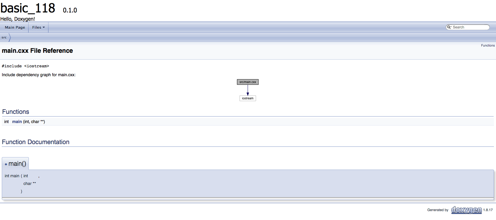
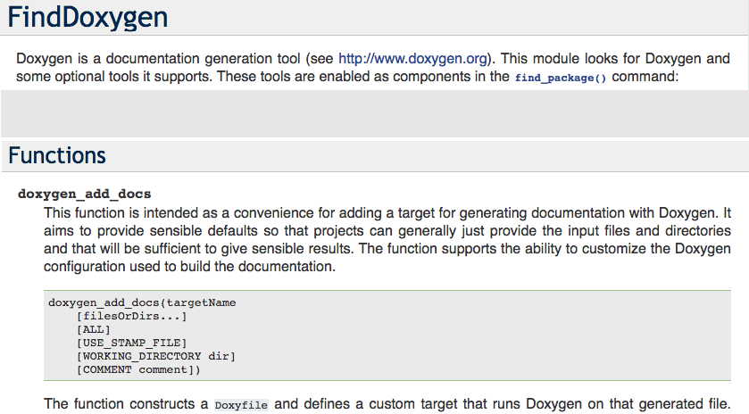

<h2>Hello, <code>Doxygen</code>!</h2>
<h3>Generating Documentation From annotated '<code>C/C++</code>'s Sources</h3>
</br>
</br>

[@Gitter](https://gitter.im/cnruby) :gitter.im/cnruby<br/>
Code ID: basic_118</br>
Code Name: Hello, Doxygen!</br>
<p class ="fragment" data-audio-src="docs/118/audio/basic_118-01.m4a"></p>


* [Youtube Video](https://youtu.be/T1CBiV09v8w)


<h2>TABLE of CONTENTS</h2>

- [Requirements](#requirements)
  - [Install Doxygen and Graphviz on MacOS](#install-doxygen-and-graphviz-on-macos)
- [Illustrate the Method of Generation 'Doxygen's API Documentation](#illustrate-the-method-of-generation-doxygens-api-documentation)
  - [Get The Code with Shell Commands](#get-the-code-with-shell-commands)
  - [How to Suppress developer warnings](#how-to-suppress-developer-warnings)
  - [Illustrate Hiding developer warnings](#illustrate-hiding-developer-warnings)
  - [What is The Command for Generating 'Doxygen's API Documentation](#what-is-the-command-for-generating-doxygens-api-documentation)
  - [Illustrate Generating 'Doxygen's API Documentation](#illustrate-generating-doxygens-api-documentation)
- [The <code>CMake</code> File of The Project](#the-cmake-file-of-the-project)
  - [The Listfile of Folder <code>'cmake'</code>](#the-listfile-of-folder-cmake)
  - [Commands for Illustrating the Parameter "WORKING_DIRECTORY"](#commands-for-illustrating-the-parameter-%22workingdirectory%22)
  - [Illustrate the Parameter "WORKING_DIRECTORY"](#illustrate-the-parameter-%22workingdirectory%22)
- [The Structures of Project](#the-structures-of-project)
  - [The <code>Folder's</code> Structure](#the-folders-structure)
  - [The <code>Command's</code> Structure](#the-commands-structure)
  - [The <code>Process's</code> Structure](#the-processs-structure)
- [Final Summary](#final-summary)
- [References](#references)
- [The Project's Commands](#the-projects-commands)
  - [Formatting The Codes](#formatting-the-codes)
  - [Get The Code with Shell Commands](#get-the-code-with-shell-commands-1)
  - [Build and Run The Project](#build-and-run-the-project)
<div class ="fragment" data-audio-src="docs/118/audio/basic_118-02.m4a"></div>


## Requirements
- [VS Code 1.43.0+](https://code.visualstudio.com/)
- [CMake 3.17.0+](https://cmake.org/)
- [Tool Doxygen](http://www.doxygen.nl/)
- [Tool Graphviz](http://graphviz.org/)
### Install Doxygen and Graphviz on MacOS
```bash
brew install doxygen
brew cask install graphviz
```
<div class ="fragment" data-audio-src="docs/118/audio/basic_118-03.m4a"></div>


## Illustrate the Method of Generation 'Doxygen's API Documentation

<div class ="fragment" data-audio-src="docs/118/audio/basic_118-04.m4a"></div>


### Get The Code with Shell Commands
```bash
git clone https://github.com/cnruby/w3h1_cmake.git basic_118
cd basic_118
git checkout basic_118
code .
```
<div class ="fragment" data-audio-src="docs/118/audio/basic_118-05.m4a"></div>


### How to Suppress developer warnings
```bash
# Create Build Folder
cmake -GNinja -Bbuild/
# show developer warnings: "This warning is for project developers."
cmake --build build/ --target rebuild_cache
# get help
cmake --help | grep dev
# change CMake cahce to hide developer warnings
ccmake -Wno-dev --build build/
# "c", "g", "q"
cmake --build build/ --target rebuild_cache
code ./build/CMakeCache.txt
# Goto 346
```
<div class ="fragment" data-audio-src="docs/118/audio/basic_118-06.m4a"></div>


### Illustrate Hiding developer warnings
<video width="720" height="480" controls data-autoplay>
  <source src="docs/118/video/basic_118-07.mov" autoplay=true type="video/mp4">
</video>


### What is The Command for Generating 'Doxygen's API Documentation
```bash
# Where do The Commands for generate docs come from
cmake --build build/ --target help
# Generate 'Doxygen's API Documentation
cmake --build build --target target_doxygen
# Open 'Doxygen's API Documentation
open build-docs/index.html
```
<div class ="fragment" data-audio-src="docs/118/audio/basic_118-08.m4a"></div>


### Illustrate Generating 'Doxygen's API Documentation
<video width="720" height="480" controls data-autoplay>
  <source src="docs/118/video/basic_118-09.mov" autoplay=true type="video/mp4">
</video>


## The <code>CMake</code> File of The Project

<p class ="fragment" data-audio-src="docs/118/audio/basic_118-10.m4a"></p>


```bash
#<!-- markdown-exec(cmd:cat cmake/CMakeLists.txt) -->#
find_package(Doxygen REQUIRED dot)
if (DOXYGEN_FOUND)
  set(DOXYGEN_OUTPUT_DIRECTORY      ${PROJECT_SOURCE_DIR}/build-docs) 
  set(DOXYGEN_EXTRACT_ALL            YES)
  set(DOXYGEN_BUILTIN_STL_SUPPORT    YES)
  set(DOXYGEN_WARN_NO_PARAMDOC       YES)
  set(DOXYGEN_HTML_OUTPUT            .)
  set(DOXYGEN_USE_MDFILE_AS_MAINPAGE README.md)
  set(DOXYGEN_FILE_PATTERNS           *.c *.cc *.cxx *.cpp *.c++ *.ii *.ixx *.ipp *.i++ *.inl *.h *.hh *.hxx *.hpp *.h++ *.inc README.md)
  doxygen_add_docs(
    target_doxygen   # cmake --build build --target target_doxygen
    ${PROJECT_SOURCE_DIR}                 # Sources root directory
    WORKING_DIRECTORY ${PROJECT_SOURCE_DIR} # change the directory used as the relative base poin
    COMMENT "Generate html pages"
  )
  #
  execute_process(
    COMMAND echo "cp docs"
    COMMAND mkdir -p ${PROJECT_SOURCE_DIR}/build-docs/docs/118/image
    COMMAND cp -rf ${PROJECT_SOURCE_DIR}/docs/118/image ${PROJECT_SOURCE_DIR}/build-docs/docs/118/
  )
else()
  message(STATUS "Doxygen not found, not building docs")
endif ()
message(STATUS "Doxygen Version: ${DOXYGEN_VERSION}")
#º<!-- /markdown-exec -->
```
### The Listfile of Folder <code>'cmake'</code>
<p class ="fragment" data-audio-src="docs/118/audio/basic_118-11.m4a"></p>


### Commands for Illustrating the Parameter "WORKING_DIRECTORY"
```bash
open build-docs/index.html
code cmake/CMakeLists.txt
# comment "WORKING_DIRECTORY"
cmake --build build/ --target rebuild_cache
cmake --build build --target target_doxygen
open build-docs/index.html
```
<div class ="fragment" data-audio-src="docs/118/audio/basic_118-12.m4a"></div>


### Illustrate the Parameter "WORKING_DIRECTORY"
<video width="720" height="480" controls data-autoplay>
  <source src="docs/118/video/basic_118-13.mov" autoplay=true type="video/mp4">
</video>


## The Structures of Project
```bash
#<!-- markdown-exec(cmd:cat docs/output/tree.txt) -->#
.                          >>>PROJECT_SOURCE_DIR
├── build-docs             >>>DOXYGEN_OUTPUT_DIRECTORY
├── CMakeLists.txt
├── cmake
│  └── CMakeLists.txt
├── README.md              >>>DOXYGEN_USE_MDFILE_AS_MAINPAGE
└── src
   ├── CMakeLists.txt
   └── main.cxx
#<!-- /markdown-exec -->
```
### The <code>Folder's</code> Structure
<p class ="fragment" data-audio-src="docs/118/audio/basic_118-14.m4a"></p>


### The <code>Command's</code> Structure
<p class ="fragment" data-audio-src="docs/118/audio/basic_118-15.m4a"></p>


### The <code>Process's</code> Structure
<p class ="fragment" data-audio-src="docs/118/audio/basic_118-16.m4a"></p>


## Final Summary
<p class ="fragment" data-audio-src="docs/118/audio/basic_118-17.m4a"></p>


<h1><!-- markdown-exec(cmd:echo "感谢大家观看!") -->感谢大家观看!<!-- /markdown-exec --></h1>

@Gitter: gitter.im/cnruby<br/>

@Github: github.com/cnruby<br/>

@Twitter: twitter.com/cnruby<br/>

@Blogspot: cnruby.blogspot.com


## References
- https://cmake.org/cmake/help/latest/module/FindDoxygen.html
- https://gitlab.com/CLIUtils/modern-cmake/-/tree/master/examples/extended-project
- https://stackoverflow.com/questions/37315378/supressing-warning-in-building-opencv-with-cmake
- https://kubasejdak.com/19-reasons-why-cmake-is-actually-awesome#17-cmake-allows-generation-of-doxygen-docs-without-the-hardcoded-config
- http://macappstore.org/doxygen/
- http://www.doxygen.nl/
- http://macappstore.org/doxygen/
- http://macappstore.org/graphviz-2/
- http://graphviz.org/
- https://stackoverflow.com/questions/24488250/check-graphviz-installed-version-on-ubuntu


## The Project's Commands


### Formatting The Codes
```bash
ruby format-codes.rb
```


### Get The Code with Shell Commands
```bash
git clone https://github.com/cnruby/w3h1_cmake.git basic_118
cd basic_118
git checkout basic_118
code .
```


### Build and Run The Project
```bash
cmake -GNinja -Bbuild/
cmake --build build/ --clean-first -v
cmake --build build/ --target clean
cmake --build build/ --clean-first -v &> v11.txt
# generate the configure file
rm -rf config
cmake --build build/ --clean-first
cmake -Bbuild/
cmake --build build/ --target rebuild_cache
cmake --build build/ --clean-first
./bin/main_118
#  update the configure file
cmake --build build/ --clean-first
# others
code build/build.ninja
cmake --check-system-vars --build build/
cmake --help-command find_package | less


# show this dev Info "This warning is for project developers."
cmake -GNinja -Bbuild/
cmake -Bbuild/
cmake --help | grep dev
ccmake -Wno-dev --build build/
cmake -Bbuild/
open ./build/CMakeCache.txt
# Goto 346
# show no dev info
cmake -Bbuild/


# Where do The Commands for generate docs come from
cmake --build build/ --target help
cmake --build build/ --target rebuild_cache


# generate docs
cmake --build build/ --target help
cmake --build build --target target_doxygen
open build-docs/index.html


markdown-exec README.md
ruby format-codes.rb
git branch -vv
git checkout -b basic_118
exa -T > docs/output/tree.txt
dot -V
doxygen --version
```