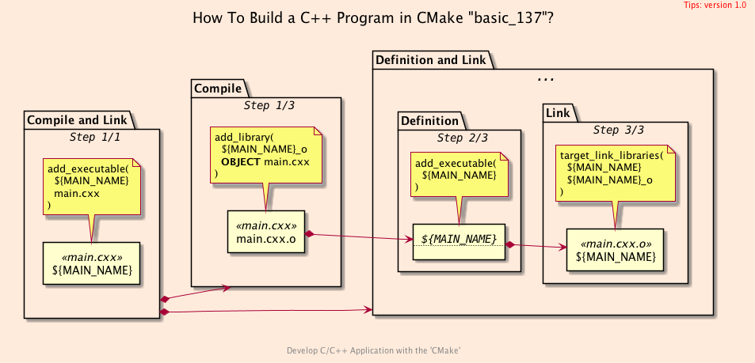
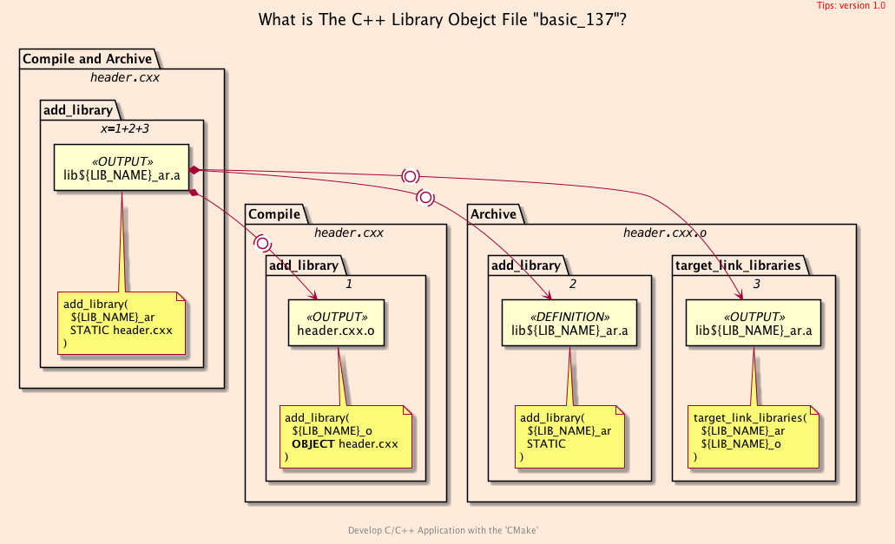
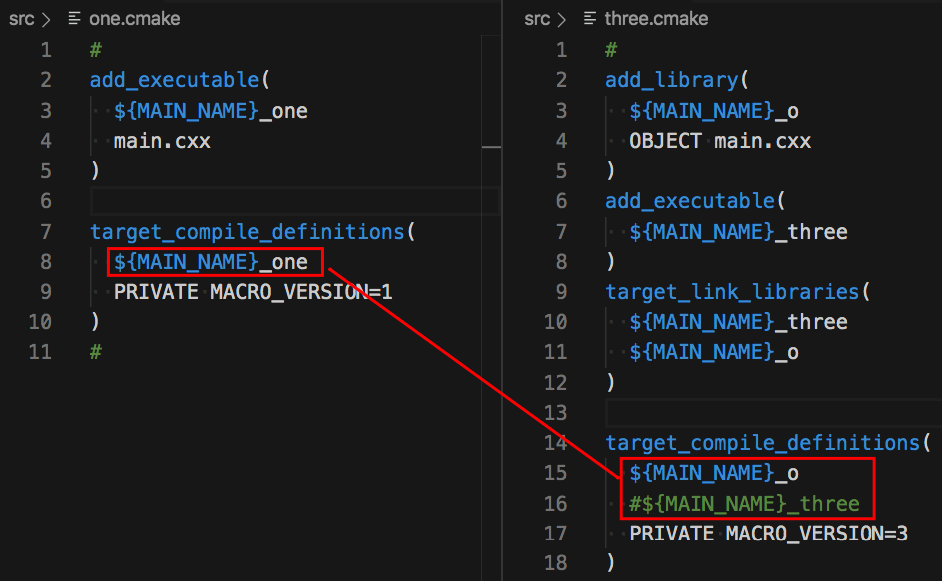

<h2>Hello, Object Library!</h2>
<h3>How to Create and Use The Object File in CMake</h3>
</br>
</br>

[@Gitter](https://gitter.im/cnruby) :gitter.im/cnruby<br/>
Code ID: basic_137</br>
Code Name: Hello, Object Library!</br>
<p class ="fragment" data-audio-src="docs/137/audio/basic_137-01.m4a"></p>


[<h1>Youtube Video</h1>](https://youtu.be/xj1fx2Xsl-U)

[<h1>Short Video</h1>](https://youtu.be/edcA9puzDgU)


<h2>TABLE of CONTENTS</h2>

- [About The Project](#about-the-project)
  - [Explain The C++ Library Obejct of <code>CMake</code>](#explain-the-c-library-obejct-of-cmake)
- [Explain <code>C++</code>  and <code>CMake</code> Code](#explain-c-and-cmake-code)
  - [Explain Main's <code>CMake</code> Code](#explain-mains-cmake-code)
  - [Explain Library's <code>CMake</code> Code](#explain-librarys-cmake-code)
- [A Demonstration of Building Project](#a-demonstration-of-building-project)
  - [The Difference for two build methods](#the-difference-for-two-build-methods)
- [Final Summary](#final-summary)
- [References](#references)
  - [Requirements](#requirements)
  - [Get The Code with Shell Commands](#get-the-code-with-shell-commands)
  - [The Structure of Folder](#the-structure-of-folder)
<div class ="fragment" data-audio-src="docs/137/audio/basic_137-02.m4a"></div>




## About The Project
<p class ="fragment" data-audio-src="docs/137/audio/basic_137-03.m4a"></p>




### Explain The C++ Library Obejct of <code>CMake</code>
<p class ="fragment" data-audio-src="docs/137/audio/basic_137-04.m4a"></p>


<!--{ "./src/main.cxx" | lines: 0 13 | code: c }-->
```c
// ./src/main.cxx
#include <iostream>
#include "config.hxx"
#include "header.hxx"
#include "macro.hxx"

int main(int, char**) {
  std::cout << "Project ID:\t\t\t" << PROJECT_NAME << std::endl;
  std::cout << "Project Code:\t\t\t" << PROJECT_DESCRIPTION << std::endl;
  std::cout << "Project Version:\t\t" << MACRO_VERSION << std::endl << std::endl;

  Header header;
  header.hello("Library");
```
<!--{ end }-->
## Explain <code>C++</code>  and <code>CMake</code> Code 
<p class ="fragment" data-audio-src="docs/137/audio/basic_137-05.m4a"></p>


<!--{ "./src/one.cmake" | lines: 0 5 | code: bash }-->
```bash
# ./src/one.cmake
add_executable(
  ${MAIN_NAME}_one
  main.cxx
)
```
<!--{ end }-->

<hr/>

<!--{ "./src/three.cmake" | lines: 0 12 | code: CMake }-->
```CMake
# ./src/three.cmake
add_library(
  ${MAIN_NAME}_o
  OBJECT main.cxx
)
add_executable(
  ${MAIN_NAME}_three
)
target_link_libraries(
  ${MAIN_NAME}_three
  ${LIB_NAME}_o ${MAIN_NAME}_o
)
```
<!--{ end }-->
### Explain Main's <code>CMake</code> Code 
<p class ="fragment" data-audio-src="docs/137/audio/basic_137-06.m4a"></p>


<!--{ "./lib/one.cmake" | code: CMake }-->
```CMake
# ./lib/one.cmake
add_library(
  ${LIB_NAME}_a
  STATIC header.cxx
)
```
<!--{ end }-->

<hr/>

<!--{ "./lib/three.cmake" | code: bash }-->
```bash
# ./lib/three.cmake
add_library(
  ${LIB_NAME}_o
  OBJECT header.cxx
)
add_library(
  ${LIB_NAME}_ar STATIC
)
target_link_libraries(
  ${LIB_NAME}_ar
  ${LIB_NAME}_o
)
```
<!--{ end }-->
### Explain Library's <code>CMake</code> Code
<p class ="fragment" data-audio-src="docs/137/audio/basic_137-07.m4a"></p>


## A Demonstration of Building Project
<video width="720" height="480" controls data-autoplay>
  <source src="docs/137/video/basic_137-08.mp4" autoplay=true type="video/mp4">
</video>




### The Difference for two build methods
<p class ="fragment" data-audio-src="docs/137/audio/basic_137-09.m4a"></p>


## Final Summary
<p class ="fragment" data-audio-src="docs/137/audio/basic_137-10.m4a"></p>


<h1><!-- markdown-exec(cmd:echo "感谢大家观看!") -->感谢大家观看!<!-- /markdown-exec --></h1>

@Gitter: gitter.im/cnruby<br/>

@Github: github.com/cnruby<br/>

@Twitter: twitter.com/cnruby<br/>

@Blogspot: cnruby.blogspot.com


## References
- https://stackoverflow.com/questions/8249945/what-is-object-in-object-file-and-why-is-it-called-this-way
- https://qiita.com/mrk_21/items/57075ce36f49ce0aacf4
- https://stackoverflow.com/questions/35696103/cmake-wildcard-for-target-objects
- https://stackoverflow.com/questions/44767099/linking-cmake-interface-libraries-with-object-libraries
- https://stackoverflow.com/questions/49265945/cmake-append-objects-from-different-cmakelists-txt-into-one-library
- https://stackoverflow.com/questions/58969829/cmake-object-files-of-executable-in-custom-command
- https://github.com/dev-cafe/cmake-cookbook
- https://www.dealii.org/9.1.1/users/cmakelists.html
- https://cmake.org/cmake/help/latest/manual/cmake-generator-expressions.7.html
- https://stackoverflow.com/questions/50684930/how-to-collect-object-files-o-in-a-particular-directory-with-cmake
- https://stackoverflow.com/questions/48296061/cmakes-objects-output-folder-variable
- https://stackoverflow.com/questions/29884856/how-to-get-path-to-object-files-with-cmake-for-both-multiconfiguration-generator


### Requirements
- [Ubuntu 20.04+](https://ubuntu.com/)
- [VS Code 1.43.0+](https://code.visualstudio.com/)
- [CMake 3.17.2+](https://cmake.org/)


### Get The Code with Shell Commands
```bash
git clone https://github.com/cnruby/w3h1_cmake.git basic_137
cd basic_137
git checkout basic_137
code .
```


### The Structure of Folder
<!--{ "./docs/output/tree.txt" | code: bash }-->
```bash
# ./docs/output/tree.txt
.
├── cmake
│  ├── CMakeLists.txt
│  ├── config.h.in
│  ├── GetOutput.cmake
│  └── Initialize.cmake
├── CMakeLists.txt
├── config
   ├── config.hxx
│  └── macro.hxx
└── src
   ├── CMakeLists.txt
   ├── main.cxx
   ├── one.cmake
   └── three.cmake
```
<!--{ end }-->
