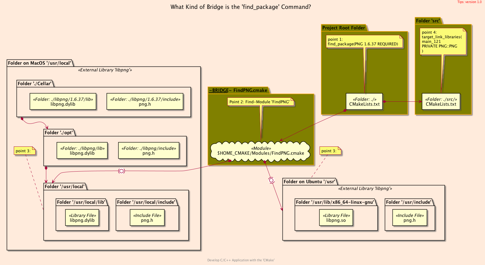
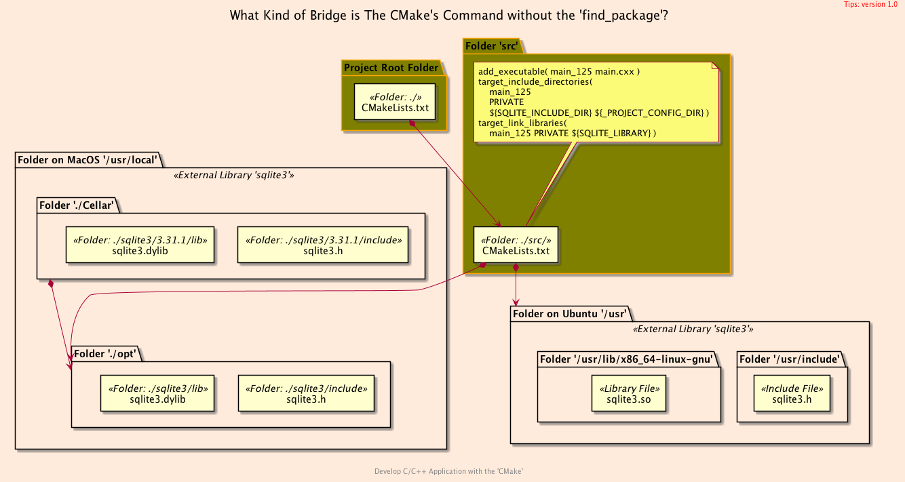

<h2>Hello, MULTOS!</h2>
<h3>Building <code>C++</code> Project on Multiple Operating System using <code>CMake</code></h3>
</br>
</br>

[@Gitter](https://gitter.im/cnruby) :gitter.im/cnruby<br/>
Code ID: basic_125</br>
Code Name: Hello, MULTOS!</br>
<p class ="fragment" data-audio-src="docs/125/audio/basic_125-01.m4a"></p>


<h2>TABLE of CONTENTS</h2>

- [About The Project](#about-the-project)
  - [Requirements](#requirements)
  - [Install The Library <code>SQLite3</code>](#install-the-library-sqlite3)
  - [Get The Code with Shell Commands](#get-the-code-with-shell-commands)
- [Demonstrate Building The Project on MULTOS](#demonstrate-building-the-project-on-multos)
- [The Structure of Project](#the-structure-of-project)
  - [The <code>Folder's</code> Structure](#the-folders-structure)
  - [The Command's Structure of Project "basic_121"](#the-commands-structure-of-project-%22basic121%22)
  - [The Command's Structure of Project "basic_125"](#the-commands-structure-of-project-%22basic125%22)
- [The <code>CMake</code> Codes of Project</code>](#the-cmake-codes-of-projectcode)
  - [The Listfile of Folder <code>'src'</code>](#the-listfile-of-folder-src)
  - [The File 'GetSQLite3.cmake' of Folder <code>'cmake'</code>](#the-file-getsqlite3cmake-of-folder-cmake)
- [Final Summary](#final-summary)
- [References](#references)
  - [General](#general)
  - [Important](#important)
<div class ="fragment" data-audio-src="docs/125/audio/basic_125-02.m4a"></div>


## About The Project

<div class ="fragment" data-audio-src="docs/125/audio/basic_125-03.m4a"></div>


### Requirements
- [VS Code 1.43.0+](https://code.visualstudio.com/)
- [CMake 3.17.0+](https://cmake.org/)
- [Library SQLite 3.31.1+](https://www.sqlite.org/index.html)
<div class ="fragment" data-audio-src="docs/125/audio/basic_125-04.m4a"></div>


### Install The Library <code>SQLite3</code>
```bash
# For MacOS
brew install sqlite
# For Ubuntu 20.04+
sudo apt-get update
sudo apt-get install sqlite3
```
<div class ="fragment" data-audio-src="docs/125/audio/basic_125-05.m4a"></div>


### Get The Code with Shell Commands
```bash
#<!-- markdown-exec(cmd:cat ../get_project.sh) -->#!/bin/bash
# ./get_project.sh <PROJECT_ID>
# ./get_project.sh basic_125
#
PROJECT_HOME=$HOME/Documents/dev/cpp-ws/$1
git clone https://github.com/cnruby/w3h1_cmake.git $PROJECT_HOME
cd $PROJECT_HOME && git checkout $1
code $PROJECT_HOME
#<!-- /markdown-exec -->
```
<div class ="fragment" data-audio-src="docs/125/audio/basic_125-06.m4a"></div>


## Demonstrate Building The Project on MULTOS
<video width="720" height="480" controls data-autoplay>
  <source src="docs/125/video/basic_125-14.mov" autoplay=true type="video/mp4">
</video>


## The Structure of Project
```bash
#<!-- markdown-exec(cmd:cat docs/output/tree.txt) -->#
.
├── cmake
│  ├── CMakeLists.txt
│  ├── config.h.in
│  ├── GetSQLite3.cmake
│  └── Initialize.cmake
├── CMakeLists.txt
├── config
│  └── config.hxx
└── src
   ├── CMakeLists.txt
   └── main.cxx
#<!-- /markdown-exec -->
```
### The <code>Folder's</code> Structure
<p class ="fragment" data-audio-src="docs/125/audio/basic_125-07.m4a"></p>


### The Command's Structure of Project "basic_121"

<p class ="fragment" data-audio-src="docs/125/audio/basic_125-09.m4a"></p>


### The Command's Structure of Project "basic_125"

<p class ="fragment" data-audio-src="docs/125/audio/basic_125-09.m4a"></p>


## The <code>CMake</code> Codes of Project</code>
```bash
#<!-- markdown-exec(cmd:cat src/CMakeLists.txt) -->#
add_executable( main_125 main.cxx )
target_include_directories(
  main_125 
  PRIVATE 
  ${_SQLITE_INCLUDE_DIR} ${_PROJECT_CONFIG_DIR}
)
target_link_libraries(
  main_125 PRIVATE ${_SQLITE_LIBRARY})
#<!-- /markdown-exec -->
```
### The Listfile of Folder <code>'src'</code>
<p class ="fragment" data-audio-src="docs/125/audio/basic_125-12.m4a"></p>


```bash
#<!-- markdown-exec(cmd:cat cmake/GetSQLite3.cmake) -->#
if(${OS_NAME} STREQUAL APPLE)
  set(_SQLITE_INCLUDE_DIR /usr/local/opt/sqlite3/include)
  set(_SQLITE_LIBRARY /usr/local/opt/sqlite3/lib/libsqlite3.a)
elseif(${OS_NAME} STREQUAL UBUNTU)
  set(_SQLITE_INCLUDE_DIR /usr/include)
  set(_SQLITE_LIBRARY /usr/lib/x86_64-linux-gnu/libsqlite3.so)
else()
endif()
#<!-- /markdown-exec -->
```
### The File 'GetSQLite3.cmake' of Folder <code>'cmake'</code>
<p class ="fragment" data-audio-src="docs/125/audio/basic_125-13.m4a"></p>


## Final Summary
<p class ="fragment" data-audio-src="docs/125/audio/basic_125-16.m4a"></p>


<h1><!-- markdown-exec(cmd:echo "感谢大家观看!") -->感谢大家观看!<!-- /markdown-exec --></h1>

@Gitter: gitter.im/cnruby<br/>

@Github: github.com/cnruby<br/>

@Twitter: twitter.com/cnruby<br/>

@Blogspot: cnruby.blogspot.com


## References
### General
- https://cmake.org/cmake/help/latest/command/configure_file.html
- https://gitlab.kitware.com/cmake/community/-/wikis/doc/tutorials/How-to-create-a-ProjectConfig.cmake-file
- https://riptutorial.com/cmake/example/26652/generate-a-cplusplus-configure-file-with-cmake
- https://stackoverflow.com/questions/48580399/how-to-ensure-a-generated-config-h-file-is-in-the-include-path
- https://github.com/bast/cmake-example/tree/master/cmake 
- https://cmake.org/pipermail/cmake/2006-May/009049.html
- https://discourse.brew.sh/t/failed-to-set-locale-category-lc-numeric-to-en-ru/5092/5
- https://raw.githubusercontent.com/git/git/master/po/de.po
- https://raw.githubusercontent.com/git/git/master/po/zh_CN.po
- https://www.boost.org/doc/libs/1_57_0/libs/locale/doc/html/messages_formatting.html
- https://cmake.org/cmake/help/v3.0/variable/ENV.html
- https://cmake.org/cmake/help/latest/module/FindIntl.html
- https://stackoverflow.com/questions/1003360/complete-c-i18n-gettext-hello-world-example/1033337
- https://fedoraproject.org/wiki/How_to_do_I18N_through_gettext
- https://stackoverflow.com/questions/1003360/complete-c-i18n-gettext-hello-world-example
- https://stackoverflow.com/questions/21370363/link-error-installing-rcpp-library-not-found-for-lintl
- https://ubuntuforums.org/showthread.php?t=108879
- https://github.com/neovim/neovim/blob/master/src/nvim/po/de.po
- https://progmar.net.pl/en/knowledge-base/gettext
- https://stackoverflow.com/questions/11789615/how-to-support-multiple-language-in-a-linux-c-c-program
- https://stackoverflow.com/questions/11370684/what-is-libintl-h-and-where-can-i-get-it
- https://nkumar.fedorapeople.org/helloi18n/helloworldintld/
- https://nkumar.fedorapeople.org/helloi18n/helloworld/
- https://stackoverflow.com/questions/31356199/multiple-make-targets-in-the-same-cmake-project
- https://stackoverflow.com/questions/47553569/how-can-i-build-multiple-targets-using-cmake-build?rq=1
- https://cmake.org/pipermail/cmake/2013-March/054016.html


### Important
- https://davesteele.github.io/debian/development/2015/12/10/i18n-build-flow/
- https://www.debian.org/international/l10n/po/pot