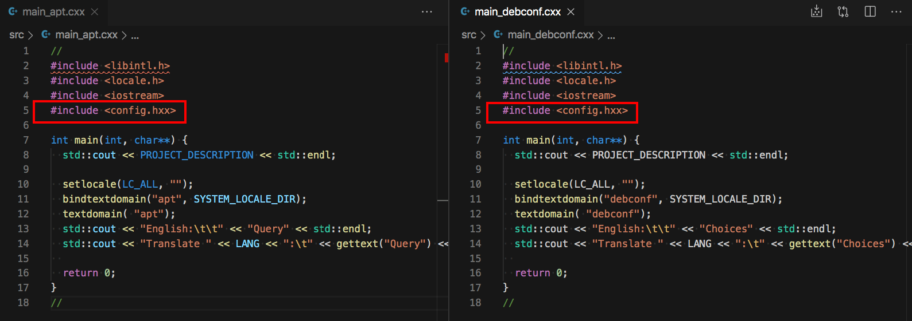
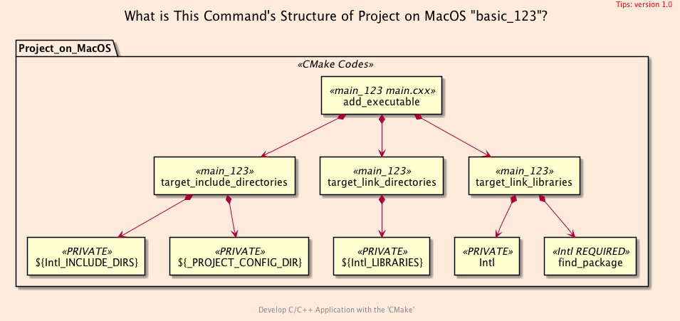
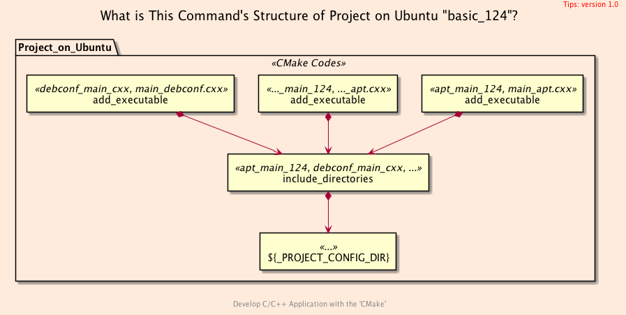
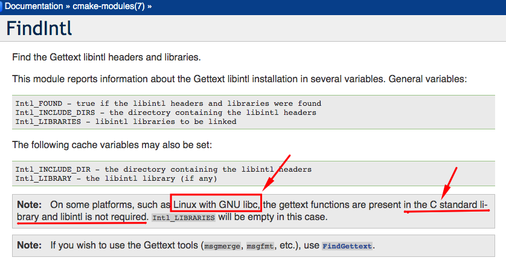
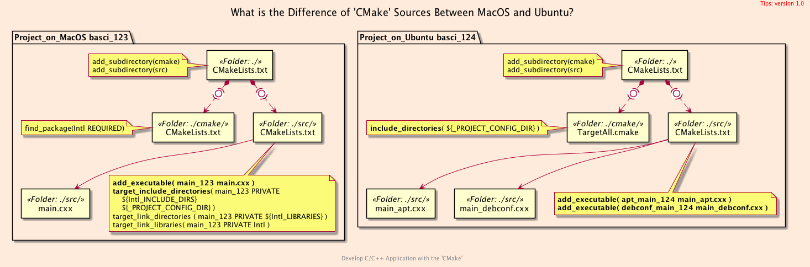

<h2>Hello, Targets!</h2>
<h3>Building multiple Targets using <code>CMake</code> on Ubuntu 20.04</h3>
</br>
</br>

[@Gitter](https://gitter.im/cnruby) :gitter.im/cnruby<br/>
Code ID: basic_124</br>
Code Name: Hello, Targets!</br>
<p class ="fragment" data-audio-src="docs/124/audio/basic_124-01.m4a"></p>


<h2>TABLE of CONTENTS</h2>

- [About The Project](#about-the-project)
  - [Requirements](#requirements)
  - [Install The Library <code>gettext</code>](#install-the-library-gettext)
  - [Get The Code with Shell Commands](#get-the-code-with-shell-commands)
- [The Structure of Project](#the-structure-of-project)
  - [The <code>Folder's</code> Structure](#the-folders-structure)
  - [The Command's Structure of Project on <code>MacOS</code> "basic_123"](#the-commands-structure-of-project-on-macos-%22basic123%22)
  - [The Command's Structure of Project on <code>Ubuntu</code> "basic_124"](#the-commands-structure-of-project-on-ubuntu-%22basic124%22)
- [The <code>CMake</code> Codes of Project</code>](#the-cmake-codes-of-projectcode)
  - [The Difference of <code>'CMake'</code> Sources Between <code>MacOS</code> and <code>Ubuntu</code>?](#the-difference-of-cmake-sources-between-macos-and-ubuntu)
  - [The Listfile of Folder <code>'src'</code>](#the-listfile-of-folder-src)
  - [The Listfile of Folder <code>'src'</code>](#the-listfile-of-folder-src-1)
- [Demonstrate The Development of Project](#demonstrate-the-development-of-project)
  - [Demonstrate Building The Project](#demonstrate-building-the-project)
  - [Demonstrate The Build's Commands](#demonstrate-the-builds-commands)
- [Final Summary](#final-summary)
- [References](#references)
  - [General](#general)
  - [Important](#important)
<div class ="fragment" data-audio-src="docs/124/audio/basic_124-02.m4a"></div>


## About The Project

<div class ="fragment" data-audio-src="docs/124/audio/basic_124-03.m4a"></div>


[<h1>Youtube Video</h1>](https://youtu.be/-T4BMEI2agc)


### Requirements
- [VS Code 1.43.0+](https://code.visualstudio.com/)
- [CMake 3.17.0+](https://cmake.org/)
- [Library gettext 0.20.1](https://www.gnu.org/software/gettext/)
- Library language-pack-de
- Library language-pack-zh-hans
- Library language-pack-zh-hant, optional
<div class ="fragment" data-audio-src="docs/124/audio/basic_124-04.m4a"></div>


### Install The Library <code>gettext</code>
```bash
# For Ubuntu 20.04+
sudo apt-get update
sudo apt-get install -y gettext
sudo apt-get install -y language-pack-de
sudo apt-get install -y language-pack-zh-hans
sudo apt-get install -y language-pack-zh-hant
```
<div class ="fragment" data-audio-src="docs/124/audio/basic_124-05.m4a"></div>


### Get The Code with Shell Commands
```bash
git clone https://github.com/cnruby/w3h1_cmake.git basic_124
cd basic_124
git checkout basic_124
code .
```
<div class ="fragment" data-audio-src="docs/124/audio/basic_124-06.m4a"></div>


## The Structure of Project
```bash
#<!-- markdown-exec(cmd:cat docs/output/tree.txt) -->#
.
├── cmake
│  ├── CMakeLists.txt
│  ├── config.h.in
│  ├── GetLocaleDir.cmake
│  ├── Initialize.cmake
│  └── TargetAll.cmake
├── CMakeLists.txt
├── config
│  └── config.hxx
└── src
   ├── CMakeLists.txt
   ├── main_apt.cxx
   └── main_debconf.cxx
#<!-- /markdown-exec -->
```
### The <code>Folder's</code> Structure
<p class ="fragment" data-audio-src="docs/124/audio/basic_124-07.m4a"></p>



### The Command's Structure of Project on <code>MacOS</code> "basic_123"
<p class ="fragment" data-audio-src="docs/124/audio/basic_124-08.m4a"></p>



### The Command's Structure of Project on <code>Ubuntu</code> "basic_124"
<p class ="fragment" data-audio-src="docs/124/audio/basic_124-09.m4a"></p>


## The <code>CMake</code> Codes of Project</code>

<p class ="fragment" data-audio-src="docs/124/audio/basic_124-10.m4a"></p>



### The Difference of <code>'CMake'</code> Sources Between <code>MacOS</code> and <code>Ubuntu</code>?
<p class ="fragment" data-audio-src="docs/124/audio/basic_124-11.m4a"></p>


```bash
#<!-- markdown-exec(cmd:cat src/CMakeLists.txt) -->#
add_executable(
  apt_main_124
  main_apt.cxx
)
add_executable(
  debconf_main_124
  main_debconf.cxx
)
#<!-- /markdown-exec -->
```
### The Listfile of Folder <code>'src'</code>
<p class ="fragment" data-audio-src="docs/124/audio/basic_124-12.m4a"></p>


```bash
#<!-- markdown-exec(cmd:cat cmake/TargetAll.cmake) -->#
# For Ubuntu
include_directories(${_PROJECT_CONFIG_DIR})
# For MacOS
# include_directories( ${Intl_INCLUDE_DIRS} ${_PROJECT_CONFIG_DIR} )
# include_directories(${Intl_INCLUDE_DIRS} ${_PROJECT_CONFIG_DIR})
# link_directories(${Intl_LIBRARIES})
#<!-- /markdown-exec -->
```
### The Listfile of Folder <code>'src'</code>
<p class ="fragment" data-audio-src="docs/124/audio/basic_124-13.m4a"></p>


## Demonstrate The Development of Project
<video width="720" height="480" controls data-autoplay>
  <source src="docs/124/video/basic_124-14.mov" autoplay=true type="video/mp4">
</video>

### Demonstrate Building The Project


### Demonstrate The Build's Commands
<video width="720" height="480" controls data-autoplay>
  <source src="docs/124/video/basic_124-15.mov" autoplay=true type="video/mp4">
</video>


## Final Summary
<p class ="fragment" data-audio-src="docs/124/audio/basic_124-16.m4a"></p>


<h1><!-- markdown-exec(cmd:echo "感谢大家观看!") -->感谢大家观看!<!-- /markdown-exec --></h1>

@Gitter: gitter.im/cnruby<br/>

@Github: github.com/cnruby<br/>

@Twitter: twitter.com/cnruby<br/>

@Blogspot: cnruby.blogspot.com


## References
### General
- https://cmake.org/cmake/help/latest/command/configure_file.html
- https://gitlab.kitware.com/cmake/community/-/wikis/doc/tutorials/How-to-create-a-ProjectConfig.cmake-file
- https://riptutorial.com/cmake/example/26652/generate-a-cplusplus-configure-file-with-cmake
- https://stackoverflow.com/questions/48580399/how-to-ensure-a-generated-config-h-file-is-in-the-include-path
- https://github.com/bast/cmake-example/tree/master/cmake 
- https://cmake.org/pipermail/cmake/2006-May/009049.html
- https://discourse.brew.sh/t/failed-to-set-locale-category-lc-numeric-to-en-ru/5092/5
- https://raw.githubusercontent.com/git/git/master/po/de.po
- https://raw.githubusercontent.com/git/git/master/po/zh_CN.po
- https://www.boost.org/doc/libs/1_57_0/libs/locale/doc/html/messages_formatting.html
- https://cmake.org/cmake/help/v3.0/variable/ENV.html
- https://cmake.org/cmake/help/latest/module/FindIntl.html
- https://stackoverflow.com/questions/1003360/complete-c-i18n-gettext-hello-world-example/1033337
- https://fedoraproject.org/wiki/How_to_do_I18N_through_gettext
- https://stackoverflow.com/questions/1003360/complete-c-i18n-gettext-hello-world-example
- https://stackoverflow.com/questions/21370363/link-error-installing-rcpp-library-not-found-for-lintl
- https://ubuntuforums.org/showthread.php?t=108879
- https://github.com/neovim/neovim/blob/master/src/nvim/po/de.po
- https://progmar.net.pl/en/knowledge-base/gettext
- https://stackoverflow.com/questions/11789615/how-to-support-multiple-language-in-a-linux-c-c-program
- https://stackoverflow.com/questions/11370684/what-is-libintl-h-and-where-can-i-get-it
- https://nkumar.fedorapeople.org/helloi18n/helloworldintld/
- https://nkumar.fedorapeople.org/helloi18n/helloworld/
- https://stackoverflow.com/questions/31356199/multiple-make-targets-in-the-same-cmake-project
- https://stackoverflow.com/questions/47553569/how-can-i-build-multiple-targets-using-cmake-build?rq=1
- https://cmake.org/pipermail/cmake/2013-March/054016.html


### Important
- https://davesteele.github.io/debian/development/2015/12/10/i18n-build-flow/
- https://www.debian.org/international/l10n/po/pot