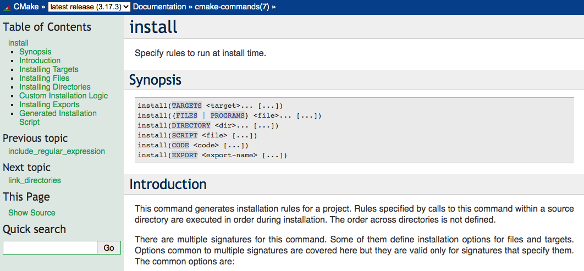
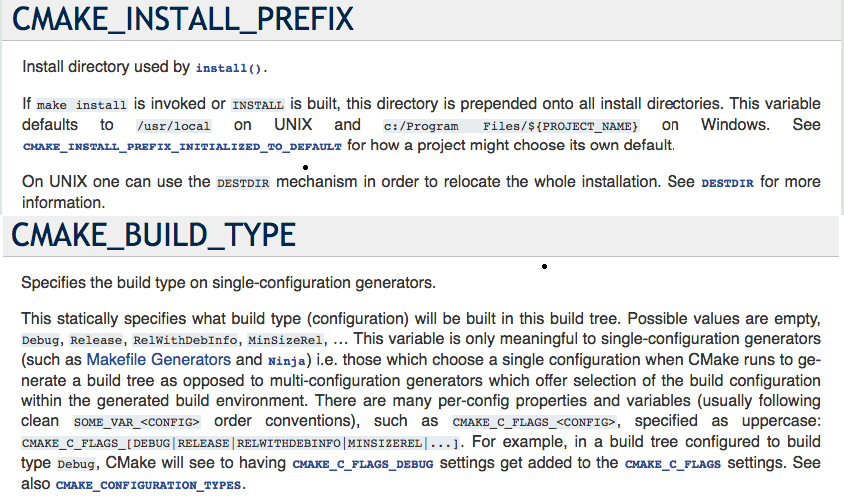
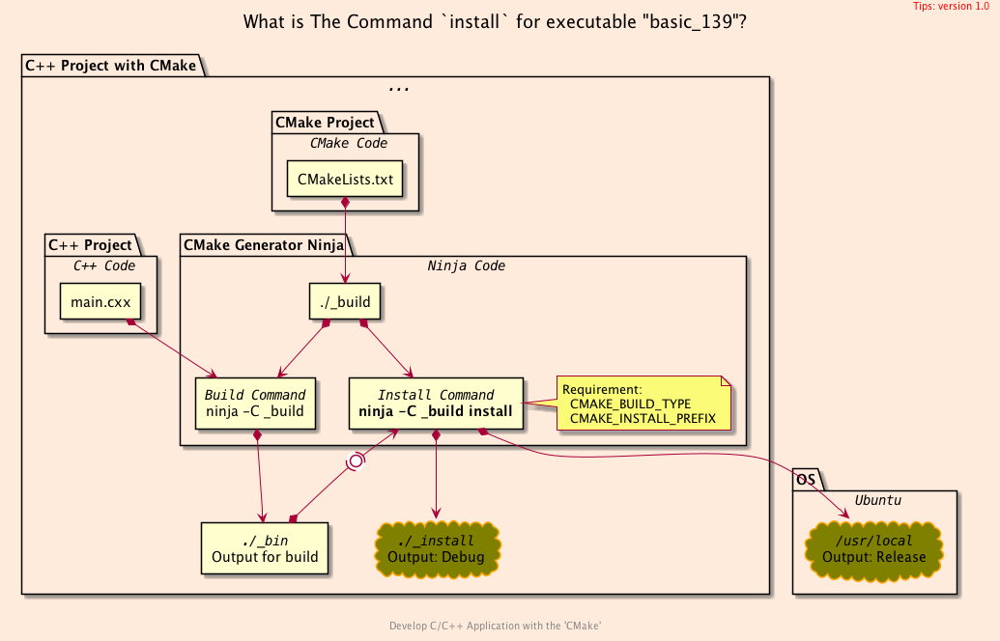

<h2>Hello, install:exe!</h2>
<h3>How to install executable from the project to local</h3>
</br>
</br>

[@Gitter](https://gitter.im/cnruby): gitter.im/cnruby<br/>
Code ID: basic_139</br>
Code Name: Hello, install:exe!</br>
<p class ="fragment" data-audio-src="docs/139/audio/basic_139-01.m4a"></p>


[<h1>Youtube Video</h1>](https://youtu.be/nJj1efRi6oI)

[<h1>Short Video</h1>](https://youtu.be/edcA9puzDgU)


<h2>TABLE of CONTENTS</h2>

- [About The Project](#about-the-project)
  - [<code>CMake</code> install Code of Project](#cmake-install-code-of-project)
  - [install executable on Project](#install-executable-on-project)
  - [install executable on OS](#install-executable-on-os)
- [A Demonstration of Building Project](#a-demonstration-of-building-project)
- [Explaining the <code>CMake</code> command and variables](#explaining-the-cmake-command-and-variables)
  - [Explaining the <code>CMake</code> command: "<code>cmake --install _build</code>"](#explaining-the-cmake-command-cmake---install-_build)
  - [Explaining the CMAKE variables](#explaining-the-cmake-variables)
- [Final Summary](#final-summary)
- [References](#references)
  - [General](#general)
  - [CMake API](#cmake-api)
  - [Requirements](#requirements)
  - [Get The Code with Shell Commands](#get-the-code-with-shell-commands)
  - [The Structure of Folder](#the-structure-of-folder)
- [Explain <code>C++</code>  and <code>CMake</code> Code](#explain-c-and-cmake-code)
<div class ="fragment" data-audio-src="docs/139/audio/basic_139-02.m4a"></div>




## About The Project
<p class ="fragment" data-audio-src="docs/139/audio/basic_139-03.m4a"></p>


<!--{ "./src/install.cmake" | line-numbers: " " | lines: 4 15 | code: CMake }-->
```CMake
4 install(
5   TARGETS ${TARGET_NAME}
6   CONFIGURATIONS Debug
7   RUNTIME
8     DESTINATION ${RUNTIME_INSTALL_DIRECTORY}/Debug/bin
9 )
10 install(
11   TARGETS ${TARGET_NAME}
12   CONFIGURATIONS Release
13   RUNTIME
14     DESTINATION ${CMAKE_INSTALL_PREFIX}/bin
15 )
```
<!--{ end }-->
### <code>CMake</code> install Code of Project
<p class ="fragment" data-audio-src="docs/139/audio/basic_139-04.m4a"></p>


<!--{ "./docs/cmd/on_project.sh" | line-numbers: " " | code: bash }-->
```bash
1 # to install executable to Project for Developer 
2 cmake -GNinja -H. -B_build
3 cmake -DCMAKE_BUILD_TYPE=Debug --build _build
4 ninja -C _build
5 ninja -C _build install
6 ./_install/Debug/bin/main_139
```
<!--{ end }-->
### install executable on Project
<p class ="fragment" data-audio-src="docs/139/audio/basic_139-05.m4a"></p>


<!--{ "./docs/cmd/on_os.sh" | line-numbers: " " | code: bash }-->
```bash
1 # to install executable from source to OS for User
2 cmake -GNinja -H. -B_build
3 ninja -C _build
4 sudo ninja -C _build install
5 main_139
```
<!--{ end }-->
### install executable on OS
<p class ="fragment" data-audio-src="docs/139/audio/basic_139-06.m4a"></p>


## A Demonstration of Building Project
<video width="720" height="480" controls data-autoplay>
  <source src="docs/139/video/basic_139-07.mp4" autoplay=true type="video/mp4">
</video>


## Explaining the <code>CMake</code> command and variables

<p class ="fragment" data-audio-src="docs/139/audio/basic_139-08.m4a"></p>


### Explaining the <code>CMake</code> command: "<code>cmake --install _build</code>"
1. it is equal to "cmake --build _build --target install"
1. the executable MUST exist, before it run
1. it can NOT update automatically the CMake cache file
1. the uninstall command exists NOT in CMake
<p class ="fragment" data-audio-src="docs/139/audio/basic_139-09.m4a"></p>


### Explaining the CMAKE variables
- <code>CMAKE_BUILD_TYPE: default value is empty</code>
- <code>CMAKE_INSTALL_PREFIX: default value is NOT empty</code> 
<p class ="fragment" data-audio-src="docs/139/audio/basic_139-10.m4a"></p>




## Final Summary
<p class ="fragment" data-audio-src="docs/139/audio/basic_139-11.m4a"></p>


<h1>感谢大家观看!</h1>

@Gitter: gitter.im/cnruby<br/>

@Github: github.com/cnruby<br/>

@Twitter: twitter.com/cnruby<br/>

@Blogspot: cnruby.blogspot.com


## References


### General
- https://www.dealii.org/9.1.1/users/cmakelists.html
- https://cliutils.gitlab.io/modern-cmake/modern-cmake.pdf
- https://askubuntu.com/questions/954869/error-in-make-install-cannot-copy-file
- https://discourse.cmake.org/t/how-to-deal-with-ninja-setting-cmake-build-type-to-debug/281/3
- https://chenxiaowei.gitbook.io/cmake-cookbook/10.0-chinese/10.1-chinese
- https://github.com/pr0g/cmake-examples
- https://foonathan.net/2016/03/cmake-install/
- https://stackoverflow.com/questions/34040522/is-there-a-cmake-install-switch/34040747
- https://mirkokiefer.com/cmake-by-example-f95eb47d45b1
- https://lastviking.eu/adding_an_install_target_in_cmake.html
- https://pabloariasal.github.io/2018/02/19/its-time-to-do-cmake-right/
- https://stackoverflow.com/questions/41471620/cmake-support-make-uninstall
- https://www.linux.com/training-tutorials/cmake-recipe-5-adding-uninstall-target-your-project/
- https://gist.github.com/royvandam/3033428


### CMake API
- https://cmake.org/cmake/help/latest/command/install.html
- https://cmake.org/cmake/help/latest/variable/CMAKE_INSTALL_PREFIX.html
- https://cmake.org/cmake/help/latest/variable/CMAKE_BUILD_TYPE.html


### Requirements
- [Ubuntu 20.04+](https://ubuntu.com/)
- [VS Code 1.43.0+](https://code.visualstudio.com/)
- [CMake 3.17.3+](https://cmake.org/)


### Get The Code with Shell Commands
```bash
git clone https://github.com/cnruby/w3h1_cmake.git basic_139
cd basic_139
git checkout basic_139
code .
```


### The Structure of Folder
<!--{ "./docs/output/tree.txt" | code: bash }-->
```bash
.
├── cmake
│  ├── CMakeLists.txt
│  └── config.h.in
├── CMakeLists.txt
├── config
│  └── config.hxx
└── src
   ├── CMakeLists.txt
   ├── install.cmake
   └── main.cxx
```
<!--{ end }-->
## Explain <code>C++</code>  and <code>CMake</code> Code 
<p class ="fragment" data-audio-src="docs/137/audio/basic_137-03.m4a"></p>
