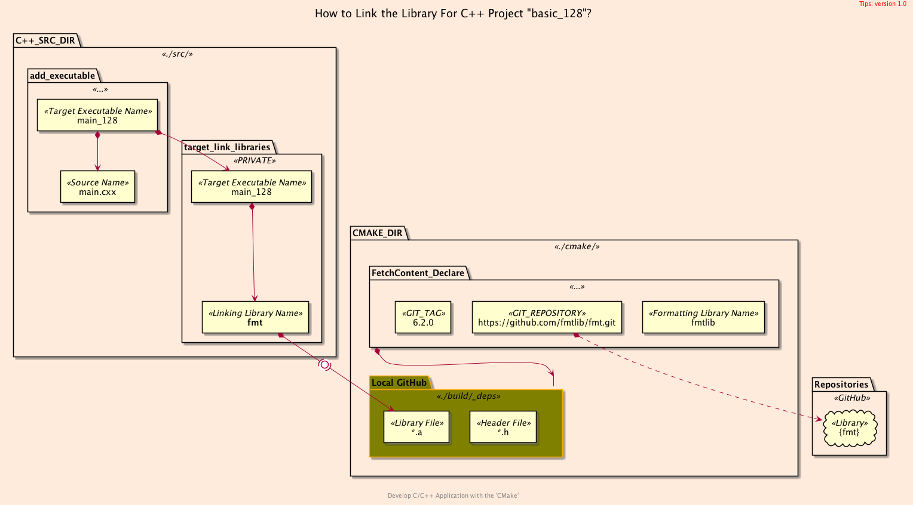
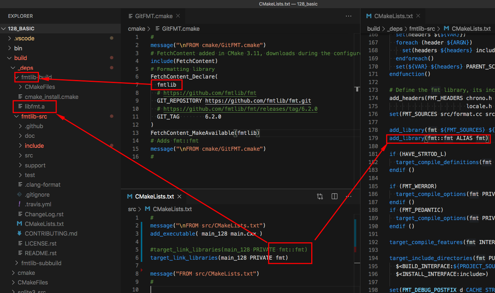
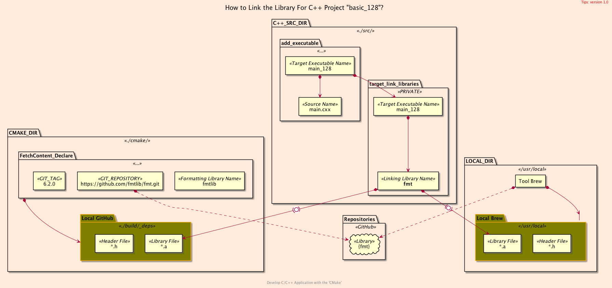

<h2>Hello, GitHub!</h2>
<h3>Formatting Library from Repositories Using <code>CMake</code></h3>
</br>
</br>

[@Gitter](https://gitter.im/cnruby) :gitter.im/cnruby<br/>
Code ID: basic_128</br>
Code Name: Hello, GitHub!</br>
<p class ="fragment" data-audio-src="docs/128/audio/basic_128-01.m4a"></p>


[<h1>Youtube Video</h1>](https://youtu.be/27zsR2It2K8) 


<h2>TABLE of CONTENTS</h2>

- [About The Project](#about-the-project)
  - [Requirements](#requirements)
  - [Install The Library <code>{fmt}</code>](#install-the-library-fmt)
  - [Get The Code with Shell Commands](#get-the-code-with-shell-commands)
- [Demonstrate Building The Project](#demonstrate-building-the-project)
  - [The File <code>'GitFMT.cmake'</code> of Folder <code>'cmake'</code>](#the-file-gitfmtcmake-of-folder-cmake)
  - [Demonstrate Formatting Library from Repositories](#demonstrate-formatting-library-from-repositories)
- [Demonstrate Origin of Library's Name](#demonstrate-origin-of-librarys-name)
  - [The Listfile of Folder <code>'src'</code>](#the-listfile-of-folder-src)
  - [Demonstrate Library's Name from diffrent Library](#demonstrate-librarys-name-from-diffrent-library)
  - [Linking the Library For C++ Project](#linking-the-library-for-c-project)
- [Final Summary](#final-summary)
- [References](#references)
- [The Structures of Project](#the-structures-of-project)
  - [The <code>Folder's</code> Structure](#the-folders-structure)
<div class ="fragment" data-audio-src="docs/128/audio/basic_128-02.m4a"></div>


## About The Project

<div class ="fragment" data-audio-src="docs/128/audio/basic_128-03.m4a"></div>


### Requirements
- [VS Code 1.43.0+](https://code.visualstudio.com/)
- [CMake 3.17.0+](https://cmake.org/)
- [Library {fmt} 6.1.2+](https://fmt.dev/latest/index.html)
<div class ="fragment" data-audio-src="docs/128/audio/basic_128-04.m4a"></div>


### Install The Library <code>{fmt}</code>
```bash
# For MacOS 10.11+
brew install fmt
# For Ubuntu 20.04+
sudo apt update
sudo apt install libfmt-dev
```
<div class ="fragment" data-audio-src="docs/128/audio/basic_128-05.m4a"></div>


### Get The Code with Shell Commands
```bash
#<!-- markdown-exec(cmd:cat ../get_project.sh) -->#!/bin/bash
# ./get_project.sh <PROJECT_ID>
# ./get_project.sh basic_128
#
PROJECT_HOME=$HOME/Documents/dev/cpp-ws/$1
git clone https://github.com/cnruby/w3h1_cmake.git $PROJECT_HOME
cd $PROJECT_HOME && git checkout $1
code $PROJECT_HOME
#<!-- /markdown-exec -->
```
<div class ="fragment" data-audio-src="docs/128/audio/basic_128-06.m4a"></div>


## Demonstrate Building The Project
```bash
#<!-- markdown-exec(cmd:cat cmake/GitFMT.cmake) -->#
message("\nFROM cmake/GitFMT.cmake")
# FetchContent added in CMake 3.11, downloads during the configure step
include(FetchContent)
# Formatting library
FetchContent_Declare(
  fmtlib
  # https://github.com/fmtlib/fmt
  GIT_REPOSITORY https://github.com/fmtlib/fmt.git
  # https://github.com/fmtlib/fmt/releases/tag/6.2.0
  GIT_TAG        6.2.0
)
FetchContent_MakeAvailable(fmtlib)
# Adds fmt::fmt
message("\nFROM cmake/GitFMT.cmake")
#<!-- /markdown-exec -->
```
### The File <code>'GitFMT.cmake'</code> of Folder <code>'cmake'</code>
<p class ="fragment" data-audio-src="docs/128/audio/basic_128-07.m4a"></p>


### Demonstrate Formatting Library from Repositories
<video width="720" height="480" controls data-autoplay>
  <source src="docs/128/video/basic_128-08.mp4" autoplay=true type="video/mp4">
</video>


## Demonstrate Origin of Library's Name
```bash
#<!-- markdown-exec(cmd:cat src/CMakeLists.txt) -->#
message("\nFROM src/CMakeLists.txt")
add_executable( main_128 main.cxx )

#target_link_libraries(main_128 PRIVATE fmt::fmt)
target_link_libraries(main_128 PRIVATE fmt)

message("FROM src/CMakeLists.txt")
#<!-- /markdown-exec -->
```
### The Listfile of Folder <code>'src'</code>
<p class ="fragment" data-audio-src="docs/128/audio/basic_128-09.m4a"></p>


### Demonstrate Library's Name from diffrent Library
<video width="720" height="480" controls data-autoplay>
  <source src="docs/128/video/basic_128-10.mp4" autoplay=true type="video/mp4">
</video>



### Linking the Library For C++ Project
<p class ="fragment" data-audio-src="docs/128/audio/basic_128-11.m4a"></p>



## Final Summary
<p class ="fragment" data-audio-src="docs/128/audio/basic_128-12.m4a"></p>


<h1><!-- markdown-exec(cmd:echo "感谢大家观看!") -->感谢大家观看!<!-- /markdown-exec --></h1>

@Gitter: gitter.im/cnruby<br/>

@Github: github.com/cnruby<br/>

@Twitter: twitter.com/cnruby<br/>

@Blogspot: cnruby.blogspot.com


## References
- https://github.com/fmtlib/fmt/releases
- https://kubasejdak.com/how-to-join-repositories-in-cmake
- https://cmake.org/cmake/help/latest/module/FetchContent.html
- http://cmake.3232098.n2.nabble.com/How-to-link-against-projects-added-through-FetchContent-td7597224.html
- https://stackoverflow.com/questions/56329088/cmake-fetchcontent-downloads-external-dependencies-multiple-times
- https://stackoverflow.com/questions/49827556/why-does-fetchcontent-say-no-download-info-even-with-git-repository
- https://brewinstall.org/install-fmt-on-mac-with-brew/
- https://www.howtoinstall.me/ubuntu/18-04/libfmt-dev/
- https://fmt.dev/latest/index.html


## The Structures of Project
```bash
#<!-- markdown-exec(cmd:cat docs/output/tree.txt) -->#
.
├── cmake
│  ├── CMakeLists.txt
│  ├── config.h.in
│  ├── GitFMT.cmake
│  └── Initialize.cmake
├── CMakeLists.txt
├── config
│  └── config.hxx
└── src
   ├── CMakeLists.txt
   └── main.cxx
#<!-- /markdown-exec -->
```
### The <code>Folder's</code> Structure
