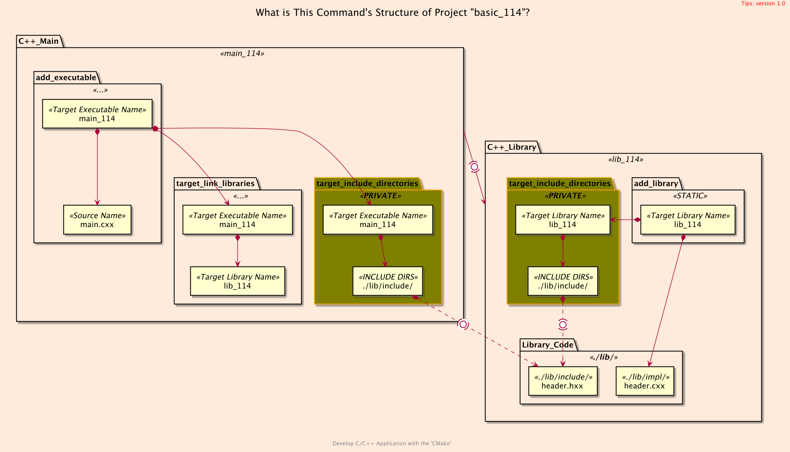
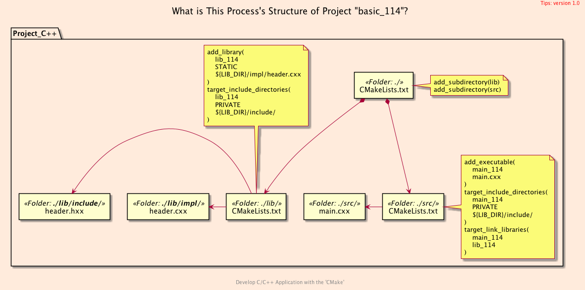
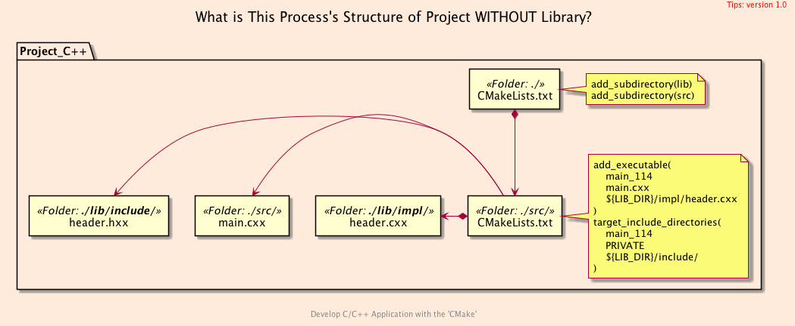

<h2>Hello, Different Folders!</h2>
<h3>Storing Header and Implementation File in Different Folders</h3>
</br>
</br>

[@Gitter](https://gitter.im/cnruby) :gitter.im/cnruby<br/>
Code ID: basic_114</br>
Code Name: Hello, Different Folders!</br>
<p class ="fragment" data-audio-src="docs/114/audio/basic_114-01.m4a"></p>


<h2>TABLE of CONTENTS</h2>

- [What is This Structure of Project?](#what-is-this-structure-of-project)
  - [The <code>Folder's</code> Structure](#the-folders-structure)
  - [The <code>Command's</code> Structure](#the-commands-structure)
  - [The <code>Process's</code> Structure](#the-processs-structure)
- [Analyze The Build of <code>CMake</code>](#analyze-the-build-of-cmake)
  - [The Listfile of Folder <code>'lib'</code>](#the-listfile-of-folder-lib)
  - [The Listfile of Folder <code>'src'</code>](#the-listfile-of-folder-src)
  - [The <code>Command's</code> Structure <code>without<code> Library File](#the-commands-structure-codewithoutcode-library-file)
  - [Demonstrate Build's Process on <code>CMake<code>](#demonstrate-builds-process-on-codecmakecode)
- [Final Summary](#final-summary)
- [References](#references)
- [The Project Command](#the-project-command)
  - [Formatting The Codes](#formatting-the-codes)
  - [Get The Code with Shell Commands](#get-the-code-with-shell-commands)
  - [Build and Run The Project](#build-and-run-the-project)
<p class ="fragment" data-audio-src="docs/114/audio/basic_114-02.m4a"></p>


## What is This Structure of Project?
### The <code>Folder's</code> Structure
```bash
#<!-- markdown-exec(cmd:cat docs/output/tree.txt) -->#
.
├── CMakeLists.txt
├── lib
│  ├── CMakeLists.txt
│  ├── impl
│  │  └── header.cxx
│  └── include
│     └── header.hxx
└── src
   ├── CMakeLists.txt
   └── main.cxx
#<!-- /markdown-exec -->
```
<p class ="fragment" data-audio-src="docs/114/audio/basic_114-03.m4a"></p>



### The <code>Command's</code> Structure
<p class ="fragment" data-audio-src="docs/114/audio/basic_114-04.m4a"></p>



### The <code>Process's</code> Structure
<p class ="fragment" data-audio-src="docs/114/audio/basic_114-05.m4a"></p>


## Analyze The Build of <code>CMake</code>
<br>
<p class ="fragment" data-audio-src="docs/114/audio/basic_114-06.m4a"></p>


```bash
#<!-- markdown-exec(cmd:cat lib/CMakeLists.txt) -->#
add_library(
  lib_114 STATIC
  ${LIB_DIR}/impl/header.cxx
)
target_include_directories(
  lib_114
  PRIVATE
  ${LIB_DIR}/include/
)
#<!-- /markdown-exec -->
```
### The Listfile of Folder <code>'lib'</code>
<p class ="fragment" data-audio-src="docs/114/audio/basic_114-07.m4a"></p>


```bash
#<!-- markdown-exec(cmd:cat src/CMakeLists.txt) -->#
add_executable(
  main_114
  main.cxx
)
target_include_directories(
  main_114
  PRIVATE ${LIB_DIR}/include/
)
target_link_libraries(main_114 lib_114)
#<!-- /markdown-exec -->
```
### The Listfile of Folder <code>'src'</code>
<p class ="fragment" data-audio-src="docs/114/audio/basic_114-08.m4a"></p>



### The <code>Command's</code> Structure <code>without<code> Library File
<p class ="fragment" data-audio-src="docs/114/audio/basic_114-09.m4a"></p>


### Demonstrate Build's Process on <code>CMake<code>
<video width="720" height="480" controls data-autoplay>
  <source src="docs/114/video/basic_114-10.mp4" autoplay=true type="video/mp4">
</video>


## Final Summary
<p class ="fragment" data-audio-src="docs/114/audio/basic_114-11.m4a"></p>


<h1><!-- markdown-exec(cmd:echo "感谢大家观看!") -->感谢大家观看!<!-- /markdown-exec --></h1>

@Gitter: gitter.im/cnruby<br/>

@Github: github.com/cnruby<br/>

@Twitter: twitter.com/cnruby<br/>

@Blogspot: cnruby.blogspot.com


## References
- http://www.math.uaa.alaska.edu/~afkjm/csce211/handouts/SeparateCompilation.pdf
- https://www.eclipse.org/forums/index.php/t/521887/
- https://softwareengineering.stackexchange.com/questions/254233/why-do-we-need-to-include-the-h-while-everything-works-when-including-only-the
- https://stackoverflow.com/questions/2887465/c-header-and-implementation-files-what-to-include
- http://www.cplusplus.com/forum/beginner/29385/


## The Project Command


### Formatting The Codes
```bash
ruby format-codes.rb
```


### Get The Code with Shell Commands
```bash
git clone https://github.com/cnruby/w3h1_cmake.git basic_114
cd basic_114
git checkout basic_114
code .
```


### Build and Run The Project
```bash
cmake -GNinja -Bbuild/
cmake --build build/ --clean-first -v
cmake --build build/ --target clean
cmake --build build/ --clean-first -v &> v11.txt
./bin/main_114
```