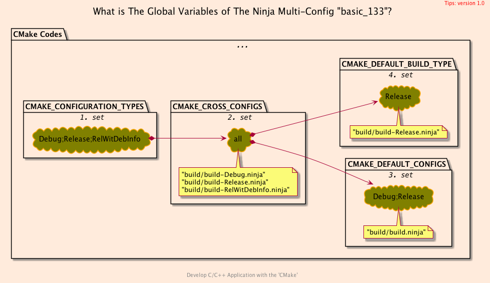
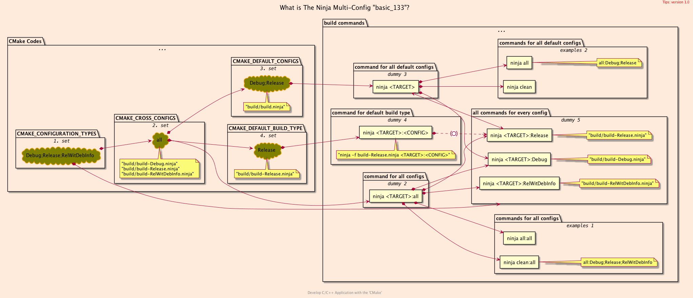
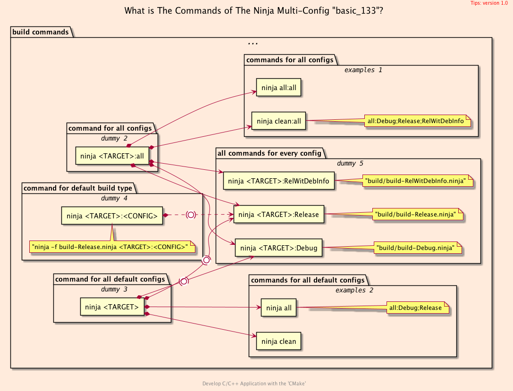
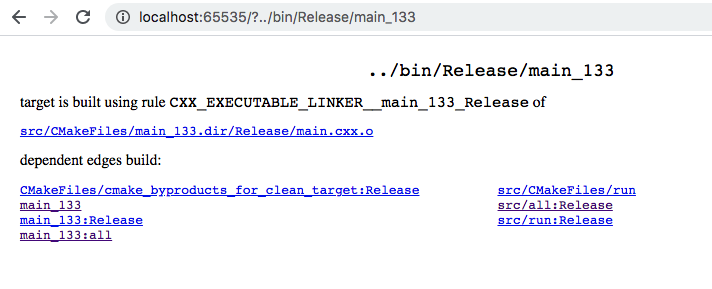

<h2>Hello, <code>Ninja</code> Multi-Config!</h2>
<h3>Creating a Solution with <code>C++</code> Multiple Configuration</h3>
</br>
</br>

[@Gitter](https://gitter.im/cnruby) :gitter.im/cnruby<br/>
Code ID: basic_133</br>
Code Name: Hello, <code>Ninja</code> Multi-Config!</br>
<p class ="fragment" data-audio-src="docs/133/audio/basic_133-01.m4a"></p>


[<h1>Youtube Video</h1>](https://youtu.be/TLpscEDcI1U)


<h2>TABLE of CONTENTS</h2>

- [About The Project](#about-the-project)
  - [The CMake Codes of <code>Ninja</code> Multi-Config Generator](#the-cmake-codes-of-ninja-multi-config-generator)
- [Explain The <code>Ninja</code> Multi-Config Generator](#explain-the-ninja-multi-config-generator)
  - [The Code of File <code>'multi_config.cmake'</code>](#the-code-of-file-multiconfigcmake)
  - [Demonstrate Building <code>Ninja</code> Multi-Config generator](#demonstrate-building-ninja-multi-config-generator)
  - [The Varibales and Commands of <code>Ninja</code> Multi-Config generator](#the-varibales-and-commands-of-ninja-multi-config-generator)
  - [The Commands of <code>Ninja</code> Multi-Config generator](#the-commands-of-ninja-multi-config-generator)
- [The Targets of <code>Ninja</code> Multi-Config generator](#the-targets-of-ninja-multi-config-generator)
  - [Demonstrate The Targets of <code>Ninja</code> Multi-Config generator](#demonstrate-the-targets-of-ninja-multi-config-generator)
- [Final Summary](#final-summary)
- [References](#references)
  - [Important](#important)
  - [General](#general)
  - [Requirements](#requirements)
  - [Get The Code with Shell Commands](#get-the-code-with-shell-commands)
  - [The Structure of Folder](#the-structure-of-folder)
<div class ="fragment" data-audio-src="docs/133/audio/basic_133-02.m4a"></div>


## About The Project
<div class ="fragment" data-audio-src="docs/133/audio/basic_133-03.m4a"></div>


```bash
#<!-- markdown-exec(cmd:cat ./cmake/multi_config.txt) -->#
set( 
  CMAKE_CONFIGURATION_TYPES "Debug;Release;RelWithDebInfo"
  CACHE STRING "specifies available build types" FORCE )
set(
  CMAKE_CROSS_CONFIGS "all"
  CACHE STRING "create available config files" FORCE )
set(
  CMAKE_DEFAULT_CONFIGS "Debug;Release"
  CACHE STRING "determine default config types" FORCE )
set(
  CMAKE_DEFAULT_BUILD_TYPE "Release"
  CACHE STRING "determine A default build type" FORCE )
#<!-- /markdown-exec -->
```
### The CMake Codes of <code>Ninja</code> Multi-Config Generator
<p class ="fragment" data-audio-src="docs/133/audio/basic_133-04.m4a"></p>



## Explain The <code>Ninja</code> Multi-Config Generator
<p class ="fragment" data-audio-src="docs/133/audio/basic_133-05.m4a"></p>


```bash
#<!-- markdown-exec(cmd:cat ./cmake/multi_config.cmake) -->#
# -DCMAKE_CONFIGURATION_TYPES="Debug;Release;RelWitDebInfo;MinSizeRel"
if(NOT CMAKE_CONFIGURATION_TYPES)
  set(
    CMAKE_CONFIGURATION_TYPES "Debug;Release;RelWithDebInfo"
    CACHE STRING "specifies available build types" FORCE )
endif()
if(NOT CMAKE_CROSS_CONFIGS)
set(                                # -DCMAKE_CROSS_CONFIGS="all"
  CMAKE_CROSS_CONFIGS "all"         #CMAKE_CROSS_CONFIGS "Debug;Release"
  CACHE STRING "create available config files" FORCE )
endif()
if(NOT CMAKE_DEFAULT_CONFIGS)
  set(                                # -DCMAKE_DEFAULT_CONFIGS="Debug;Release"
    CMAKE_DEFAULT_CONFIGS "Debug;Release"
    CACHE STRING "determine default config types" FORCE )
endif()
if(NOT CMAKE_DEFAULT_BUILD_TYPE)
  set(                                # -DCMAKE_DEFAULT_BUILD_TYPE=Release
    CMAKE_DEFAULT_BUILD_TYPE "Release"
    CACHE STRING "determine A default build type" FORCE )
endif()
#<!-- /markdown-exec -->
```
### The Code of File <code>'multi_config.cmake'</code>
<p class ="fragment" data-audio-src="docs/133/audio/basic_133-06.m4a"></p>


### Demonstrate Building <code>Ninja</code> Multi-Config generator
<video width="720" height="480" controls data-autoplay>
  <source src="docs/133/video/basic_133-07.mp4" autoplay=true type="video/mp4">
</video>




### The Varibales and Commands of <code>Ninja</code> Multi-Config generator
<p class ="fragment" data-audio-src="docs/133/audio/basic_133-08.m4a"></p>




### The Commands of <code>Ninja</code> Multi-Config generator
<p class ="fragment" data-audio-src="docs/133/audio/basic_133-09.m4a"></p>


## The Targets of <code>Ninja</code> Multi-Config generator

<p class ="fragment" data-audio-src="docs/133/audio/basic_133-10.m4a"></p>


### Demonstrate The Targets of <code>Ninja</code> Multi-Config generator
<video width="720" height="480" controls data-autoplay>
  <source src="docs/133/video/basic_133-11.mp4" autoplay=true type="video/mp4">
</video>


## Final Summary
<p class ="fragment" data-audio-src="docs/133/audio/basic_133-12.m4a"></p>


<h1><!-- markdown-exec(cmd:echo "感谢大家观看!") -->感谢大家观看!<!-- /markdown-exec --></h1>

@Gitter: gitter.im/cnruby<br/>

@Github: github.com/cnruby<br/>

@Twitter: twitter.com/cnruby<br/>

@Blogspot: cnruby.blogspot.com


## References
### Important
- https://cmake.org/cmake/help/v3.17/generator/Ninja%20Multi-Config.html
- https://www.scivision.dev/cmake-ninja-multi-config/
- https://gitlab.kitware.com/cmake/cmake/issues/20161
- https://blogs.kde.org/2011/02/05/how-selectively-remove-entries-cmake-cache-command-line


### General
- https://blog.kitware.com/multi-config-ninja-generator-in-cmake-3-17/
- https://cmake.org/cmake/help/latest/generator/Ninja%20Multi-Config.html
- https://www.dealii.org/9.1.1/users/cmakelists.html
- https://bastian.rieck.me/blog/posts/2018/cmake_tips/
- https://stackoverflow.com/questions/18435516/how-to-set-a-cmake-option-at-command-line


### Requirements
- [VS Code 1.43.0+](https://code.visualstudio.com/)
- [CMake 3.17.2+](https://cmake.org/)


### Get The Code with Shell Commands
```bash
git clone https://github.com/cnruby/w3h1_cmake.git basic_133
cd basic_133
git checkout basic_133
code .
```


### The Structure of Folder
```bash
#<!-- markdown-exec(cmd:cat ./docs/output/tree.txt) -->#
.
├── cmake
│  ├── CMakeLists.txt
│  └── default.cmake
├── CMakeLists.txt
├── Lib
│  ├── CMakeLists.txt
│  ├── impl
│  │  └── hello.cxx
│  └── include
│     └── hello.hxx
└── Main
   │   ...
   ├── CMakeLists.txt
   └── src
      ├── CMakeLists.txt
      └── main.cxx
#<!-- /markdown-exec -->
```
