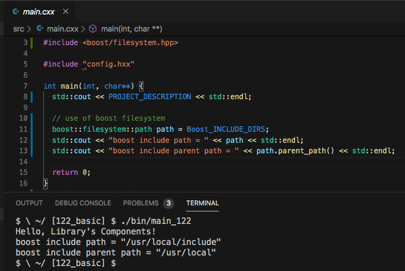
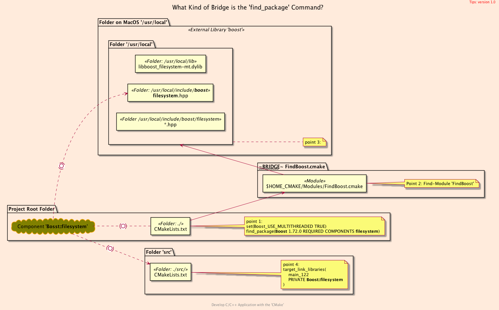

<h2>Hello, Library's Components!</h2>
<h3>Using Library's Components For <code>C++</code> Sources</h3>
</br>
</br>

[@Gitter](https://gitter.im/cnruby) :gitter.im/cnruby<br/>
Code ID: basic_122</br>
Code Name: Hello, Library's Components!</br>
<p class ="fragment" data-audio-src="docs/122/audio/basic_122-01.m4a"></p>


[<h1>Youtube Video</h1>](https://youtu.be/AMn65HQ5WAE)


<h2>TABLE of CONTENTS</h2>

- [About The Project](#about-the-project)
  - [Requirements](#requirements)
  - [Install The Library <code>boost</code>](#install-the-library-boost)
  - [Get The Code with Shell Commands](#get-the-code-with-shell-commands)
  - [The <code>Folder's</code> Structure](#the-folders-structure)
- [Codes of The Project](#codes-of-the-project)
  - [The Structure of Process](#the-structure-of-process)
  - [The CMake File of Folder <code>'cmake'</code>](#the-cmake-file-of-folder-cmake)
  - [The Listfile of Folder <code>'src'</code>](#the-listfile-of-folder-src)
  - [The C++ Main File of Folder <code>'src'</code>](#the-c-main-file-of-folder-src)
- [Demonstrate Using Library <code>'boost'<code>](#demonstrate-using-library-codeboostcode)
- [Final Summary](#final-summary)
- [References](#references)
<div class ="fragment" data-audio-src="docs/122/audio/basic_122-02.m4a"></div>


## About The Project

<div class ="fragment" data-audio-src="docs/122/audio/basic_122-03.m4a"></div>


### Requirements
- [VS Code 1.43.0+](https://code.visualstudio.com/)
- [CMake 3.17.0+](https://cmake.org/)
- [Library boost 1.72.0+](https://www.boost.org/)
<div class ="fragment" data-audio-src="docs/122/audio/basic_122-04.m4a"></div>


### Install The Library <code>boost</code>
```bash
# For MacOS 10.11+
brew install boost
# For Ubuntu 20.04+
sudo apt install libboost-all-dev
```
<div class ="fragment" data-audio-src="docs/122/audio/basic_122-05.m4a"></div>


### Get The Code with Shell Commands
```bash
git clone https://github.com/cnruby/w3h1_cmake.git basic_122
cd basic_122
git checkout basic_122
code .
```
<div class ="fragment" data-audio-src="docs/122/audio/basic_122-06.m4a"></div>


```bash
#<!-- markdown-exec(cmd:cat docs/output/tree.txt) -->#
.
├── cmake
│  ├── CMakeLists.txt
│  ├── config.h.in
│  ├── GetBoostOne.cmake
│  └── Initialize.cmake
├── CMakeLists.txt
├── config
│  └── config.hxx
└── src
   ├── CMakeLists.txt
   └── main.cxx
#<!-- /markdown-exec -->
```
### The <code>Folder's</code> Structure
<p class ="fragment" data-audio-src="docs/122/audio/basic_122-07.m4a"></p>




## Codes of The Project
<div class ="fragment" data-audio-src="docs/122/audio/basic_122-08.m4a"></div>




### The Structure of Process
<p class ="fragment" data-audio-src="docs/122/audio/basic_122-09.m4a"></p>


```bash
#<!-- markdown-exec(cmd:cat cmake/GetBoostOne.cmake) -->#
# find a library 'boost' with the component 'filesystem'
set(Boost_USE_MULTITHREADED TRUE)
find_package(Boost 1.72.0 REQUIRED COMPONENTS filesystem)

# check if Boost was found
if(Boost_FOUND)
    message(STATUS "Boost found")
    message(STATUS "Boost_VERSION_STRING\t\t= ${Boost_VERSION_STRING}")
    message(STATUS "Boost_INCLUDE_DIRS\t\t= ${Boost_INCLUDE_DIRS}")
    message(STATUS "Boost_LIBRARY_DIRS\t\t= ${Boost_LIBRARY_DIRS}")
    message(STATUS "Boost_LIBRARIES\t\t= ${Boost_LIBRARIES}")
    message(STATUS "Boost_FILESYSTEM_FOUND\t= ${Boost_FILESYSTEM_FOUND}")
    message(STATUS "Boost_FILESYSTEM_LIBRARY\t= ${Boost_FILESYSTEM_LIBRARY}")
else()
    message(FATAL_ERROR "Cannot find Boost")
endif()
#<!-- /markdown-exec -->
```
### The CMake File of Folder <code>'cmake'</code>
<p class ="fragment" data-audio-src="docs/122/audio/basic_122-10.m4a"></p>


```bash
#<!-- markdown-exec(cmd:cat src/CMakeLists.txt) -->#
add_executable(
  main_122
  main.cxx
)
target_include_directories(
  main_122
  PRIVATE ${PROJECT_CONIFG_DIR}
)
# link against the boost libraries
target_link_libraries(
  main_122
  PRIVATE Boost::filesystem
)
#<!-- /markdown-exec -->
```
### The Listfile of Folder <code>'src'</code>
<p class ="fragment" data-audio-src="docs/122/audio/basic_122-11.m4a"></p>


```C++
//<!-- markdown-exec(cmd:cat src/main.cxx) -->//
#include <iostream>
#include <boost/filesystem.hpp>

#include "config.hxx"

int main(int, char**) {
  std::cout << PROJECT_DESCRIPTION << std::endl;

  // use of boost filesystem
  boost::filesystem::path path = Boost_INCLUDE_DIRS;
  std::cout << "boost include path = " << path << std::endl;
  std::cout << "boost include parent path = " << path.parent_path() << std::endl;

  return 0;
}
//#include <boost/filesystem/path.hpp>
//<!-- /markdown-exec -->
```
### The C++ Main File of Folder <code>'src'</code>
<p class ="fragment" data-audio-src="docs/122/audio/basic_122-12.m4a"></p>


## Demonstrate Using Library <code>'boost'<code>
<video width="720" height="480" controls data-autoplay>
  <source src="docs/122/video/basic_122-13.mov" autoplay=true type="video/mp4">
</video>


## Final Summary
<p class ="fragment" data-audio-src="docs/122/audio/basic_122-14.m4a"></p>


<h1><!-- markdown-exec(cmd:echo "感谢大家观看!") -->感谢大家观看!<!-- /markdown-exec --></h1>

@Gitter: gitter.im/cnruby<br/>

@Github: github.com/cnruby<br/>

@Twitter: twitter.com/cnruby<br/>

@Blogspot: cnruby.blogspot.com


## References
- https://cmake.org/cmake/help/latest/command/configure_file.html
- https://gitlab.kitware.com/cmake/community/-/wikis/doc/tutorials/How-to-create-a-ProjectConfig.cmake-file
- https://riptutorial.com/cmake/example/26652/generate-a-cplusplus-configure-file-with-cmake
- https://stackoverflow.com/questions/48580399/how-to-ensure-a-generated-config-h-file-is-in-the-include-path
- https://github.com/bast/cmake-example/tree/master/cmake 
- https://cmake.org/pipermail/cmake/2006-May/009049.html
- https://cmake.org/cmake/help/latest/module/FindBoost.html
- https://stackoverflow.com/questions/58081084/target-boostlibrary-already-has-an-imported-location-link-errors
- https://stackoverflow.com/questions/12578499/how-to-install-boost-on-ubuntu
- https://www.boost.org/doc/libs/
- https://www.boost.org/doc/libs/1_73_0/libs/filesystem/doc/index.htm