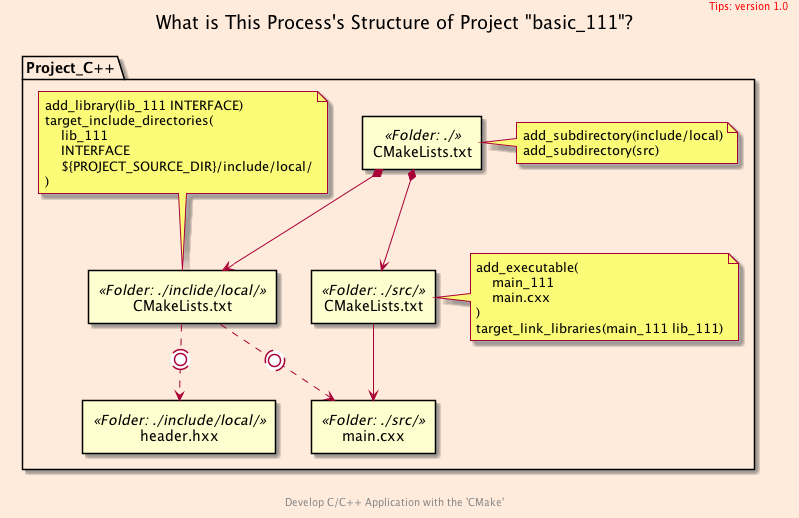
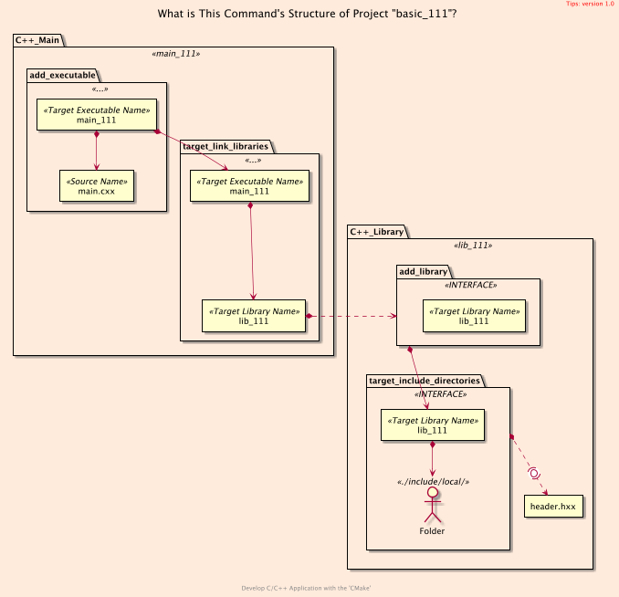
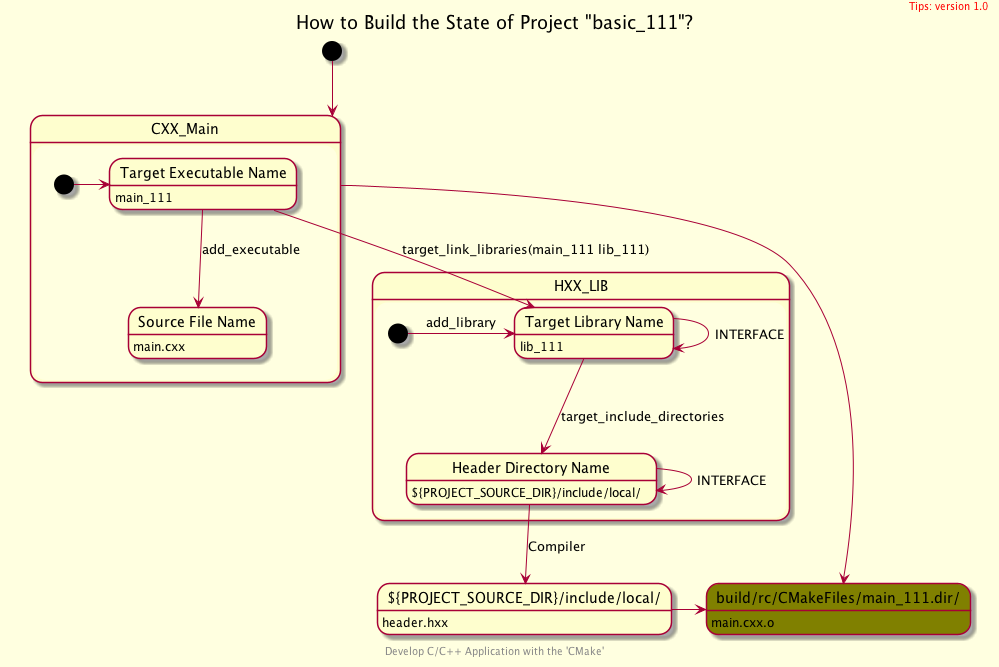

<h2>Hello, <code>C++</code> Library!</h2>
<h3>Build a Single Header File with <code>CMake</code></h3>
</br>

[@Gitter](https://gitter.im/cnruby) :gitter.im/cnruby<br/>
Code ID: basic_111</br>
Code Name: Hello, C++ Library!</br>
<p class ="fragment" data-audio-src="docs/111/audio/basic_111-01.m4a"></p>


<h2>TABLE of CONTENTS</h2>

- [The Structure of Project "basic_111"](#the-structure-of-project-%22basic111%22)
  - [Get The Code with Shell Commands](#get-the-code-with-shell-commands)
  - [What is The <code>Folder's</code> Structure of Project](#what-is-the-folders-structure-of-project)
  - [What is The <code>Process's</code> Structure of Project](#what-is-the-processs-structure-of-project)
  - [What is The <code>Command's</code> Structure of Project](#what-is-the-commands-structure-of-project)
- [Build and Run The Project](#build-and-run-the-project)
  - [How to Build The Bridge Between <code>C++</code> File and Library](#how-to-build-the-bridge-between-c-file-and-library)
  - [How to Build The Library of A Single Header File](#how-to-build-the-library-of-a-single-header-file)
  - [Demonstrate The Project](#demonstrate-the-project)
- [Analyze The Build of Project](#analyze-the-build-of-project)
  - [How to Understand the Build's Process of Project](#how-to-understand-the-builds-process-of-project)
  - [Command of Analyzing Build on <code>Ninja</code>](#command-of-analyzing-build-on-ninja)
  - [Demonstrate Build's Process on <code>Ninja</code>](#demonstrate-builds-process-on-ninja)
  - [Commands of Analyzing Build on <code>C++</code> Complier](#commands-of-analyzing-build-on-c-complier)
  - [Demonstrate Build's Process on <code>C++</code> Complier](#demonstrate-builds-process-on-c-complier)
- [Final Summary](#final-summary)
- [References](#references)
- [The Project's Commands](#the-projects-commands)
  - [Formtting The Codes](#formtting-the-codes)
  - [Build and Run The Project](#build-and-run-the-project-1)
<p class ="fragment" data-audio-src="docs/111/audio/basic_111-02.m4a"></p>


## The Structure of Project "basic_111"
### Get The Code with Shell Commands
```bash
git clone https://github.com/cnruby/w3h1_cmake.git basic_111
cd basic_111
git checkout basic_111
code .
```


### What is The <code>Folder's</code> Structure of Project
```bash
#<!-- markdown-exec(cmd:cat tree.txt) -->#
.
├── CMakeLists.txt
├── include
│  └── local
│     ├── CMakeLists.txt
│     └── header.hxx
└── src
   ├── CMakeLists.txt
   └── main.cxx
#<!-- /markdown-exec -->
```


### What is The <code>Process's</code> Structure of Project

<p class ="fragment" data-audio-src="docs/111/audio/basic_111-03.m4a"></p>


### What is The <code>Command's</code> Structure of Project



<p class ="fragment" data-audio-src="docs/111/audio/basic_111-04.m4a"></p>


## Build and Run The Project


### How to Build The Bridge Between <code>C++</code> File and Library
```bash
#<!-- markdown-exec(cmd:cat src/CMakeLists.txt) -->#
add_executable(
  main_111
  main.cxx
)
target_link_libraries(main_111 lib_111)
#<!-- /markdown-exec -->
```
<p class ="fragment" data-audio-src="docs/111/audio/basic_111-05.m4a"></p>


### How to Build The Library of A Single Header File

```bash
#<!-- markdown-exec(cmd:cat include/local/CMakeLists.txt) -->#
add_library(lib_111 INTERFACE)
target_include_directories(
  lib_111
  INTERFACE
  ${PROJECT_SOURCE_DIR}/include/local/
)
#<!-- /markdown-exec -->
```
<p class ="fragment" data-audio-src="docs/111/audio/basic_111-07.m4a"></p>


### Demonstrate The Project
<video width="720" height="480" controls data-autoplay>
  <source src="docs/111/video/basic_111-11.mp4" autoplay=true type="video/mp4">
</video>


## Analyze The Build of Project
### How to Understand the Build's Process of Project



<p class ="fragment" data-audio-src="docs/111/audio/basic_111-04.m4a"></p>


### Command of Analyzing Build on <code>Ninja</code>
```bash
cmake --build build/ --clean-first -v
```
<p class ="fragment" data-audio-src="docs/111/audio/basic_111-10.m4a"></p>


### Demonstrate Build's Process on <code>Ninja</code>
<video width="720" height="480" controls data-autoplay>
  <source src="docs/111/video/basic_111-11.mp4" autoplay=true type="video/mp4">
</video>


### Commands of Analyzing Build on <code>C++</code> Complier
```bash
./bin/main_111
# compile
c++ -I./include/local -std=gnu++1z -MD -MT bin/main.cxx.o -MF  bin/main.cxx.o.d \
    -o bin/main.cxx.o -c ./src/main.cxx -v
# link
c++ -Wl,-search_paths_first -Wl,-headerpad_max_install_names \
     bin/main.cxx.o  -o ./bin/main_111 -v
```
<p class ="fragment" data-audio-src="docs/111/audio/basic_111-10.m4a"></p>


### Demonstrate Build's Process on <code>C++</code> Complier
<video width="720" height="480" controls data-autoplay>
  <source src="docs/111/video/basic_111-11.mp4" autoplay=true type="video/mp4">
</video>


## Final Summary

<p class ="fragment" data-audio-src="docs/111/audio/basic_111-12.m4a"></p>


<h1><!-- markdown-exec(cmd:echo "感谢大家观看!") -->感谢大家观看!<!-- /markdown-exec --></h1>

@Gitter: gitter.im/cnruby<br/>

@Github: github.com/cnruby<br/>

@Twitter: twitter.com/cnruby<br/>

@Blogspot: cnruby.blogspot.com


## References
- https://cmake.org/cmake/help/latest/command/include_directories.html
- https://cmake.org/cmake/help/latest/command/target_include_directories.html
- https://stackoverflow.com/questions/31969547/what-is-the-difference-between-include-directories-and-target-include-directorie
- https://stackoverflow.com/questions/26243169/cmake-target-include-directories-meaning-of-scope
- https://gitlab.kitware.com/cmake/cmake/issues/19802
- https://pabloariasal.github.io/2018/02/19/its-time-to-do-cmake-right/
- http://mariobadr.com/creating-a-header-only-library-with-cmake.html
- https://stackoverflow.com/questions/18869282/initialize-char
- https://stackoverflow.com/questions/2587349/initializing-char-and-char-pointers
- https://stackoverflow.com/questions/18963888/c-char-initialization-in-constructor
- https://stackoverflow.com/questions/13703647/how-to-properly-add-include-directories-with-cmake
- https://stackoverflow.com/questions/9834067/difference-between-char-and-const-char
- https://stackoverflow.com/questions/2186246/what-is-o-file
- https://www.online-convert.com/file-format/o


## The Project's Commands


### Formtting The Codes
```bash
ruby format-codes.rb
```


### Build and Run The Project
```bash
cmake -GNinja -Bbuild/
cmake --build build/ --clean-first -v
./bin/main_111
rm ./bin/main.* ./bin/main_*
c++ -I./include/local -std=gnu++1z -MD -MT bin/main.cxx.o -MF  bin/main.cxx.o.d \
    -o bin/main.cxx.o -c ./src/main.cxx
c++ -Wl,-search_paths_first -Wl,-headerpad_max_install_names \
    bin/main.cxx.o -o ./bin/main_111
c++ -I./include/local -std=gnu++1z -MD -MT bin/main.cxx.o -MF  bin/main.cxx.o.d \
    -o bin/main.cxx.o -c ./src/main.cxx -v
c++ -Wl,-search_paths_first -Wl,-headerpad_max_install_names \
    bin/main.cxx.o -o ./bin/main_111 -v
```