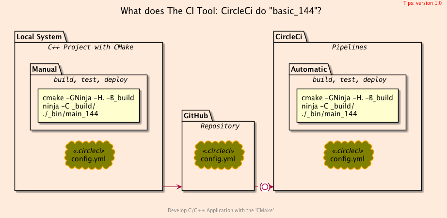
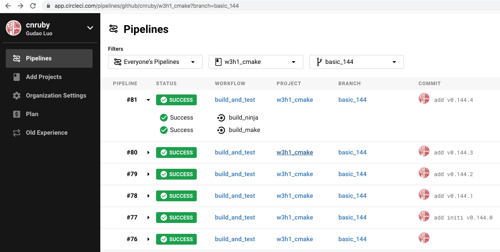

<h2>Hello, CircleCi!</h2>
<h3>How to Build C++ Project with `CMake` and `CircleCI`</h3>
</br>
</br>

[@Gitter](https://gitter.im/cnruby): gitter.im/cnruby<br/>
Code ID: basic_144</br>
Code Name: Hello, CircleCi!</br>
Code Status: [](https://circleci.com/gh/cnruby/w3h1_cmake/tree/basic_144)
<p class ="fragment" data-audio-src="docs/144/audio/basic_144-01.m4a"></p>


[<h1>Youtube Video</h1>](https://youtu.be/7lxEofq8jhM)

[<h1>Demo Video</h1>](https://www.shorturl.at/fwGQX)


<h2>TABLE of CONTENTS</h2>

- [About The Project](#about-the-project)
  - [The Structure of project](#the-structure-of-project)
- [A Demonstration of Building Project](#a-demonstration-of-building-project)
- [Explain the Continuous Integration tool: CircleCi](#explain-the-continuous-integration-tool-circleci)
  - [The Configuration file of CircleCi](#the-configuration-file-of-circleci)
  - [The Commands of Building the project](#the-commands-of-building-the-project)
  - [The System diversity of Building the project](#the-system-diversity-of-building-the-project)
  - [The Method diversity of Building the project](#the-method-diversity-of-building-the-project)
- [Final Summary](#final-summary)
- [References](#references)
  - [Requirements](#requirements)
  - [Get The Code with Shell Commands](#get-the-code-with-shell-commands)
<p class ="fragment" data-audio-src="docs/144/audio/basic_144-02.m4a"></p>




## About The Project
<p class ="fragment" data-audio-src="docs/144/audio/basic_144-03.m4a"></p>


<!--{ "./docs/output/tree.txt" | code: bash }-->
```bash
.
├── .circleci
│  └── config.yml
├── cmake
│  ├── CMakeLists.txt
│  ├── config.hxx.in
│  ├── initialize.cmake
│  └── targets.cmake
├── CMakeLists.txt
└── src
   ├── CMakeLists.txt
   └── main.cxx
```
<!--{ end }-->
### The Structure of project
<p class ="fragment" data-audio-src="docs/144/audio/basic_144-04.m4a"></p>


## A Demonstration of Building Project
<video width="720" height="480" controls data-autoplay>
  <source src="docs/144/video/basic_144-05.mp4" autoplay=true type="video/mp4">
</video>




## Explain the Continuous Integration tool: CircleCi
<p class ="fragment" data-audio-src="docs/144/audio/basic_144-06.m4a"></p>


<!--{ "./.circleci/config.yml"| line-numbers | line: 5 6 7 8 9 10 11 12 13 14 46 47 48 49 | code: bash }-->
```bash
 5: version: 2.1
 6: jobs:
 7:   build_make:
 8:     docker:
 9:       - image: rikorose/gcc-cmake
10:     steps:
11:       - checkout
12:       - run:
13:           name: Creating Build Files
14:           command: 'cmake -G"Unix Makefiles" -H. -B_build'
46: workflows:
47:   build_and_test:
48:     jobs:
49:       - build_make
```
<!--{ end }-->
### The Configuration file of CircleCi
<p class ="fragment" data-audio-src="docs/144/audio/basic_144-07.m4a"></p>


<!--{ "./.circleci/config.yml" | lines: 39 44 | code: bash }-->
```bash
      - run:
          name: Build the project
          command: |
            cmake -GNinja -H. -B_build
            ninja -C _build
            ./_bin/main_144
```
<!--{ end }-->
### The Commands of Building the project
<p class ="fragment" data-audio-src="docs/144/audio/basic_144-08.m4a"></p>


<!--{ "./.circleci/config.yml" | lines: 8 9 | code: bash }-->
```bash
    docker:
      - image: rikorose/gcc-cmake
```
<!--{ end }-->
### The System diversity of Building the project
<p class ="fragment" data-audio-src="docs/144/audio/basic_144-09.m4a"></p>


<!--{ "./.circleci/config.yml" | lines: 12 20 | code: bash }-->
```bash
      - run:
          name: Creating Build Files
          command: 'cmake -G"Unix Makefiles" -H. -B_build'
      - run:
          name: Creating Binary Files
          command: 'make -C _build'
      - run:
          name: Point Unit Testing
          command: './_bin/main_144'
```
<!--{ end }-->
### The Method diversity of Building the project
<p class ="fragment" data-audio-src="docs/144/audio/basic_144-10.m4a"></p>


## Final Summary
<p class ="fragment" data-audio-src="docs/144/audio/basic_144-11.m4a"></p>


<h1>感谢大家观看!</h1>

@Gitter: gitter.im/cnruby<br/>

@Github: github.com/cnruby<br/>

@Twitter: twitter.com/cnruby<br/>

@Blogspot: cnruby.blogspot.com


## References
- https://circleci.com/
- https://circleci.com/docs/2.0/getting-started/#section=getting-started
- http://gueepo.me/blog/simple-ci-for-cpp/
- https://thoughts-on-coding.com/2020/04/20/a-cpp-github-template-repository-utilizing-circleci-cmake-docker-and-doxygen/
- https://shields.io/category/build
- https://circleci.com/docs/2.0/status-badges/
- https://github.com/GPMueller/circleci-cpp


### Requirements
- [Ubuntu 20.04+](https://ubuntu.com/)
- [VS Code 1.43.0+](https://code.visualstudio.com/)
- [CMake 3.17.3+](https://cmake.org/)
- [CircleCi 2.0](https://circleci.com/)


### Get The Code with Shell Commands
```bash
git clone https://github.com/cnruby/w3h1_cmake.git basic_144
cd basic_144
git checkout basic_144
code .
```