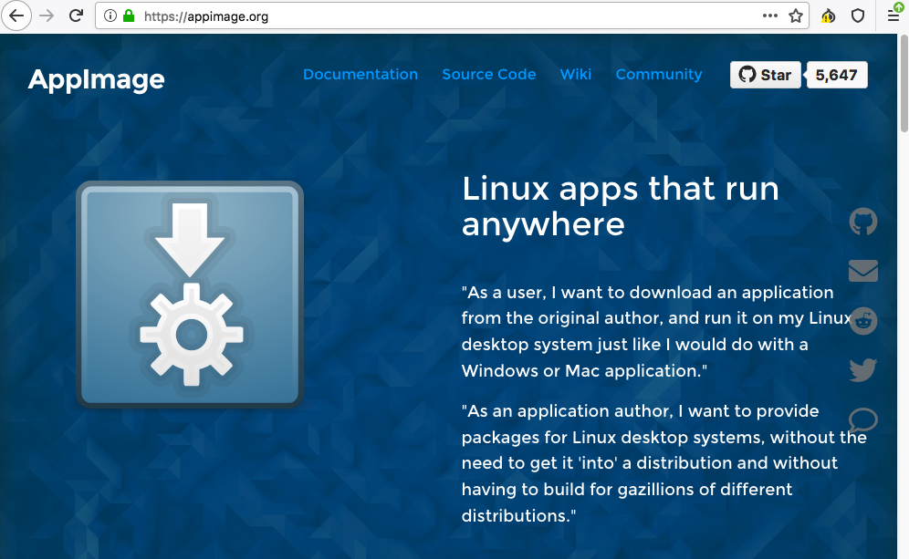
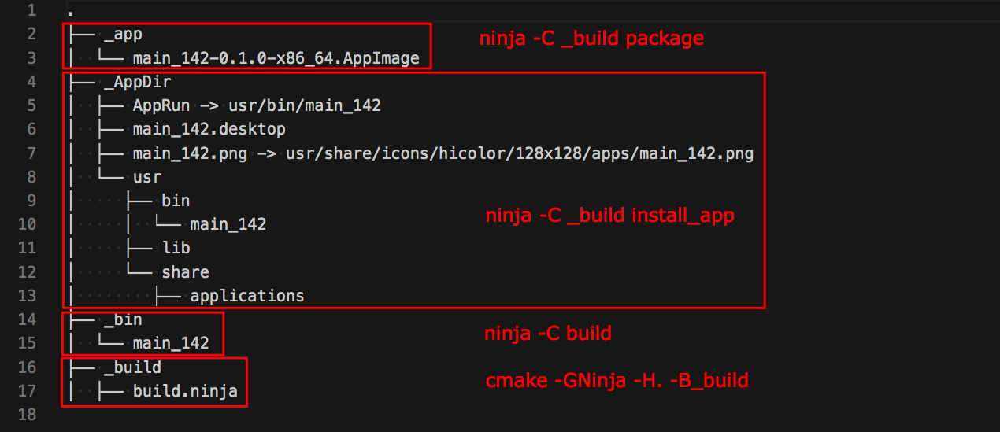
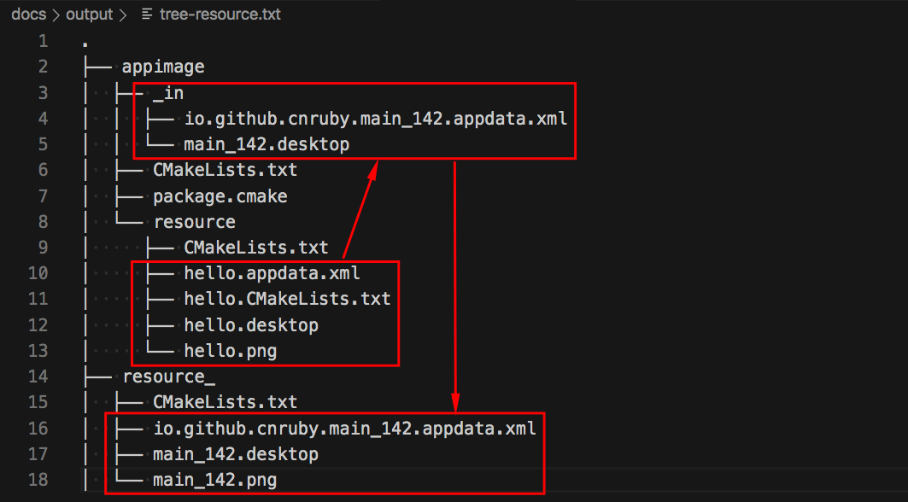
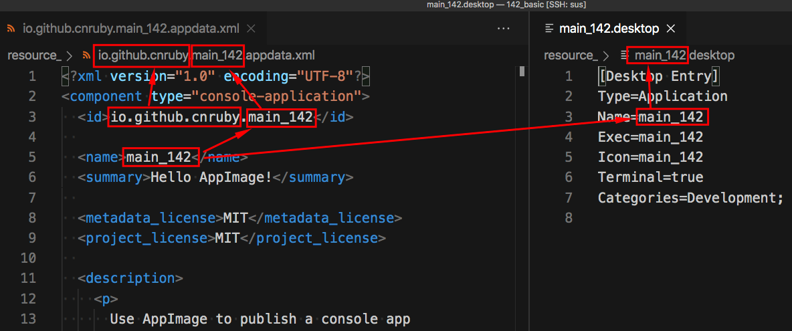

<h2>Hello, package:AppImage!</h2>
<h3>How to package a Linux console application for `AppImage`</h3>
</br>
</br>

[@Gitter](https://gitter.im/cnruby): gitter.im/cnruby<br/>
Code ID: basic_142</br>
Code Name: Hello, package:AppImage!</br>
<p class ="fragment" data-audio-src="docs/142/audio/basic_142-01.m4a"></p>


[<h1>Youtube Video</h1>](https://youtu.be/QkpnCki13Mc)

[<h1>Short Video</h1>](https://youtu.be/qRKJlasaVbI)


<h2>TABLE of CONTENTS</h2>

- [About The Project](#about-the-project)
  - [The Structur for AppImage](#the-structur-for-appimage)
- [A Demonstration of Building Project](#a-demonstration-of-building-project)
- [Explaining the AppImage and The Resource Files](#explaining-the-appimage-and-the-resource-files)
  - [Explaining the CMake Environment Variable <code>`DESTDIR`</code>](#explaining-the-cmake-environment-variable-destdir)
  - [The Resource Files for AppImage](#the-resource-files-for-appimage)
  - [The appdata File for AppImage](#the-appdata-file-for-appimage)
- [Final Summary](#final-summary)
- [References](#references)
  - [General](#general)
  - [create metainfo appdata file](#create-metainfo-appdata-file)
  - [Requirements](#requirements)
  - [install tools](#install-tools)
  - [The Structure of Folder](#the-structure-of-folder)
- [Explain <code>C++</code>  and <code>CMake</code> Code](#explain-c-and-cmake-code)
<div class ="fragment" data-audio-src="docs/142/audio/basic_142-02.m4a"></div>




## About The Project
<p class ="fragment" data-audio-src="docs/142/audio/basic_142-03.m4a"></p>




### The Structur for AppImage
<p class ="fragment" data-audio-src="docs/142/audio/basic_142-04.m4a"></p>


## A Demonstration of Building Project
<video width="720" height="480" controls data-autoplay>
  <source src="docs/142/video/basic_142-05.mp4" autoplay=true type="video/mp4">
</video>


<!--{ "./docs/output/tree.txt" | line-numbers: " " | lines: 2 12 | code: bash }-->
```bash
 2 ├── appimage
 3 │  ├── CMakeLists.txt
 4 │  ├── package.cmake
 5 │  └── resource
 6 │     ├── CMakeLists.txt
 7 │     ├── hello.appdata.xml
 8 │     ├── hello.CMakeLists.txt
 9 │     ├── hello.desktop
10 │     └── hello.png
11 ├── cmake
12 │  ├── appimage.cmake
```
<!--{ end }-->
## Explaining the AppImage and The Resource Files
<p class ="fragment" data-audio-src="docs/142/audio/basic_142-06.m4a"></p>


<!--{ "./CMakeLists.txt" | line-numbers: " " | lines: 24 27 | code: bash }-->
```bash
24 set(
25   _DESTDIR "${PROJECT_SOURCE_DIR}/_AppDir"
26   CACHE STRING "DESTDIR Default: ${PROJECT_SOURCE_DIR}/_AppDir"
27 )
```
<!--{ end }-->
### Explaining the CMake Environment Variable <code>`DESTDIR`</code>
<p class ="fragment" data-audio-src="docs/142/audio/basic_142-07.m4a"></p>




### The Resource Files for AppImage
<p class ="fragment" data-audio-src="docs/142/audio/basic_142-08.m4a"></p>




### The appdata File for AppImage
<p class ="fragment" data-audio-src="docs/142/audio/basic_142-09.m4a"></p>


## Final Summary
<p class ="fragment" data-audio-src="docs/142/audio/basic_142-10.m4a"></p>


<h1>感谢大家观看!</h1>

@Gitter: gitter.im/cnruby<br/>

@Github: github.com/cnruby<br/>

@Twitter: twitter.com/cnruby<br/>

@Blogspot: cnruby.blogspot.com


## References


### General
- https://cmake.org/cmake/help/v3.12/envvar/DESTDIR.html
- https://cmake.org/pipermail/cmake/2009-April/029017.html
- https://discourse.appimage.org/t/how-to-create-an-appimage/155/38
- https://github.com/AppImage/AppImageKit/issues/1048
- https://fireflytech.org/2019/05/29/appimage-an-app-bundle-format-for-linux-howto/
- https://github.com/linuxdeploy/linuxdeploy/releases
- https://dev.to/slurpsmadrips/everything-you-never-wanted-to-know-about-cmake-4mgg


### create metainfo appdata file
- https://www.freedesktop.org/software/appstream/metainfocreator/#/


### Requirements
- [Ubuntu 20.04+](https://ubuntu.com/)
- [VS Code 1.43.0+](https://code.visualstudio.com/)
- [CMake 3.17.3+](https://cmake.org/)


### install tools
```bash
sudo apt install appstream-util appstream apt-config-icons
```


### The Structure of Folder
<!--{ "./docs/output/tree.txt" | code: bash }-->
```bash
.
├── appimage
│  ├── CMakeLists.txt
│  ├── package.cmake
│  └── resource
│     ├── CMakeLists.txt
│     ├── hello.appdata.xml
│     ├── hello.CMakeLists.txt
│     ├── hello.desktop
│     └── hello.png
├── cmake
│  ├── appimage.cmake
│  ├── CMakeLists.txt
│  ├── config.hxx.in
│  └── targets.cmake
├── CMakeLists.txt
└── src
   ├── CMakeLists.txt
   ├── install.cmake
   └── main.cxx
```
<!--{ end }-->
## Explain <code>C++</code>  and <code>CMake</code> Code 
