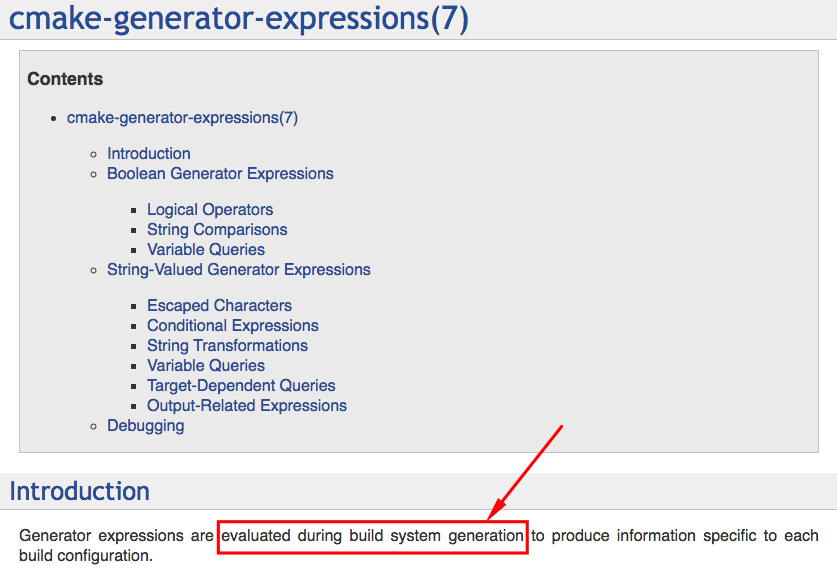
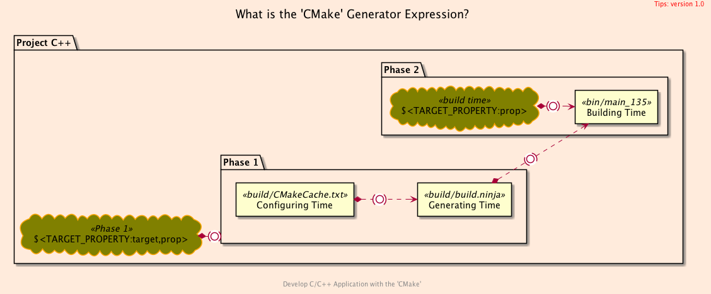
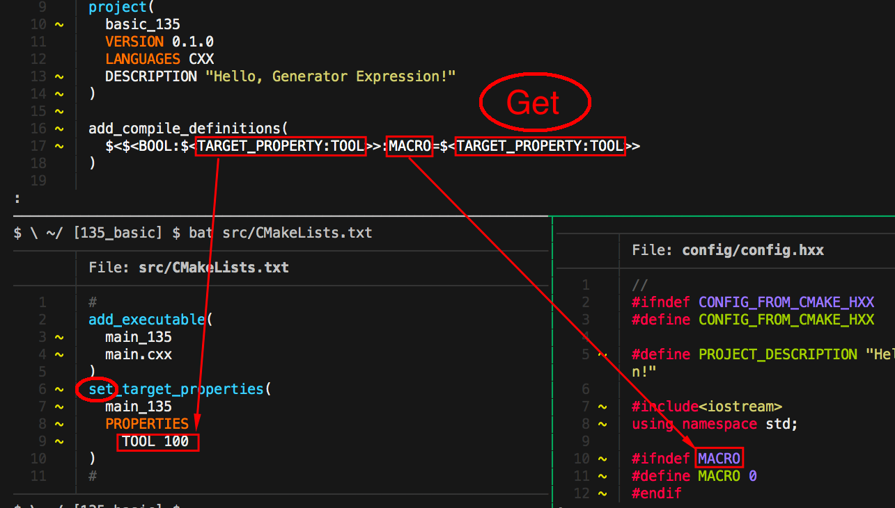
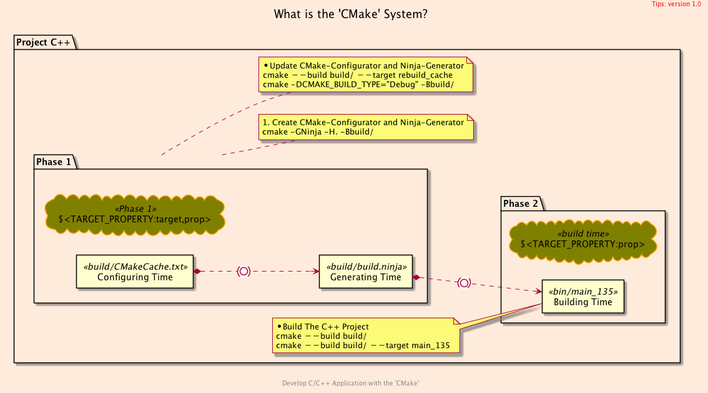

<h2>Hello, Generator Expression!</h2>
<h3>How to Learn Generator Expression in CMake</h3>
</br>
</br>

[@Gitter](https://gitter.im/cnruby) :gitter.im/cnruby<br/>
Code ID: basic_135</br>
Code Name: Hello, Generator Expression!</br>
<p class ="fragment" data-audio-src="docs/135/audio/basic_135-01.m4a"></p>


[<h1>Youtube Video</h1>](https://youtu.be/xZkakSO3_II)


<h2>TABLE of CONTENTS</h2>

- [About The Project](#about-the-project)
  - [generator expressions for build system generation](#generator-expressions-for-build-system-generation)
- [Applying the generator expression](#applying-the-generator-expression)
  - [Demonstrating Applying the generator expression](#demonstrating-applying-the-generator-expression)
- [Explaining Codes for <code>CMake's</code> generator expressions](#explaining-codes-for-cmakes-generator-expressions)
  - [Evaluate Example of generator expression for "Phase 1"](#evaluate-example-of-generator-expression-for-phase-1)
  - [Example of a generator expression for build time](#example-of-a-generator-expression-for-build-time)
  - [Demonstrating generator expressions](#demonstrating-generator-expressions)
- [Final Summary](#final-summary)
- [References](#references)
  - [References CMake API](#references-cmake-api)
  - [Requirements](#requirements)
  - [Get The Code with Shell Commands](#get-the-code-with-shell-commands)
  - [The Structure of Folder](#the-structure-of-folder)
<div class ="fragment" data-audio-src="docs/135/audio/basic_135-02.m4a"></div>




## About The Project
<p class ="fragment" data-audio-src="docs/135/audio/basic_135-03.m4a"></p>



### generator expressions for build system generation
<p class ="fragment" data-audio-src="docs/135/audio/basic_135-04.m4a"></p>



## Applying the generator expression
<p class ="fragment" data-audio-src="docs/135/audio/basic_135-05.m4a"></p>


### Demonstrating Applying the generator expression
<video width="720" height="480" controls data-autoplay>
  <source src="docs/135/video/basic_135-06.mp4" autoplay=true type="video/mp4">
</video>


```CMake
# Generator expressions have the form $<...>.
# The Generator expression is evaluated during build generation
# 
add_compile_definitions(
  $<$<BOOL:$<TARGET_PROPERTY:TOOL>>:TOOL=$<TARGET_PROPERTY:TOOL>>
)
```
## Explaining Codes for <code>CMake's</code> generator expressions
<p class ="fragment" data-audio-src="docs/135/audio/basic_135-07.m4a"></p>


```bash
#<!-- markdown-exec(cmd:cat cmake/GetOutput.cmake) -->#
file(
  GENERATE OUTPUT ${PROJECT_SOURCE_DIR}/expression.md
  CONTENT "### Generator Expressions Result:
1. $<TARGET_PROPERTY:main_135,INCLUDE_DIRECTORIES>
2. $<TARGET_PROPERTY:main_135,TOOL>
3. $<BOOL:100>
4. $<BOOL:>
5. $<BOOL:$<TARGET_PROPERTY:main_135,TOOL>>
6. $<$<BOOL:1>:MACRO=100>
7. $<BOOL:$<TARGET_PROPERTY:main_135,TOOL>>:MACRO=$<TARGET_PROPERTY:main_135,TOOL>
8. $<$<BOOL:$<TARGET_PROPERTY:main_135,TOOL>>:MACRO=$<TARGET_PROPERTY:main_135,TOOL>>
"
)
#<!-- /markdown-exec -->
```
### Evaluate Example of generator expression for "Phase 1"
<p class ="fragment" data-audio-src="docs/135/audio/basic_135-08.m4a"></p>


```bash
#<!-- markdown-exec(cmd:cat docs/output/Output_1.txt) -->#
add_compile_definitions(
  $<$<BOOL:$<TARGET_PROPERTY:TOOL>>:MACRO=$<TARGET_PROPERTY:TOOL>>
  # variable = (condition) ? expressionTrue : expressionFalse;
  # variable = ($<BOOL:$<TARGET_PROPERTY:TOOL>) ? MACRO=$<TARGET_PROPERTY:TOOL> : [empty]
  #
  # Case 1  
  # $<TARGET_PROPERTY:TOOL>           # 100
  # $<BOOL:$<TARGET_PROPERTY:TOOL>>   # true
  # MACRO=$<TARGET_PROPERTY:TOOL>     # MACRO=100
  # $<$<BOOL:$<...>>:MACRO=$<...>>    # $<MACRO=100>
  # Result: variable                  # MACRO=100
)
#<!-- /markdown-exec -->
```
### Example of a generator expression for build time
<p class ="fragment" data-audio-src="docs/135/audio/basic_135-09.m4a"></p>


### Demonstrating generator expressions
<video width="720" height="480" controls data-autoplay>
  <source src="docs/135/video/basic_135-10.mp4" autoplay=true type="video/mp4">
</video>



## Final Summary
<p class ="fragment" data-audio-src="docs/135/audio/basic_135-11.m4a"></p>


<h1><!-- markdown-exec(cmd:echo "感谢大家观看!") -->感谢大家观看!<!-- /markdown-exec --></h1>

@Gitter: gitter.im/cnruby<br/>

@Github: github.com/cnruby<br/>

@Twitter: twitter.com/cnruby<br/>

@Blogspot: cnruby.blogspot.com


## References
- https://stackoverflow.com/questions/46206495/cmake-generator-expressions
- https://www.rapidtables.com/code/linux/gcc/gcc-d.html
- https://stackoverflow.com/questions/26226874/what-is-the-d-compiler-flag-c-clang-gnu-msvc
- https://qiita.com/mrk_21/items/57075ce36f49ce0aacf4
- https://stackoverflow.com/questions/35696103/cmake-wildcard-for-target-objects
- https://stackoverflow.com/questions/44767099/linking-cmake-interface-libraries-with-object-libraries
- https://stackoverflow.com/questions/49265945/cmake-append-objects-from-different-cmakelists-txt-into-one-library
- https://stackoverflow.com/questions/58969829/cmake-object-files-of-executable-in-custom-command
- https://github.com/dev-cafe/cmake-cookbook
- https://www.dealii.org/9.1.1/users/cmakelists.html
- https://cmake.org/cmake/help/latest/manual/cmake-generator-expressions.7.html
- https://stackoverflow.com/questions/50684930/how-to-collect-object-files-o-in-a-particular-directory-with-cmake
- https://stackoverflow.com/questions/48296061/cmakes-objects-output-folder-variable
- https://stackoverflow.com/questions/29884856/how-to-get-path-to-object-files-with-cmake-for-both-multiconfiguration-generator
- https://stackoverflow.com/questions/25845294/target-compile-definitions-with-several-flags
- https://stackoverflow.com/questions/5096881/does-set-target-properties-in-cmake-override-cmake-cxx-flags
- https://stackoverflow.com/questions/30546677/cmake-how-to-set-multiple-compile-definitions-for-target-executable
- https://foonathan.net/2017/05/preprocessor/
- https://www.codenong.com/15223779/
- https://stackoverflow.com/questions/15223779/cmake-when-to-use-add-definitions-instead-of-set-target-propertiestarget-prope/15263203
- https://stackoverflow.com/questions/5403705/cmake-add-definitions-and-compile-definitions-how-to-see-them
- https://stackoverflow.com/questions/23973470/cmake-compile-definition-not-working
- https://cmake.org/pipermail/cmake/2017-April/065258.html
- https://cmake.org/pipermail/cmake/2011-February/042919.html
- https://en.cppreference.com/w/cpp/preprocessor/conditional
- https://stackoverflow.com/questions/2335888/how-to-compare-strings-in-c-conditional-preprocessor-directives
- https://stackoverflow.com/questions/26193171/cmake-how-to-create-a-file-with-make-command
- https://samthursfield.wordpress.com/2015/11/21/cmake-dependencies-between-targets-and-files-and-custom-commands/
- https://support.circleci.com/hc/en-us/articles/360003649774-Permission-Denied-When-Creating-Directory-or-Writing-a-File
- https://stackoverflow.com/questions/31582344/how-to-redirect-the-output-of-a-cmake-custom-command-to-a-file
- http://mariobadr.com/creating-a-header-only-library-with-cmake.html
- https://dev.to/slurpsmadrips/everything-you-never-wanted-to-know-about-cmake-4mgg
- https://medium.com/@rvarago/introduction-to-cmake-for-cpp-4c464272a239
- https://www.jetbrains.com/help/clion/quick-cmake-tutorial.html
- http://derekmolloy.ie/hello-world-introductions-to-cmake/


### References CMake API
- https://cmake.org/cmake/help/latest/manual/cmake-generator-expressions.7.html
- https://cmake.org/cmake/help/latest/command/add_compile_definitions.html
- https://cmake.org/cmake/help/latest/command/set_property.html
- https://cmake.org/cmake/help/latest/command/set_target_properties.html


### Requirements
- [VS Code 1.43.0+](https://code.visualstudio.com/)
- [CMake 3.17.2+](https://cmake.org/)


### Get The Code with Shell Commands
```bash
git clone https://github.com/cnruby/w3h1_cmake.git basic_135
cd basic_135
git checkout basic_135
code .
```


### The Structure of Folder
```bash
#<!-- markdown-exec(cmd:cat ./docs/output/tree.txt) -->#
.
├── cmake
│  ├── CMakeLists.txt
│  ├── config.h.in
│  ├── GetLocaleDir.cmake
│  ├── Initialize.cmake
│  ├── Output.cmake
│  └── TargetAll.cmake
├── CMakeLists.txt
├── config
│  └── config.hxx
└── src
   ├── CMakeLists.txt
   └── main.cxx
#<!-- /markdown-exec -->
```
