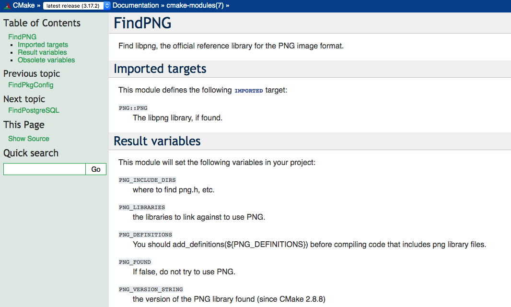
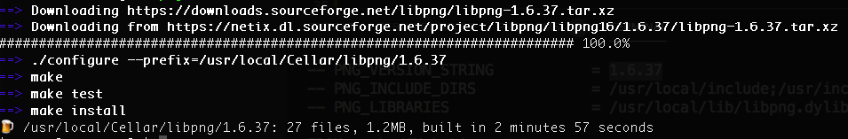
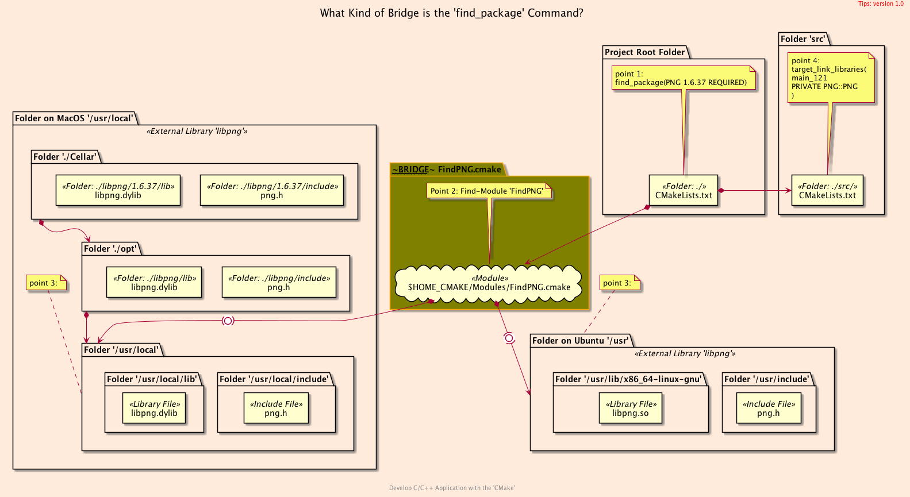

<h2>Hello, Third Party Library!</h2>
<h3>Using Third Party Library For <code>C++</code> Sources</h3>
</br>
</br>

[@Gitter](https://gitter.im/cnruby) :gitter.im/cnruby<br/>
Code ID: basic_121</br>
Code Name: Hello, Third Party Library!</br>
<p class ="fragment" data-audio-src="docs/121/audio/basic_121-01.m4a"></p>


[<h1>Youtube Video</h1>](https://youtu.be/fPAShAPvlio)


<h2>TABLE of CONTENTS</h2>

- [About The Project](#about-the-project)
  - [Requirements](#requirements)
  - [Install The Library <code>libpng</code>](#install-the-library-libpng)
  - [Install The Library <code>'libpng'</code> with <code>'brew'</code> on MacOS](#install-the-library-libpng-with-brew-on-macos)
  - [Get The Code with Shell Commands](#get-the-code-with-shell-commands)
  - [The <code>Folder's</code> Structure](#the-folders-structure)
- [Demonstrate Building The Project](#demonstrate-building-the-project)
- [Explain The Project](#explain-the-project)
  - [The <code>Process's</code> Structure](#the-processs-structure)
- [Final Summary](#final-summary)
- [References](#references)
<div class ="fragment" data-audio-src="docs/121/audio/basic_121-02.m4a"></div>


## About The Project

<div class ="fragment" data-audio-src="docs/121/audio/basic_121-03.m4a"></div>


### Requirements
- [VS Code 1.43.0+](https://code.visualstudio.com/)
- [CMake 3.17.0+](https://cmake.org/)
- [Library libpng 1.6.37+](http://www.libpng.org/pub/png/libpng.html)
<div class ="fragment" data-audio-src="docs/121/audio/basic_121-04.m4a"></div>


### Install The Library <code>libpng</code>
```bash
# For MacOS 10.11+
brew install libpng
# For Ubuntu 20.04+
sudo apt-get install libpng-dev
```
<div class ="fragment" data-audio-src="docs/121/audio/basic_121-05.m4a"></div>


### Install The Library <code>'libpng'</code> with <code>'brew'</code> on MacOS

<p class ="fragment" data-audio-src="docs/121/audio/basic_121-06.m4a"></p>


### Get The Code with Shell Commands
```bash
git clone https://github.com/cnruby/w3h1_cmake.git basic_121
cd basic_121
git checkout basic_121
code .
```
<div class ="fragment" data-audio-src="docs/121/audio/basic_121-07.m4a"></div>


```bash
#<!-- markdown-exec(cmd:cat docs/output/tree.txt) -->#
.
├── cmake
│  ├── CMakeLists.txt
│  └── config.h.in
├── CMakeLists.txt
├── config
│  └── config.hxx
└── src
   ├── CMakeLists.txt
    └── main.cxx
#<!-- /markdown-exec -->
```
### The <code>Folder's</code> Structure
<p class ="fragment" data-audio-src="docs/121/audio/basic_121-08.m4a"></p>


## Demonstrate Building The Project
<video width="720" height="480" controls data-autoplay>
  <source src="docs/121/video/basic_121-09.mp4" autoplay=true type="video/mp4">
</video>


## Explain The Project
```bash
#<!-- markdown-exec(cmd:cat src/CMakeLists.txt) -->#
add_executable(
  main_121
  main.cxx
)
target_include_directories(
  main_121
  PRIVATE ${PROJECT_CONIFG_DIR}
)
# link against the library 'libpng'
target_link_libraries(
  main_121
  PRIVATE PNG::PNG
)
#<!-- /markdown-exec -->
```
<p class ="fragment" data-audio-src="docs/121/audio/basic_121-10.m4a"></p>



### The <code>Process's</code> Structure
<p class ="fragment" data-audio-src="docs/121/audio/basic_121-11.m4a"></p>


## Final Summary
<p class ="fragment" data-audio-src="docs/121/audio/basic_121-12.m4a"></p>


<h1><!-- markdown-exec(cmd:echo "感谢大家观看!") -->感谢大家观看!<!-- /markdown-exec --></h1>

@Gitter: gitter.im/cnruby<br/>

@Github: github.com/cnruby<br/>

@Twitter: twitter.com/cnruby<br/>

@Blogspot: cnruby.blogspot.com


## References
- https://cmake.org/cmake/help/latest/command/configure_file.html
- https://gitlab.kitware.com/cmake/community/-/wikis/doc/tutorials/How-to-create-a-ProjectConfig.cmake-file
- https://riptutorial.com/cmake/example/26652/generate-a-cplusplus-configure-file-with-cmake
- https://stackoverflow.com/questions/48580399/how-to-ensure-a-generated-config-h-file-is-in-the-include-path
- https://github.com/bast/cmake-example/tree/master/cmake 
- https://cmake.org/pipermail/cmake/2006-May/009049.html
- https://cmake.org/cmake/help/latest/module/FindBoost.html
- https://stackoverflow.com/questions/58081084/target-boostlibrary-already-has-an-imported-location-link-errors
- https://gist.github.com/niw/5963798
- https://stackoverflow.com/questions/30980383/cmake-compile-options-for-libpng
- https://cmake.org/cmake/help/latest/module/FindPNG.html
- http://www.libpng.org/pub/png/book/
- https://gist.githubusercontent.com/niw/5963798/raw/75034851d379413695f422a5dbdb314513396281/libpng_test.c
- http://www.libpng.org/pub/png/libpng.html
- http://zarb.org/~gc/html/libpng.html
- https://askubuntu.com/questions/508934/how-to-install-libpng-and-zlib